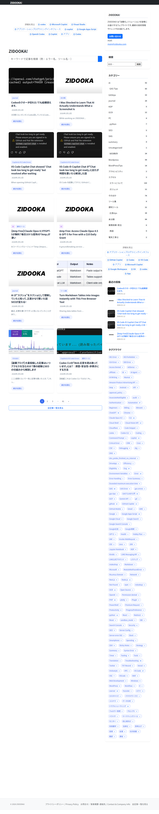
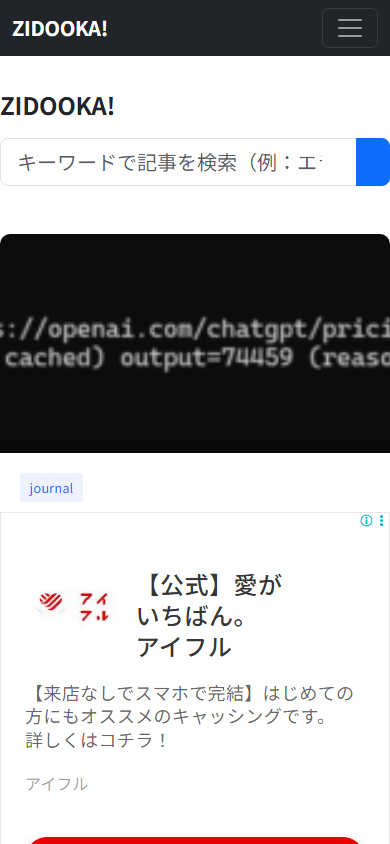
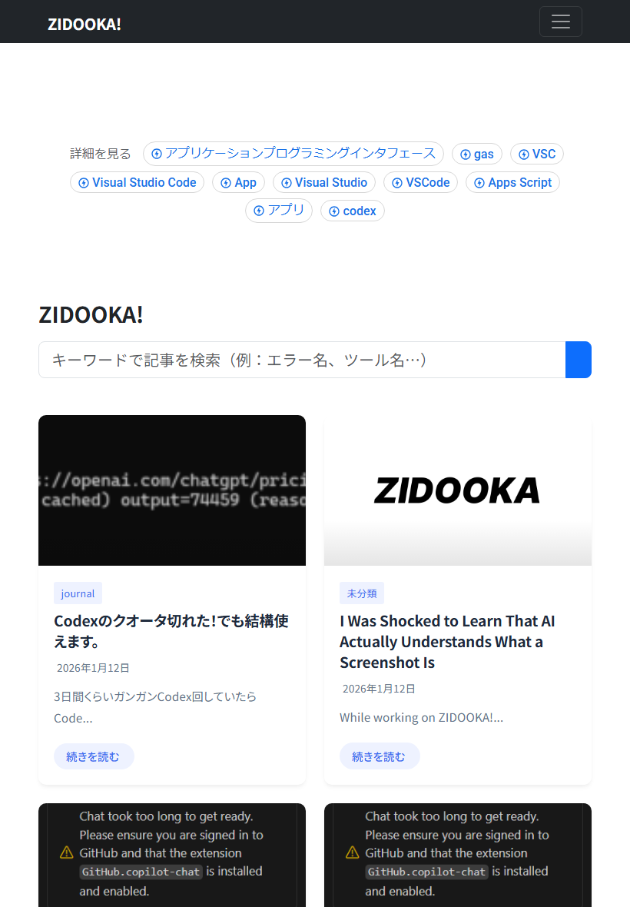

# Zidooka! モード: agent-browser (Playwright) でマルチデバイス検証ギャラリーを作る

【結論】
`agent-browser` (または Playwright) のオプションを使い分けることで、PC・スマホ・タブレットそれぞれのビューを自動取得し、記事素材や検証に活用できます。

## ギャラリースクリプトの実例

以下のようなスクリプトを用意しておくと、一発で3種類のスクリーンショットを生成できます。
（実物はリポジトリの `scripts/agent-browser-gallery.mjs` を参照）

### 1. フルページ (PC)

記事全体のデザイン確認などに使います。

```javascript
// agent-browser CLI
// agent-browser open https://www.zidooka.com
// agent-browser screenshot zidooka-full.png --full

// Playwright
await page.setViewportSize({ width: 1280, height: 800 });
await page.screenshot({ path: 'zidooka-full.png', fullPage: true });
```

**取得画像:**


### 2. モバイル (iPhone 14 想定)

スマホでの見え方（ハンバーガーメニュー、文字サイズ）の確認に必須です。UserAgent も設定するとより正確です。

```javascript
// CLI では set device が便利
// agent-browser set device "iPhone 14"
// agent-browser screenshot zidooka-mobile.png

// Playwright Context
const context = await browser.newContext({
    viewport: { width: 390, height: 844 },
    userAgent: 'Mozilla/5.0 (iPhone...)',
    isMobile: true
});
```

**取得画像:**


### 3. タブレット (iPad Air 想定)

PCとスマホの中間レスポンシブ挙動の確認用です。

```javascript
await page.setViewportSize({ width: 820, height: 1180 });
await page.screenshot({ path: 'zidooka-tablet.png', fullPage: false }); // ファーストビューのみ
```

**取得画像:**


## 活用シーン

- **記事作成:** 「スマホではこう見えます」という解説画像を自動生成
- **LP検証:** ファーストビューが正しく収まっているかの確認
- **定期モニタリング:** 崩れやすいモバイルメニューの自動チェック

## 実行コマンド (Zidooka リポジトリ内)

```powershell
node scripts/agent-browser-gallery.mjs
```

これで `images-agent-browser/` フォルダに3枚の画像が自動生成されます。便利！
