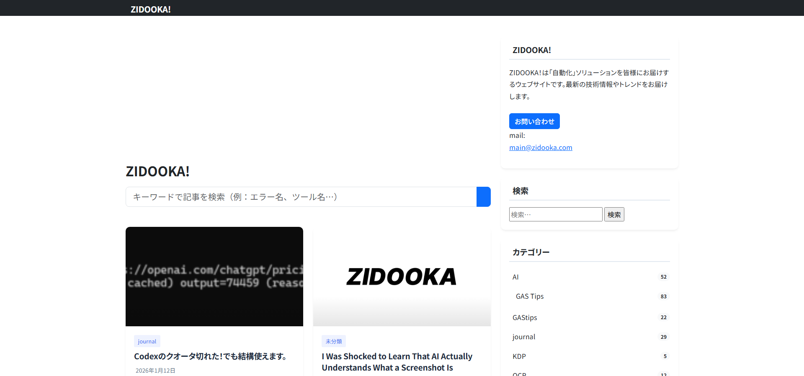

ブログ書いてると、スクリーンショット撮る作業、多くないですか？

「ここのボタンを押した後の画面を見せたい…」「毎回同じサイズで撮るの、地味にめんどくさい…」「手順書のスクショ、もう10枚目だよ…」

そんなあなたのためのツール、見つけちゃいました。
それが、Vercel Labsが作った **`agent-browser`** です！

これを使ったら、ブログ用のスクリーンショット作成が、驚くほど楽ちんになりました。マジで、ブログ運営がはかどりまくる予感しかしません！！！



## `agent-browser`って何者？

一言でいうと、「**コマンドでブラウザを操れるすごいやつ**」です。

[公式リポジトリはこちら (GitHub)](https://github.com/vercel-labs/agent-browser)

これまで手作業でやっていた、

- ページを開いて…
- マウスでカシャッと撮影して…
- ファイルに名前をつけて保存…

みたいな一連の流れを、ぜーんぶコマンドで自動化できるんです。

## まずは基本！これだけでも感動する

使い方はめちゃくちゃシンプル。

```powershell
# 1. 指定したページを開く
agent-browser open https://www.zidooka.com

# 2. PCサイズのでっかい画面に設定して
agent-browser set viewport 1920 900

# 3. パシャリ！
agent-browser screenshot "screenshot.png"

# 4. ブラウザを閉じる
agent-browser close
```

たったこれだけで、指定したサイズのきれいなスクリーンショットが手に入ります。もう手動でリサイズしたり、トリミングしたりする必要なし！

## こんなことも！あんなことも！自由自在なスクショ撮影

`agent-browser`の真骨頂はここからです。ただ撮るだけじゃないんです。

### ページの「全部」を撮りたい！
Webページの上から下まで、長〜いページ全体を1枚の画像にしたいこと、ありますよね？
`--full`オプションを付けるだけ！

```powershell
agent-browser screenshot "long-page.png" --full
```

### スマホ画面のスクショが欲しい！
スマホでの見え方を紹介したい時も、ビューポートを変えるだけ。

```powershell
# iPhone 13 Pro Maxのサイズに設定
agent-browser set viewport 428 926
agent-browser screenshot "iphone-view.png"
```

## 【激アツ】操作後の画面も撮れる！これが最強すぎる

`agent-browser`は、ただページを開くだけじゃありません。**クリックしたり、文字を入力したり**、人間みたいな操作ができるんです！

例えば、「検索ボックスに文字を入れて、検索ボタンを押した後の結果画面」を撮りたい場合…

```powershell
# 1. ページを開く
agent-browser open https://www.google.com

# 2. 「#APjFqb」っていうIDの要素（検索ボックス）に文字を入力
agent-browser type "#APjFqb" "agent-browser 最高"

# 3. 「input[name='btnK']」っていう要素（検索ボタン）をクリック
agent-browser click "input[name='btnK']"

# 4. 表示が安定するまでちょっと待って…
agent-browser sleep 1000

# 5. 検索結果画面をパシャリ！
agent-browser screenshot "search-result.png"
```

やばくないですか？
これ、つまり**ログイン後の会員ページ**とか、**ECサイトで商品をカートに入れた後の画面**とか、これまで手作業じゃないと無理だったスクリーンショットが、ぜんぶ自動で撮れるってことです。

## どうやって始めるの？

始めるのは簡単です。Node.jsが入っているPCなら、以下のコマンドを叩くだけ。

```powershell
# 1. agent-browserをインストール（最初の一回だけ）
npm install -g agent-browser

# 2. 操作用のブラウザをインストール（最初の一回だけ）
agent-browser install
```

あとはもう、あなたのアイデア次第でどんなスクリーンショットでも撮り放題です！

## まとめ：これはブログ運営の革命では…？

`agent-browser`は、ブログやWebサイト運営におけるスクリーンショット作成の手間を劇的に削減してくれる、まさに神ツールでした。

- **単純作業からの解放**
- **品質の均一化**
- **複雑な手順の自動化**

これだけのことがコマンド一つでできるなら、使わない手はないですよね。
さあ、`agent-browser`で面倒なスクショ作業を自動化して、もっと価値のあるコンテンツ作りに時間を使いましょう！
