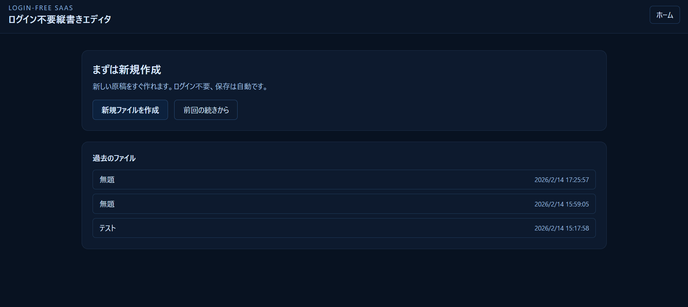
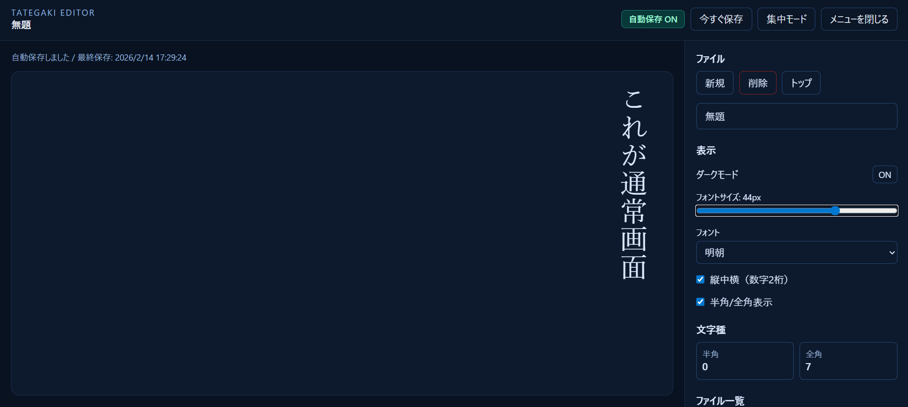
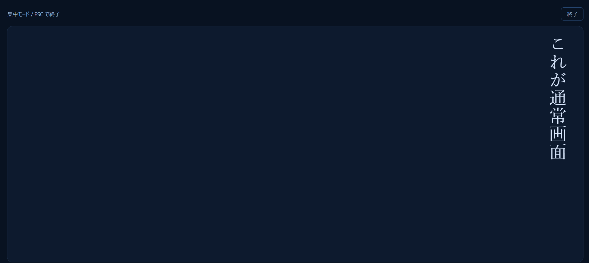

# 【新ツール】ログイン不要縦書きエディタをリリースしました

**本日、ZIDOOKA Toolsに新しいツールが仲間入りしました！**

「ログイン不要縦書きエディタ」——ブラウザを開くだけで、すぐに縦書きの文章が書ける、シンプルで本格的なエディタです。

## 🔗 ツールはこちら

**[ログイン不要縦書きエディタ](https://tools.zidooka.com/jp/tategaki-editor)**

---

## なぜ縦書きエディタを作ったのか

日本語には縦書きという美しい表現形式があります。小説、詩、手紙、そして現代のSNS投稿まで。縦書きにこそ相応しい文章は、インターネット上に無数に存在します。

しかし、今までの縦書きエディタにはいくつかの課題がありました：

- **アカウント登録が必要**で、気軽に使えない
- **保存が面倒**で、書いた文章が消えてしまう
- **縦書きの表示が不完全**で、本物の縦書き体験ができない

そこで私たちは、**「開いたらすぐ書ける」「勝手に保存してくれる」「美しい縦書きが楽しめる」**そんなエディタを作ることにしました。

---

## 主な機能

### ✅ ログイン不要

メールアドレスの登録も、パスワードの設定も不要。URLを開くだけで、即座に書き始められます。

### ✅ 自動保存（ブラウザ内）

書いている内容は**IndexedDB**に自動保存。ページを閉じても、ブラウザを閉じても、文章は消えません。次に開いた時には、前回の続きからすぐに再開できます。

※保存データはお使いのブラウザ内にのみ保存され、サーバーには送信されません。

### ✅ 美しい縦書き表示

CSSの `writing-mode: vertical-rl` を活用し、**本物の縦書き**を再現。文字は上から下へ、行は右から左へと自然に流れます。

### ✅ 縦中横（数字2桁対応）

「2026年」や「14日」のような数字も、縦書きの中で美しく表示できる「縦中横」機能に対応しています。

### ✅ 集中モード

「集中モード」をオンにすると、画面上の余計な要素がすべて消え、エディタだけが全画面に広がります。ESCキーで即座に戻れるので、安心して没頭できます。

### ✅ フォント選択

- 明朝
- ゴシック  
- 教科書風
- モダン

4種類のフォントから、文章に合った雰囲気を選べます。

---

## スクリーンショット

### トップページ
シンプルなダークブルーのインターフェース。新規作成ボタンを押すだけで、即座にエディタが開きます。過去に作成したファイルも一覧で確認・再開できます。

### 通常画面
右側に設定パネル、左側に縦書きエリアというレイアウト。フォントサイズやダークモードの切り替え、ファイル管理が簡単に行えます。「自動保存 ON」の表示が常に確認できるので、安心して書けます。

### 集中モード
全画面表示で、エディタだけに集中。メニューやボタンが消え、縦書きの文字が画面いっぱいに広がります。ESCキーまたは「終了」ボタンで通常画面に戻れます。

---

## どんな用途に使える？

- **小説・エッセイの執筆**
- **SNS投稿の下書き**（縦書きで書いて、コピペする）
- **詩の創作**
- **手紙・メッセージの作成**
- **日記・雑記**

---

## 今後の予定

この縦書きエディタは、今後も継続的に改善していく予定です。以下のような機能追加を検討中です：

- エクスポート機能（PDF、画像など）
- ショートカットキーの拡充
- スマートフォンでのさらなる最適化

---

## ぜひ使ってみてください

「ちょっと縦書きで何か書いてみたい」そんな時に、ぜひお使いください。

**[ログイン不要縦書きエディタはこちら](https://tools.zidooka.com/jp/tategaki-editor)**

フィードバックや改善リクエストもお待ちしています。SNSで **#zidooka** をつけて感想をつぶやいていただけると嬉しいです！

---

*2026年2月14日 ZIDOOKA Tools Team*
