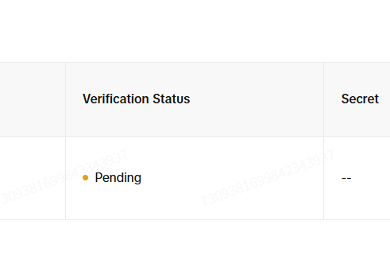

TikTokのAPI申請を出したあと、`Verification Status` がずっと `Pending` のままで少し不安になりました。  
2026年3月18日時点で公式に確認できる範囲を読むと、半日くらい `Pending` のままでも特におかしくありません。

:::conclusion
TikTok公式の案内では、アプリ審査は「数日から2週間」とされています。半日で `Pending` のままでも、急いで異常を疑う段階ではありません。
:::

## いま見えている状態

今回の状態はこんな感じです。

`Verification Status` が `Pending` のままだと、「申請が通っていないのか」「何か入力ミスがあったのか」と考えやすいです。  
ただ、少なくともこの時点で即NGと判断する材料にはなりません。

## 公式にはどれくらいかかると書いてあるか

TikTok公式の `App Review FAQ` では、審査期間について次のように案内されています。

- App review may take several days to two weeks after submission.

参照: [TikTok for Developers: App Review FAQ](https://developers.tiktok.com/doc/getting-started-faq)

:::note
2026年3月18日時点で公式に見える目安は「数日から2週間」です。半日や1日で動かなくても、その範囲内なら珍しくありません。
:::

## どこまで待てば不安になっていいか

体感ではなく、公式の文言に寄せて整理すると次の見方になります。

1. 半日から1日
まだ普通です。慌てて設定を全部疑う必要はありません。
2. 2日から数日
この段階でも公式目安の範囲内です。
3. 2週間前後
ここまで動かないなら、サポート連絡や申請内容の見直しを検討してよいタイミングです。

:::step
まずは2週間をひとつの目安にして、それまでは申請文・権限・リダイレクトURLなどを静かに再確認しつつ待つ、くらいが現実的です。
:::

## ステータスの意味も確認しておく

TikTok公式FAQでは、アプリの状態について次のように説明されています。

- `Draft`: まだ未提出
- `In review`: 審査中
- `Live`: 承認済み
- `Not approved`: 非承認。レビューコメントを確認して修正が必要

参照: [TikTok for Developers: App Review FAQ](https://developers.tiktok.com/doc/getting-started-faq)

今回の画面表示は `Pending` ですが、意味合いとしては「審査待ち」寄りで見てよさそうです。  
少なくとも、半日で `Pending` だから即失敗、とは読みません。

:::warning
TikTokの一般開発者向けFAQでは審査目安が公開されていますが、Marketing APIやBusiness APIの個別SLAが明確に公開されているわけではありません。実際の所要時間は前後する前提で見たほうが安全です。
:::

## 不安なときに先に見ておく場所

待っている間に確認しておくと無駄が減るのはこのあたりです。

- App description が用途と一致しているか
- Redirect URL が実際のURLと完全一致しているか
- 必要な scope だけに絞れているか
- 申請文で「何のために使うAPIか」が具体的に書けているか

もし最終的に承認されなかった場合は、TikTok公式FAQでもレビューコメントやサポート導線の確認が案内されています。

## まとめ

TikTok API申請後に `Pending` が続くと焦りますが、2026年3月18日時点の公式目安では、審査は数日から2週間です。  
半日で変化がなくても、まずは普通の範囲と見て大丈夫です。

:::conclusion
TikTok API申請で `Pending` のままでも、半日なら全く珍しくありません。公式目安の「数日から2週間」を基準に見たほうが落ち着いて判断できます。
:::
