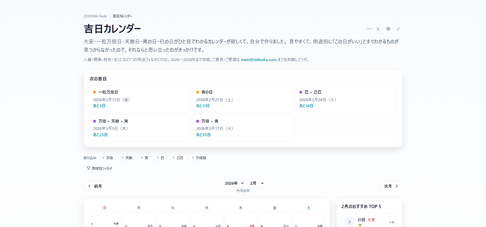

結婚式や引っ越し、開業など人生の節目に「縁起のいい日を選びたい」と考える方は多いのではないでしょうか。

2026年の**天赦日**や**一粒万倍日**の重複日を中心に、ZIDOOKAの吉日カレンダーで調べた結果をまとめました。大切な予定を立てるときの参考にしていただけるとうれしいです。

## 2026年の天赦日は全6回

天赦日は「天が万物の罪を赦す」とされる、暦の上で最上の吉日です。2026年は年間で**6回**あります。

:::example
**2026年 天赦日の一覧と重複ラベル**

- **3月5日（木）** ── 大安・一粒万倍日・寅の日と重複（年間最強日）
- **5月4日（月）** ── 友引・寅の日と重複
- **5月20日（水）** ── 先勝と重複（不成就日にあたるため注意）
- **7月19日（日）** ── 大安・一粒万倍日と重複（不成就日にあたるため注意）
- **10月1日（木）** ── 一粒万倍日と重複（仏滅にあたる点に留意）
- **12月16日（水）** ── 一粒万倍日と重複（赤口にあたる点に留意）
:::

天赦日のうち4回が一粒万倍日と重なっています。ただし、不成就日や仏滅と重なる日もあるため、日取りを選ぶ際にはほかのラベルも合わせて確認しておくのが安心です。

## 2026年で最も縁起がいい日はいつ？

**2026年3月5日（木）** は**大安・天赦日・一粒万倍日・寅の日**の4つが重なる、年間で最も縁起のいい日です。結婚や開業、財布の新調など、新しいスタートに最適な一日といえます。

:::warning
5月20日と7月19日の天赦日は**不成就日**と重なっています。不成就日は「何事も成就しにくい」とされる日です。天赦日の力で打ち消されるという考え方もありますが、気になる方は別の吉日を検討するとよいでしょう。
:::

## 四半期ごとの注目日ピックアップ

一年を通じて、各時期のおすすめ吉日をピックアップしました。

:::example
**Q1（1〜3月）のおすすめ**
- **1月1日（木）** ── 大安・一粒万倍日（元日から縁起よし）
- **3月5日（木）** ── 大安・天赦日・一粒万倍日・寅の日（年間ベスト）

**Q2（4〜6月）のおすすめ**
- **5月4日（月）** ── 天赦日・寅の日（GW中でスケジュールも組みやすい）
- **5月18日（日）** ── 大安・一粒万倍日

**Q3（7〜9月）のおすすめ**
- **7月31日（金）** ── 大安・一粒万倍日
- **9月14日（月）** ── 大安・一粒万倍日
- **9月26日（土）** ── 大安・一粒万倍日（週末で予定を組みやすい）

**Q4（10〜12月）のおすすめ**
- **12月15日（月）** ── 大安・一粒万倍日
- **12月27日（土）** ── 大安・一粒万倍日（年末の締めくくりに）
:::

## 吉日カレンダーで自分の予定に合う日を探す

ここで紹介したのは代表的な日だけですが、**一粒万倍日**だけでも年間50回以上あります。自分のスケジュールに合った吉日を探すなら、月ごとにラベルを確認できるツールが便利です。

:::note
ZIDOOKAの吉日カレンダーでは、月表示で天赦日・一粒万倍日・大安・寅の日・巳の日などのラベルをひと目で確認できます。気になる月をクリックするだけで、その月の吉日がすぐにわかるので、日取り選びの際にぜひ活用してみてください。

<https://tools.zidooka.com/jp/calendar>
:::

:::conclusion
2026年は天赦日が6回あり、そのうち**3月5日**は大安・一粒万倍日・寅の日も重なる年間最強の吉日です。大切な予定がある方は、この日を最有力候補として押さえておくことをおすすめします。

ただし、吉日はあくまで「背中を押してくれるきっかけ」です。迷ったときは吉日カレンダーでラベルを確認し、ご自身のスケジュールとのバランスで判断するのが一番実用的だと思います。
:::

## 参考リンク

- <https://tools.zidooka.com/jp/calendar>
