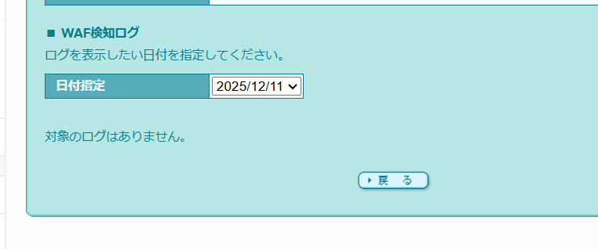

# Point: Check "SiteGuard" Before Blaming WAF

Hello, this is ZIDOOKA!
I recently encountered a **403 Forbidden** error while trying to upload images via the WordPress REST API.

I thought, "Oh, it's just the WAF (Web Application Firewall). Classic Lolipop hosting issue."
But when I checked the WAF logs... **there was nothing there.**

That's right. **The cause was NOT the WAF.**

# Reason: Security Plugins Block API Calls

Many shared hosting services (like Lolipop in Japan) come with **"SiteGuard WP Plugin"** pre-installed.
This plugin has features like **"Disable REST API"** or **"WAF Tuning Support"**, which can silently block external API connections.

# Example: Hunting Down the 403 Culprit

Here is what happened:

1.  Tried to upload an image via Node.js.
2.  Got `403 Forbidden`.
3.  Checked Lolipop WAF logs -> **No record**.
4.  Checked `.htaccess` -> No issues.

Then I checked the "SiteGuard" settings...

This was the culprit.
Specifically, settings that **restrict REST API access for non-logged-in users** can sometimes block connections even if you are using Application Passwords.

# Point: Don't Trust the Error Screen Blindly

Assuming "403 Error = WAF" is dangerous.
If you get stuck with API integrations or image uploads, check in this order:

# Update: When Disabling WAF Isn't Enough (2025/12/11)

Upon further investigation, I found cases where **the 403 error persisted even after completely disabling the WAF** (especially when posting English articles).
This suggests that **server-side spam filters** or other security layers separate from the standard WAF might be blocking specific keywords or large blocks of English text.

I was able to bypass this by using a **"Two-Step Posting Strategy"**:
1. Create an empty draft.
2. Update the draft with the full content.

Breaking the process down seems to help evade these strict security checks.

1.  **WAF** (Server Panel)
2.  **SiteGuard** (Plugin)
3.  **Directory Permissions** (755/644)

In my case, tweaking the SiteGuard settings solved the issue.
I hope this helps anyone stuck in the same trap!
