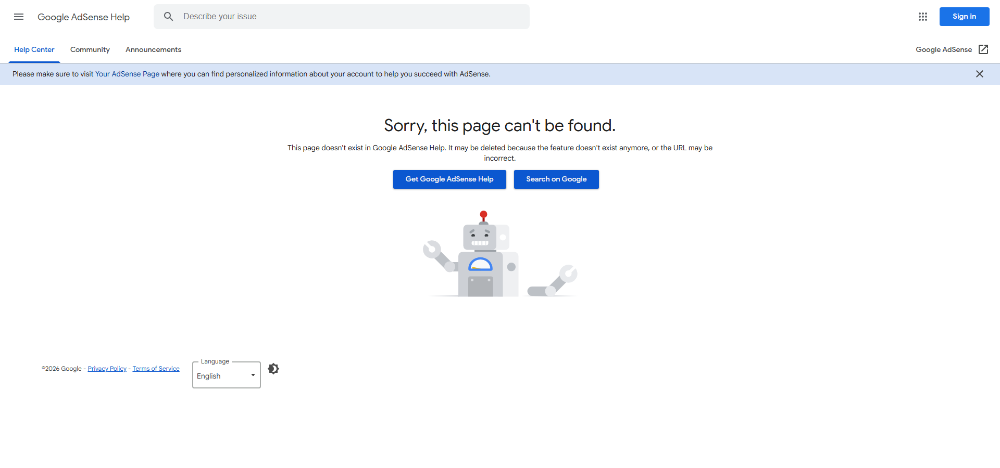

Google AdSenseからOfferwallに関するアップデート通知が届きました。今回の変更は「メールアドレス収集」の追加と「UX改善」の2点です。本記事では、この変更が何を意味し、どのようなサイトに適しているのかを整理します。

## 今回のアップデート内容

Offerwallは、一定の閲覧量を超えたユーザーに対して「広告視聴またはメール提供でコンテンツアクセス権を得る」という選択肢を提示する収益化機能です。

今回の主な変更は以下の2点です。

### 1. Email collection（メールアドレス収集）の追加

従来は「報酬型広告視聴（Rewarded ads）」のみでしたが、新たに「メールアドレスを提供してアクセス権を得る」選択肢が追加されました。

:::note
**メール収集を有効にすると**

- ユーザーは広告視聴の代わりにメール提供で解除できる
- Google側でフォーム管理が完結するため、サイト側のコード変更は不要
- 取得したメールはGoogle管理となり、独自のメーリングリストとして自由に使えるわけではない
:::

### 2. Dismiss rules（無視回数の制御）

ユーザーがOfferwallを何度まで閉じられるかを設定できる機能が追加されました。これによりUXの負荷を一定量まで緩和できます。

## この変更の背景にある意図

Googleはこのアップデートで何を目指しているのでしょうか。

### 収益モデルの多重化

単一の広告視聴モデルに依存せず、ユーザー属性に応じた異なる「価値交換」を提示できるようにしました。広告視聴に抵抗のある層からも収益機会を引き出す狙いがあります。

### コンプライアンス対応の明示化

メール収集はプライバシー規制（GDPR/CCPAなど）に抵触しやすいため、管理画面での適切な文言編集と目的提示が求められます。これは法令順守を意識させる設計でもあります。

### UX選択性の強化

従来の「ブロッキング型」広告は離脱率を高める懸念がありました。選択肢を増やすことで、ユーザーにとっての心理的負荷を軽減し、継続率の向上を目指しています。

## 導入すべきかどうかの判断基準

Offerwallは「高リピーター比率のサイト」で効果を発揮します。以下の条件に当てはまるか確認してください。

:::warning
**導入に慎重なケース**

- SEO流入が生命線の無料ツールサイト
- 月間UUが少なく、まだ認知拡大フェーズのサイト
- 「使ってもらって覚えてもらう」段階の新規サイト

これらでは、Offerwall導入によってクロール阻害や初回UX破壊のリスクが高まります。
:::

:::conclusion
**導入に適したケース**

- 学術データベースや連載系メディア
- 会員制の一歩手前の情報商材
- コミュニティ内ツールなど、内部回遊が多いページ

ただし、Metering（制限値）は深めに設定し（10〜20PV程度）、検索流入ページではなく内部回遊ページに限定することをおすすめします。
:::

## 代替案：自前でメール資産を持つ

Offerwallのメール収集はGoogle管理となるため、ニュースレター等のマーケティング資産として活用するには限界があります。メールリストを自前で構築したい場合は、以下の方法を検討してください。

- MailchimpやConvertKitなどのメール配信サービスを導入
- サイト内に独自のメルマガ登録フォームを設置
- コンテンツアップグレード（無料PDFなど）と引き換えにメール収集

この場合、完全なデータ主権を保持できますが、メンテナンスコストが発生します。

## まとめ

今回のOfferwallアップデートは、収益多様化とUX改善を同時に進める設計的な変更です。ただし、**「eCPMが高い」という魅力と引き換えに、ユーザー体験を損なうリスク**も存在します。

現段階でAdSense収益が十分でない場合や、SEO成長期にあるサイトでは、まずコンテンツ充実とアクセス拡大を優先し、収益最適化はその後のフェーズで検討するのが現実的です。

必要に応じて、URL限定（`/blog/`や`/essay/`のみ）で実験的に導入することは可能です。ただし、最終的な判断は「自サイトのユーザー行動データ」を見て行うことをおすすめします。

---

**関連記事**

- [AdSense マネタイゼーションのベストプラクティス](https://www.zidooka.com/adsense-monetization-guide/)
- [SEOと広告収益のバランス設計](https://www.zidooka.com/seo-ads-balance/)
