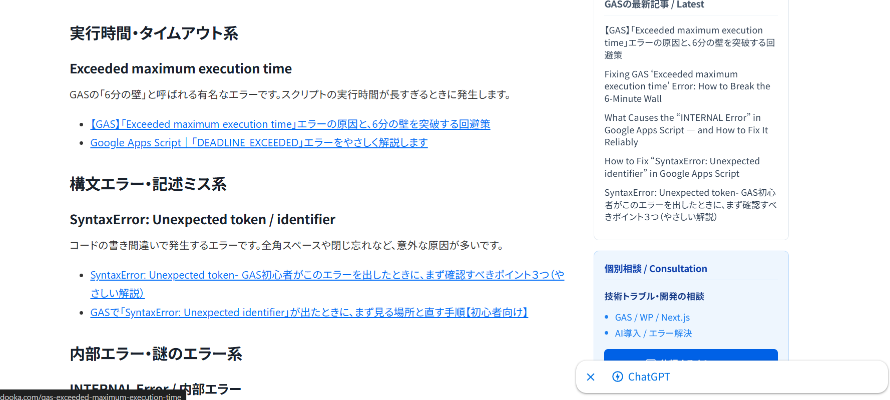

"I have too many articles, and the old ones are getting buried..."
"I want to create a 'Summary Article' to link related posts, but finding them is a pain..."

Every blog owner faces this dilemma.
At ZIDOOKA!, we dramatically streamlined this "muddy SEO work" by combining **AI Agents with custom CLI tools**.

Today, I'm sharing a next-generation SEO workflow: **"Export all posts to JSON, feed it to AI, and automatically generate & publish summary (hub) articles."**


## The Hell of Manual "Summary Creation"

Normally, creating a summary article for a specific theme (e.g., "GAS Errors") requires:

1.  Searching for "GAS" in the admin panel.
2.  Visually picking out error-related articles.
3.  Copy-pasting titles and URLs to make a list.
4.  Writing the article.

With nearly 300 articles, this alone takes hours. And you will miss things.

## The New "AI × CLI" Workflow

Here is the flow we implemented:

1.  **Export**: Dump all WordPress post data to JSON using REST API.
2.  **Analyze**: Pass the JSON to an AI (Copilot) and ask it to extract "GAS Error articles" and "ChatGPT Error articles".
3.  **Generate**: The AI writes the "Summary Article" in Markdown based on the extraction results.
4.  **Publish**: Instantly upload to WordPress using the CLI tool.

All the human did was "give instructions".
**Total time for 4 articles (JP/EN × 2 themes) was just a few minutes.**



### Step 1: JSON-ify All Articles

First, we use the method introduced in the previous article to export all WordPress post data as `all_posts.json`.
This JSON is packed with metadata like titles, slugs, categories, and tags.

### Step 2: Semantic Extraction by AI

This is where AI shines.
Instead of a simple keyword search (`grep`), we instruct the AI Agent:

> "Look at this JSON and pick out articles related to GAS error solutions and ChatGPT troubleshooting.
> List them up because I want to make summary articles for each."

The AI reads the JSON, judges the context from titles and slugs, and accurately classifies the articles.
It recognizes that "Exceeded maximum execution time" and "SyntaxError" are both "GAS Errors".

### Step 3: Auto-Generating the Hub Article

Once extracted, we let the AI write the article.

> "Using the extracted list, write a 'Summary Article' categorized to help users solve errors easily.
> Please do both Japanese and English versions."

The AI categorizes the list into "Execution Time Errors", "Syntax Errors", etc., adds explanatory text, and generates Markdown.

### Step 4: Instant Publish via CLI

Finally, we use our custom Node.js CLI tool to post the generated Markdown to WordPress.

```bash
node src/index.js post drafts/gas-error-summary-en.md
```

And just like that, a high-quality "Hub Content" filled with internal links is complete.

## Conclusion: SEO is becoming a "Collaboration with AI"

The biggest benefit of this workflow isn't just **"saving time"**.
It's **"rediscovering buried assets"**.

AI picks up past articles as data fairly, finding gems that humans might overlook.
As a result, the site's internal linking structure is strengthened, leading to better SEO evaluation (Topic Cluster formation).

The phase of "Managing & Utilizing Articles", not just "Writing Articles", is where AI Agents truly excel.
ZIDOOKA! will continue to share these **AI × WordPress** practical examples.
