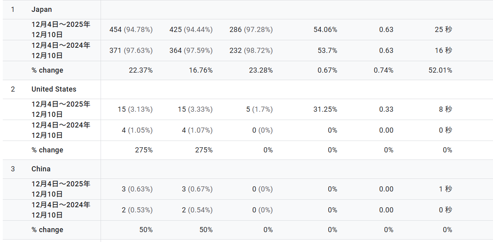

Google アナリティクスで国別トラフィックを見てみたところ、ちょっと面白い動きが出ていました。

まず、日本からのアクセスは相変わらず全体の大半を占めつつも、
前年比で **+22%** としっかり伸びている状態。エンゲージメント時間も **16秒 → 25秒** に増えていて、技術系の記事をじっくり読む読者が増えている印象です。

一方で、アメリカの動きがかなり顕著でした。
**4 → 15（+275%）** と大幅に増加。
最近、英語併記で書いているエラー解決系の記事が増えてきたので、その影響が出ている感じがあります。まだ母数は小さいですが、海外検索で拾われ始めるタイミングはだいたいこんな動きになるので、これから楽しくなってきそう。

中国も 2 → 3 と微増。インドネシア、スウェーデン、ドイツ、シンガポールといった国からも少数ながら新規でアクセスが入ってきていて、サイト全体の評価が外側に広がりつつあるのを感じました。

まだ小さな変化だけれど、技術ドキュメントやエラー解決記事が多国籍の読者にも届き始めているのは、今後の方向性として一つのヒントになりそう。英語部分のクオリティをもう少し整えていけば、さらに広がる予感があります。

とりあえずのメモとして。
