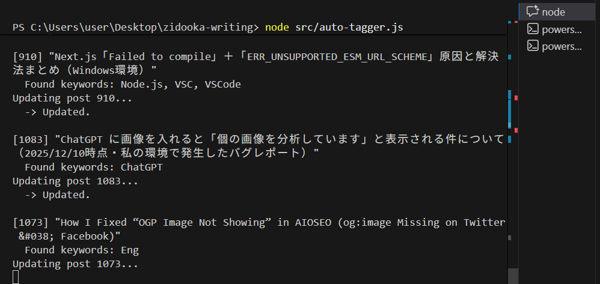

# 結論：タグ付けは人間がやる仕事じゃない

こんにちは、ZIDOOKA! です。
今回は **「WordPressの過去記事へのタグ付けを、Node.jsスクリプトで完全自動化した」** という話をします。

結論から言うと、**タグ管理はスクリプトに任せるべき** です。手動でやる必要は1ミリもありません。

## 理由：時間の無駄＆抜け漏れの温床だから

なぜそう言い切れるのか？理由はシンプルです。

1.  **時間がかかりすぎる**: 100記事あったら、100回編集画面を開く必要があります。1記事1分でも1時間半の損失です。
2.  **正確性に欠ける**: 人間は忘れます。「あ、この記事に『VS Code』タグ付け忘れた」というミスは必ず起きます。

ブログ運営において、時間は「執筆」に使うべきであり、「管理」に使うべきではありません。

## 具体例：Node.js × REST API × タスクスケジューラ

そこで私は、以下の仕組みを構築しました。

### 1. 自動タグ付けスクリプト (Node.js)

「記事の本文をスキャンし、既存のタグ名が含まれていたら、API経由でタグを付与する」というスクリプト `auto-tagger.js` を作成しました。

```javascript
// 記事本文と全タグを照合するロジック（抜粋）
for (const tag of allTags) {
  if (content.includes(tag.name.toLowerCase())) {
    // タグが含まれているのに、まだ付与されていない場合
    if (!currentTagIds.includes(tag.id)) {
      await wp.addTagToPost(post.id, tag.id);
    }
  }
}
```

### 2. Windows タスクスケジューラで定期実行

さらに、このスクリプトを Windows の **タスクスケジューラ** に登録しました。
これで、私が寝ている間でも、PCが勝手にサイトを巡回してタグを整理してくれます。



この画像のように、PowerShell経由でスクリプトを定期的に叩くだけです。

## 結論：自動化で「書くこと」に集中しよう

この仕組みを導入してから、タグ付けのことを一切考えなくて済むようになりました。
新しい記事を書いても、過去の記事をリライトしても、スクリプトが勝手に整合性を取ってくれます。

**「面倒なことは全部スクリプトにやらせる」**
これが ZIDOOKA! 流のブログ運営術です。

皆さんも、単純作業はどんどん自動化して、クリエイティブな時間を確保しましょう！
