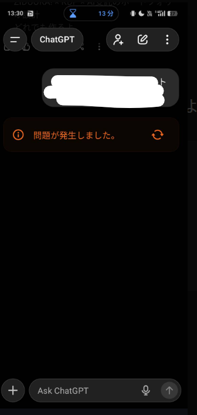

# 結論：まずは「再読み込み」か「モデル切り替え」を試そう

こんにちは、ZIDOOKA! です。
2025年12月現在、Android/iOS版のChatGPTアプリを使っていると、会話の途中で突然 **「問題が発生しました。↻」** というエラーが表示される現象が多発しています。

結論から言うと、これは **「通信の一瞬の途切れ」** や **「サーバー側の混雑」** が主な原因です。
深刻なバグではないことが多いので、まずは落ち着いて以下の対処法を試してください。

# 理由：なぜこのエラーが出るのか？

このエラーは、アプリがサーバーからの応答を受け取れなかったときに表示されます。
具体的には以下のタイミングでよく発生します。

1.  **ネットワークの瞬断**: 電車での移動中や、Wi-Fiとモバイルデータが切り替わる瞬間など。
2.  **モデルの切り替え直後**: 例えば `GPT-4o` から `o1` へ切り替えた直後など、セッションの状態が不一致になったとき。
3.  **サーバー混雑**: 世界中でアクセスが集中している時間帯。

特に最近（2025年12月）は、新モデルの追加やアップデートに伴い、アプリ側の挙動が少し不安定になることがあるようです。

# 具体例：5つの対処ステップ

エラーが出たときは、以下の順に対処してみてください。

## 1. 更新ボタン（↻）をタップする
エラーメッセージの横にある矢印マークをタップします。単純な通信エラーなら、これで再生成が始まります。

## 2. モデルを切り替えてみる
画面上部のモデル選択（例: `GPT-4o` → `GPT-4o mini` など）を一度別のものに変えてから、元のモデルに戻してみてください。これでセッションがリセットされ、直ることがあります。

## 3. 通信環境を変える
Wi-Fiを使っているならモバイルデータ（4G/5G）へ、逆にモバイルデータならWi-Fiへ切り替えてみてください。

## 4. アプリを再起動する
タスクキル（アプリを完全に終了）して、もう一度立ち上げ直します。メモリ不足などが原因の場合はこれで解消します。

## 5. Web版（ブラウザ）を使う
どうしてもアプリが動かないときは、ChromeやSafariで [chatgpt.com](https://chatgpt.com) にアクセスしましょう。アプリ固有の不具合であれば、Web版なら問題なく使えるはずです。

# まとめ

「問題が発生しました。」というエラーは、ChatGPTアプリ特有の汎用的なエラーメッセージです。
スマホの故障やアカウントBANではありませんのでご安心ください。

**発生環境:**
*   日時: 2025年12月11日
*   環境: Android版 ChatGPT公式アプリ
*   状況: モデル切り替え時およびネットワーク不安定時に頻発

もし頻繁に起こる場合は、アプリのアップデートが来ていないかストアを確認することをおすすめします。
