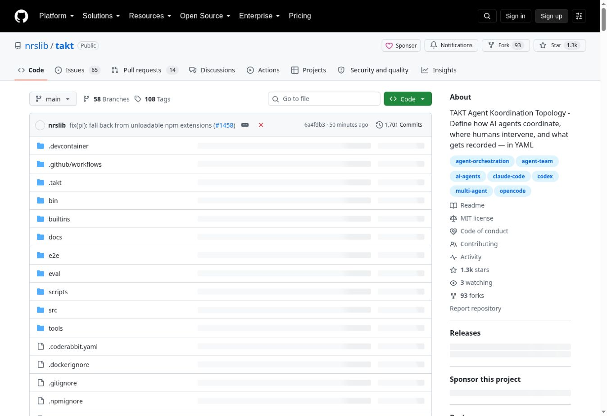

GitHubで[nrslib/takt](https://github.com/nrslib/takt)を見つけました。名前だけでは用途が分かりにくいのですが、これはCodexやClaude Codeの代替ではありません。**CodexやClaude Codeを作業員として使い、その外側で計画・実装・レビュー・修正の順番を管理するOSSのCLI**です。

:::conclusion
TAKTは、AIに「ちゃんとレビューして」とお願いするツールではなく、レビューを通らなければ完了できない開発工程をYAMLで組むツールです。AIがコードを書き、TAKTが次に誰を動かすかを決めます。
:::



## ひとことで言えば「AI開発の工程管理エンジン」

通常のAIコーディングでは、一つの長いセッションに要件整理、実装、テスト、レビュー、修正を全部やらせがちです。ところが作業が長くなると、最初の制約を忘れたり、実装した本人が自分の変更を甘くレビューしたり、途中でレビュー工程そのものが抜けたりします。

TAKTは、この問題をプロンプトの工夫だけで解こうとしません。工程をAIの外側へ出し、次のようなワークフローとして固定します。

1. Plannerが要件と実装方針を整理する
2. Coderがコードを変更する
3. Reviewerが変更を読む
4. 問題があればCoderへ戻す
5. 承認されたら完了する
6. 判断できない点だけ人間へ戻す

各工程には、別のペルソナ、指示、参照知識、編集権限、出力形式を設定できます。同じモデルを役割別に呼び分けることも、Codex、Claude、Cursorなど異なるプロバイダーを組み合わせることもできます。

## YAMLが「次に何をするか」を決める

最小構成の考え方は次のようなものです。

```yaml
name: plan-implement-review
initial_step: plan
max_steps: 10

steps:
  - name: plan
    persona: planner
    edit: false
    rules:
      - condition: Planning complete
        next: implement

  - name: implement
    persona: coder
    edit: true
    rules:
      - condition: Implementation complete
        next: review

  - name: review
    persona: reviewer
    edit: false
    rules:
      - condition: Approved
        next: COMPLETE
      - condition: Needs fix
        next: implement
```

重要なのは、AIが自由に「もう終わり」と決めるのではなく、レビュー結果に応じてワークフローが次の工程を選ぶことです。レビューで問題が出れば実装へ戻り、承認されれば `COMPLETE` になります。

:::note
`CLAUDE.md`、`AGENTS.md`、スキルは「どう振る舞うべきか」をAIへ伝えます。TAKTのYAMLは、それに加えて「どの工程を通り、どの条件で戻るか」を実行時に制御します。
:::

## 実際にはどう使うのか

TAKTはWebサービスではなく、Gitリポジトリ内で動かすローカルCLIです。基本の流れはかなり分かりやすいです。

```bash
npm install -g takt

# AIと相談し、/go で要件を固めてタスクに積む
takt

# タスクを実行する
takt run

# 差分確認、追加指示、マージ、再実行、削除を管理する
takt list
```

`takt` を起動すると、AIと会話しながら要求を整理できます。`/go` で指示を確定し、「タスクにつむ」を選ぶとキューに保存されます。`takt run` を実行すると、通常はタスクごとに隔離されたGit worktreeが作られ、その中で計画、実装、レビュー、修正ループが進みます。

完了後は `takt list` から差分を確認し、追加指示、マージ、リトライ、リキュー、ブランチ削除などを選べます。GitHub CLIを用意すれば、Issue番号を `takt add #12` のように渡し、Issueの本文やコメントを実装タスクにできます。常駐する `takt watch` でpendingタスクを自動実行する運用も可能です。

## 何が便利なのか

### 1. レビュー工程を飛ばしにくい

「実装したら別の役割がレビューし、不合格なら戻す」という構造をワークフローにできます。人間が画面の前で毎回「次はテストして」「その指摘を直して」と言い続ける必要を減らせます。

### 2. コンテキストを工程ごとに分けられる

Plannerには要件、Coderには実装情報、Reviewerには差分と評価基準というように、必要な情報だけを渡せます。一つの会話へすべてを詰め込むより、役割の混線とコンテキスト肥大化を抑えやすくなります。

### 3. 複数タスクを安全に積みやすい

タスクごとにworktreeを分けるため、複数の変更が同じ作業ディレクトリで混ざる危険を下げられます。Issueをいくつも積み、順に処理させたい運用と相性がよいです。

### 4. 後から追跡できる

各stepの結果、セッション、トレース、レポートが `.takt/runs/` などへ残ります。「どの指示で、どのレビューを受け、なぜ修正へ戻ったか」を確認できます。

:::example
「Issueを実装して終わり」ではなく、要件整理、実装、セキュリティレビュー、テストレビュー、修正、最終確認を一つの再利用可能な型にできます。同種のリポジトリ作業を繰り返すほど、TAKTの価値が出ます。
:::

## 対応するAI

2026年8月22日時点のREADMEでは、Claude Code、Claude Agent SDK、OpenAI Codex SDK、OpenCode SDK、Pi SDK、DeepSeek Harness SDK、Cursor Agent、GitHub Copilot CLI、Kiro CLIなどに対応しています。

SDK経由の `codex`、`claude-sdk`、`opencode`、`pi` は、対応する認証情報があれば外部CLIなしで利用できます。CLI経由のプロバイダーは、それぞれのCLIのインストールが必要です。プロバイダーやstepごとにモデルを変えるルーティングも設定できます。

:::warning
TAKT本体はMITライセンスのOSSですが、AIモデルの利用料金まで無料になるわけではありません。複数の計画・実装・レビュー工程を回すぶん、単発のエージェント実行よりトークン消費、時間、API費用が増える可能性があります。各プロバイダーの料金と利用規約は別途確認が必要です。
:::

## 導入条件

TAKT 0.60.0の `package.json` では、Node.js 22.22.0以上が必要です。また、少なくとも一度commitしたGitリポジトリで始めることが推奨されています。

必要になるものは次の通りです。

- Node.js 22.22.0以上
- Gitリポジトリと最低1回のcommit
- 利用するAIプロバイダーの認証情報、または対応CLI
- GitHub Issue連携を使う場合はGitHub CLI
- GitLab Issue／MR連携を使う場合はGitLab CLI

## 向いている場面、向いていない場面

TAKTが向いているのは、複数工程を毎回同じ基準で回したい作業です。

- Issueを継続的に実装する
- 実装者とレビュワーの役割を分けたい
- テストやレビューを完了条件にしたい
- 複数タスクをworktreeで隔離したい
- 実行履歴と判断の根拠を残したい
- 複数のAIプロバイダーを役割別に使いたい

一方、数行だけ直したい、対話しながらすぐ方向を変えたい、API費用を最小化したい、という場合は通常のCodexやClaude Codeを直接使う方が軽快です。ワークフローのYAML自体を設計・保守する手間もあります。

:::conclusion
TAKTは「もっと賢いコーディングAI」ではなく、「AIコーディングを属人的なチャットから、再利用できる開発工程へ変える」ための道具です。大量のIssueを積んでレビューまで回す運用にはかなり面白そうですが、小さな修正まで何でもTAKTに通す必要はありません。まずは一つの既存リポジトリで `simple` や軽量な `*-mini` ワークフローを試し、直接AIを動かす場合との差を見るのがよさそうです。
:::

なお、2026年8月22日時点で `package.json` のバージョンは0.60.0で、GitHub Releasesには正式なリリース項目がありません。開発の動きが速いため、導入時には最新READMEと設定ガイドを確認してください。

- [TAKTの日本語README](https://github.com/nrslib/takt/blob/main/docs/README.ja.md)
- [TAKTの日本語チュートリアル](https://github.com/nrslib/takt/blob/main/docs/tutorial.ja.md)
- [TAKTのWorkflow Guide](https://github.com/nrslib/takt/blob/main/docs/workflows.ja.md)
- [TAKTのpackage.json](https://github.com/nrslib/takt/blob/main/package.json)
- [TAKTのMITライセンス](https://github.com/nrslib/takt/blob/main/LICENSE)
