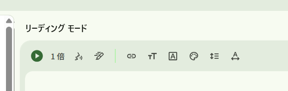

I stumbled upon "Reading Mode" while messing around with Chrome.
I tried it out, and it was incredibly convenient for reading articles, so I'm sharing it.

## What is Chrome's "Reading Mode"?

Chrome's **Reading Mode** is a feature that removes ads, sidebars, and unnecessary UI from web pages, displaying only the main text in an easy-to-read format.
Think of it as a "Focus Mode" specialized for viewing articles, blogs, and technical documents.

### What can it do? (Main Features)

*   **Extract & Display Text Only**: Hides ads, related articles, comments, and navigation.
*   **Change Text Size**: Make it larger to read long texts comfortably.
*   **Change Font**: Switch to Serif/Sans-serif or other readable fonts.
*   **Switch Background Color**: Supports White, Sepia, and Dark Mode.
*   **Stable Display**: Less layout shifting or flickering.

*Note: Videos and interactive elements are generally not displayed.*

## How to Use

### Method 1: Icon in the Address Bar (Supported Pages Only)

1.  Open an article page.
2.  Click the book-like icon if it appears on the right side of the address bar.
3.  It switches to Reading Mode.

*Note: It doesn't appear on all pages (only when Chrome recognizes the article structure).*

### Method 2: Pin from Side Panel (Recommended)

Once you have Reading Mode open, you can pin it to your toolbar for easy access.

1.  Open Reading Mode (via right-click or address bar).
2.  Click the **"Pin" icon** in the top right of the side panel.

Now, the "Reading Mode" button will stay on your toolbar. You can toggle it with a single click.

*Note: The option often doesn't appear in the Chrome Settings menu, so this method is more reliable.*

### Method 3: From Right-Click (Depends on Environment)

Right-click on the page text → "Open in Reading Mode"
(This may not appear in some environments).

## Controls in Reading Mode

You can customize it to your liking with the toolbar at the top of the screen.

*   **Aa (Text Settings)**: Font size, Font type
*   **Background Color**: White / Sepia / Dark

The "Read Aloud" feature is surprisingly useful.
You can listen to long articles like a radio, making it great for "listening while working".

## Who is this for?

*   People reading technical articles, papers, or long blogs.
*   People who want to focus on sites with many ads.
*   People who want to reduce eye strain (Dark/Sepia).

## Points to Note / Limitations

*   Often unusable on EC sites or admin panels.
*   Tables and code blocks may be simplified.
*   Comments and related articles cannot be read.

## In a Nutshell

If you want to concentrate solely on "reading", this is one of the strongest standard features in Chrome.
Especially for those reading technical or academic long-form texts, there's no loss in keeping it ON.
