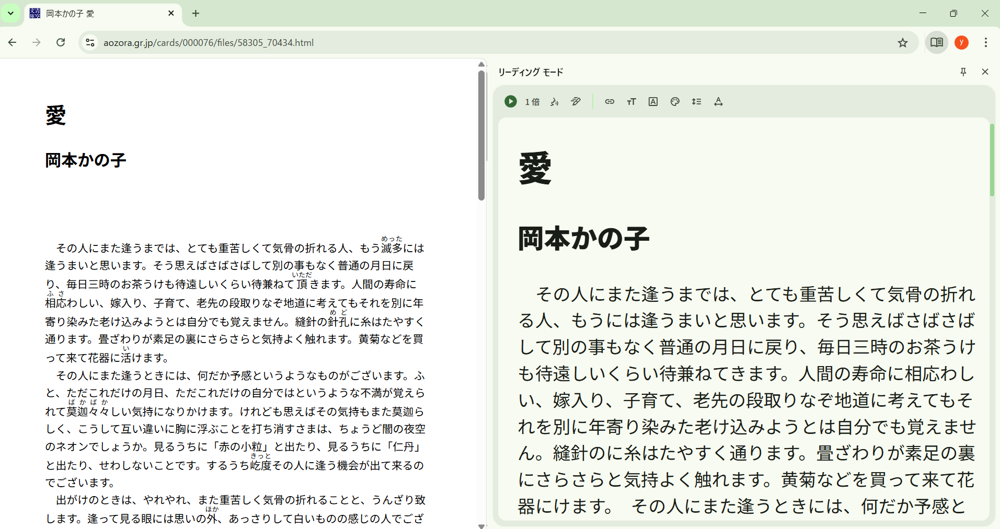
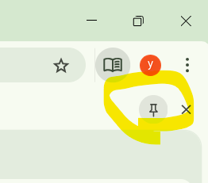
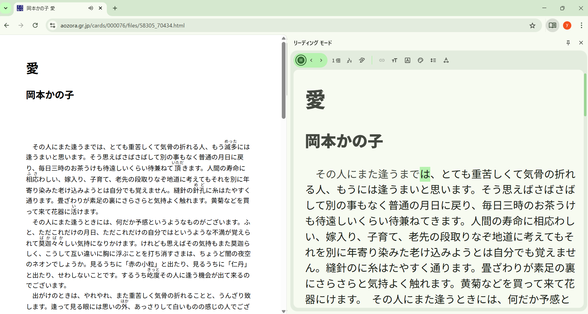

たまたまChromeをいじっていて「リーディングモード」なるものを見つけました。
使ってみたら、これが記事を読むのにめちゃくちゃ便利だったのでシェアします。

## Chromeの「リーディングモード」とは？

Chromeの**リーディングモード（Reading Mode）**は、Webページから広告・サイドバー・余計なUIを取り除き、本文だけを読みやすく表示する機能です。
記事・ブログ・技術ドキュメントの閲覧に特化した“集中モード”と考えると分かりやすいです。

### 何ができる？（主な機能）

*   **本文だけを抽出表示**: 広告、関連記事、コメント欄、ナビゲーションを非表示に。
*   **文字サイズの変更**: 大きくして長文を楽に読める。
*   **フォント変更**: 明朝／ゴシック系など、読みやすい書体に切り替え。
*   **背景色の切り替え**: 白背景・セピア・ダークモードに対応。
*   **ページ構造を無視して安定表示**: レイアウト崩れやチラつきが起きにくい。

※ 動画やインタラクティブ要素は基本的に表示されません。

## 使い方（操作方法）

### 方法①：アドレスバー右のアイコン（対応ページのみ）

1.  記事ページを開く
2.  アドレスバー右側に本のようなアイコンが表示されたらクリック
3.  リーディングモードに切り替わる

※ すべてのページで出るわけではありません（記事構造をChromeが認識できた場合のみ）。

### 方法②：サイドパネルから「固定」する（おすすめ）

一度リーディングモードを開いた状態で、パネルの右上にある「ピン留めアイコン」をクリックすると、ツールバーに常設できます。

1.  何らかの方法（右クリックなど）でリーディングモードを開く
2.  サイドパネル右上の「ピン（固定）」アイコンをクリック

これで、ツールバーに「リーディングモード」ボタンが常設されます。次回からはワンクリックで呼び出せます。

※ 設定画面（`chrome://settings/appearance`）には項目がない場合が多いので、この方法が確実です。

### 方法③：右クリックから（環境による）

ページ本文を右クリック → 「リーディングモードで開く」
（表示されない環境もあります）

## リーディングモード画面での操作

画面上部のツールバーで、自分好みにカスタマイズできます。

*   **Aa（テキスト設定）**: フォントサイズ、フォント種類
*   **背景色**: 白／セピア／ダーク

地味に便利なのが「読み上げ機能」です。
長い記事をラジオ感覚で聞けるので、作業中の「ながら聴き」にも使えます。

## どんな人に向いてる？

*   技術記事・論文・長文ブログを読む人
*   広告が多いサイトで集中したい人
*   目の疲れを減らしたい人（ダーク・セピア）

## 注意点・できないこと

*   ECサイトや管理画面では使えないことが多い
*   表・コードブロックが簡略化される場合あり
*   コメント欄や関連記事は読めない

## ひとことで

「読む」ことだけに集中したいなら、Chrome標準で最強クラスの機能です。
特に技術系・学術系の長文を読む人には、常時ONにして損はありません。
