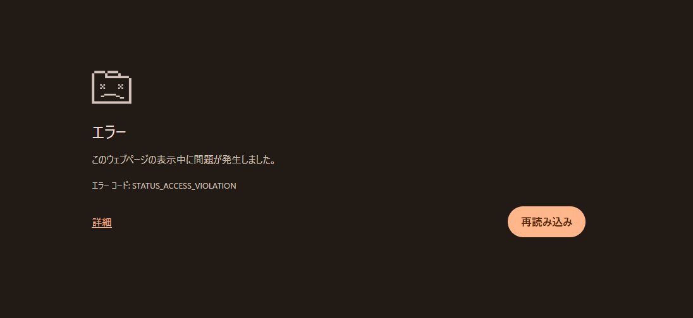

Chrome（またはEdge）で次のエラーが出ました。

`エラー コード: STATUS_ACCESS_VIOLATION`

このエラーは、ブラウザのタブ描画プロセスがクラッシュしたときに出ることが多いです。
今回のように「メモリを増設した直後」なら、メモリ起因の不安定さも十分ありえます。

## まず結論

増設後にこのエラーが増えたなら、以下の順で切り分けるのが早いです。

1. メモリを挿し直す
2. BIOSでXMP/EXPOをいったんOFF（定格で動かす）
3. Windowsメモリ診断 or MemTest86で検査
4. 追加したメモリを外して再現するか確認

4で症状が消えるなら、追加メモリ側の相性・初期不良・設定過多の可能性が高いです。

## STATUS_ACCESS_VIOLATIONの主な原因

メモリ以外にも、次の要因で発生します。

- 拡張機能の競合
- GPUアクセラレーションとドライバの相性
- ブラウザ更新不整合やキャッシュ破損
- 特定サイト側の重いスクリプト

なので、メモリ増設直後でも「絶対にメモリが原因」とは限りません。
ただし、タイミングが一致しているなら優先してメモリを疑うのは合理的です。

## すぐできる切り分け（ブラウザ側）

1. シークレットモードで再現するか確認
2. 拡張機能を全OFFにして確認
3. ハードウェアアクセラレーションをOFF
4. ブラウザを最新に更新

これで改善するなら、メモリ以外（拡張/ドライバ/ブラウザ設定）要因の可能性が上がります。

## メモリ増設後に見るべきポイント

- メモリが最後まで刺さっているか（ラッチが完全に閉じているか）
- 混在構成（メーカー・ロット・チップ構成違い）がないか
- 定格を超えるプロファイル設定になっていないか

特に「普段は動くけど、たまにブラウザだけ落ちる」状態は、軽い不安定の初期症状として出ることがあります。

## MemTest86はなぜ有効？

Windows上の通常利用だけでは、微妙なメモリエラーを見落とすことがあります。
MemTest86はUSBブートでOS外からチェックできるため、切り分け精度が高いです。

- まずは1 passでざっくり確認
- 本格検証は4 pass以上

## まとめ

`STATUS_ACCESS_VIOLATION` は「ブラウザが落ちた」結果であって、原因そのものではありません。

ただし、増設メモリの直後に発生し始めたなら、メモリ設定/相性を先に潰すのが最短です。
ブラウザ側の設定確認と並行して、メモリを定格に戻して検証してみてください。
