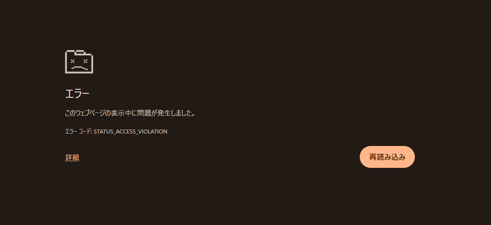

Chrome（またはEdge）で次のエラーが出ました。

`エラー コード: STATUS_ACCESS_VIOLATION`

これは、ざっくり言うと「ブラウザの中の処理が、本来触ってはいけないメモリ領域に触ろうとして落ちた」という種類のエラーです。

ChromeやEdgeでは、タブごとに分かれている描画プロセス、JavaScript実行、GPUまわり、拡張機能などのどこかがクラッシュしたときに、この画面が出ることがあります。

今回のように「メモリを交換した・増設した直後」に出ているなら、ブラウザだけの問題として片づけず、RAM側の不安定さもかなり疑ったほうがいいです。

## まず結論

:::conclusion
`STATUS_ACCESS_VIOLATION` は、Chrome/Edgeのタブがメモリアクセス違反で落ちたという結果です。メモリ交換後に出始めたなら、拡張機能やGPU設定より先に、RAMの挿し直し・XMP/EXPO解除・メモリ診断を確認したほうが早いです。
:::

メモリ交換後にこのエラーが増えたなら、以下の順で切り分けるのが早いです。

1. メモリを挿し直す
2. BIOSでXMP/EXPOをいったんOFF（定格で動かす）
3. Windowsメモリ診断 or MemTest86で検査
4. 追加したメモリを外して再現するか確認
5. 問題が消えるなら、メモリの相性・初期不良・設定過多を疑う

4で症状が消えるなら、追加メモリ側、または交換後のメモリ設定に原因がある可能性が高いです。

## 何が起きているのか

`STATUS_ACCESS_VIOLATION` は、Windowsではアクセス違反系のクラッシュとして扱われます。

ブラウザで出る場合、Chrome本体が丸ごと落ちるというより、開いているタブや描画プロセスが落ちて「このウェブページの表示中に問題が発生しました」という画面になります。

原因はひとつではありません。

- ブラウザの拡張機能が悪さをしている
- GPUアクセラレーションやグラフィックドライバと相性が悪い
- 特定サイトのJavaScriptやWebAssemblyが重い
- Chrome/Edgeのキャッシュやプロファイルが壊れている
- RAMが不安定で、読み書きのどこかで失敗している

この中で、メモリ交換直後に急に出るようになった場合は、最後の「RAMが不安定」を優先的に潰すべきです。

## メモリ交換後に特に疑うこと

メモリは、完全に壊れていなくても不安定になることがあります。

たとえば、普段のデスクトップ操作は普通に動くのに、Chromeでタブをたくさん開いたとき、動画や管理画面を開いたとき、重いWebアプリを使ったときだけ落ちる、という出方をします。

この場合、見た目は「Chromeのエラー」ですが、実際にはメモリまわりの小さな不安定さが表面化していることがあります。

確認したいのは次の点です。

- メモリがスロットの奥まで完全に刺さっているか
- ラッチが左右とも閉じているか
- 推奨スロットに刺しているか
- 旧メモリと新メモリを混在させていないか
- 容量・速度・タイミングの違うメモリを混ぜていないか
- BIOSでXMP/EXPOが有効になっていないか
- メモリ交換後にBIOS設定が自動で攻めた値になっていないか

特にXMP/EXPOは、まずOFFにして定格で動かすのが安全です。

「せっかく速いメモリを買ったのに」と思うかもしれませんが、切り分けでは性能より安定性を優先します。定格で安定するなら、原因はメモリ本体ではなく設定側かもしれません。

## STATUS_ACCESS_VIOLATIONの主な原因

メモリ以外にも、次の要因で発生します。

- 拡張機能の競合
- GPUアクセラレーションとドライバの相性
- ブラウザ更新不整合やキャッシュ破損
- 特定サイト側の重いスクリプト

なので、メモリ増設直後でも「絶対にメモリが原因」とは限りません。
ただし、タイミングが一致しているなら優先してメモリを疑うのは合理的です。

## すぐできる切り分け

まずは危険度の低いところから確認します。

1. Chrome/Edgeを再起動する
2. Windowsを再起動する
3. シークレットモードで再現するか確認する
4. 拡張機能をすべてOFFにして確認する
5. ハードウェアアクセラレーションをOFFにする
6. ブラウザを最新に更新する
7. 別ブラウザでも同じページが落ちるか確認する

これで改善するなら、メモリ以外（拡張/ドライバ/ブラウザ設定）要因の可能性が上がります。

ただし、メモリ交換後に複数のサイトでランダムに出るなら、ブラウザ側だけで完結させないほうがいいです。

## メモリ側の切り分け手順

メモリ交換に心当たりがあるなら、次の順で確認します。

### 1. いったん挿し直す

PCの電源を落とし、電源ケーブルを抜いてからメモリを挿し直します。

軽く刺さっているように見えても、片側だけ甘いことがあります。ラッチが完全に閉じているか確認します。

### 2. XMP/EXPOをOFFにする

BIOS/UEFIでXMPまたはEXPOが有効なら、まずOFFにして定格で動かします。

これで安定するなら、メモリ本体の故障ではなく、速度・電圧・タイミング設定の問題かもしれません。

### 3. Windowsメモリ診断を走らせる

Windows標準のメモリ診断は、`mdsched.exe` で起動できます。

スタートメニューで `mdsched` と入力して、再起動してチェックします。

### 4. 可能ならMemTest86で確認する

Windows上の診断で何も出なくても、不安定さが残る場合があります。

時間が取れるなら、USB起動のMemTest86で確認するほうが切り分け精度は上がります。

### 5. 1枚ずつ確認する

複数枚のメモリを使っている場合は、1枚ずつ起動して再現するか確認します。

特定の1枚でだけ落ちるなら、そのメモリの不良や相性を疑います。特定のスロットでだけ落ちるなら、マザーボード側や挿し方の問題も考えます。

## MemTest86はなぜ有効？

Windows上の通常利用だけでは、微妙なメモリエラーを見落とすことがあります。
MemTest86はUSBブートでOS外からチェックできるため、切り分け精度が高いです。

- まずは1 passでざっくり確認
- 本格検証は4 pass以上

エラーが1件でも出るなら、その状態で常用しないほうがいいです。ブラウザが落ちるだけでなく、ファイル破損や作業データの破損につながる可能性があります。

## ブラウザ側で試す設定

メモリ側に問題がなさそうなら、ブラウザ側を見ます。

### 拡張機能を全部OFF

広告ブロッカー、翻訳、スクリーンショット、開発者向け拡張などは、ページの描画やJavaScriptに干渉することがあります。

まず全部OFFにして、再現するか確認します。

### ハードウェアアクセラレーションをOFF

Chrome/Edgeの設定でハードウェアアクセラレーションをOFFにします。

GPUドライバや描画まわりの相性で落ちている場合、これで改善することがあります。

### 新しいプロファイルで試す

Chromeのユーザープロファイルが壊れている場合もあります。

ブックマークや拡張機能を大量に入れた通常プロファイルではなく、新しいプロファイルで同じページを開いて確認します。

### キャッシュを削除する

特定サイトだけで出るなら、キャッシュやCookieの破損もありえます。

そのサイトだけCookieとキャッシュを消して試します。

## どう判断すればいいか

目安はこれです。

| 症状 | 疑う場所 |
| --- | --- |
| メモリ交換後から急に出た | RAMの挿し方、相性、XMP/EXPO |
| Chromeだけで出る | 拡張機能、Chromeプロファイル、キャッシュ |
| EdgeでもChromeでも出る | GPUドライバ、RAM、OS側 |
| 特定サイトだけで出る | サイト側の処理、キャッシュ、拡張機能 |
| ゲームや他アプリも落ちる | RAM、GPU、電源、ドライバ |

今回のように、メモリ交換に心当たりがあるなら、まずRAM側を疑っていいです。

## まとめ

`STATUS_ACCESS_VIOLATION` は「ブラウザが落ちた」結果であって、原因そのものではありません。

ただし、メモリ交換の直後に発生し始めたなら、メモリ設定・相性・挿し込み不良を先に潰すのが最短です。

まずはメモリを挿し直す。XMP/EXPOをOFFにする。Windowsメモリ診断やMemTest86で確認する。

そのうえで、拡張機能、ハードウェアアクセラレーション、Chromeプロファイル、キャッシュを順に見ます。

ブラウザのエラー画面に見えても、裏側ではハードウェアの不安定さが出ていることがあります。メモリ交換後なら、そこを疑うのはかなり自然です。
