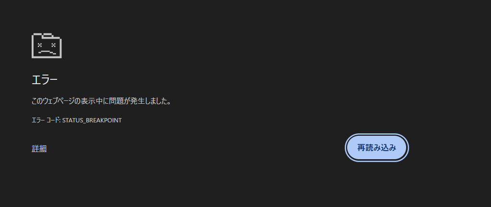

ChromeやEdgeでページを開いたときに、次のようなエラーが出ることがあります。

`エラーコード: STATUS_BREAKPOINT`

:::conclusion
`STATUS_BREAKPOINT` は、ブラウザの表示処理が途中でクラッシュしたときに出るエラーです。
:::

サイトそのものが必ず壊れている、という意味ではありません。ChromeやEdgeのタブ単位の処理、拡張機能、キャッシュ、メモリ、GPUまわりの不安定さなどで発生することがあります。

## まず試すこと

最初は難しい設定を触るより、次の順番で確認するのが早いです。

1. ページを再読み込みする
2. ChromeまたはEdgeを完全に閉じて開き直す
3. シークレットウィンドウで同じページを開く
4. 拡張機能を一時的にオフにする
5. ブラウザを最新版に更新する
6. PCを再起動する

一時的なタブクラッシュであれば、再読み込みだけで直ることもあります。何度も同じページで起きる場合は、拡張機能やブラウザ設定を疑います。

## よくある原因

`STATUS_BREAKPOINT` は原因をひとつに決め打ちしにくいエラーです。よくある原因は次の通りです。

- ブラウザの一時的なクラッシュ
- 拡張機能の競合
- キャッシュやCookieの破損
- GPUアクセラレーションとドライバの相性
- メモリ不足、またはメモリまわりの不安定さ
- サイト側の重いJavaScriptや広告スクリプト

:::note
同じサイトだけで出るならサイト側や拡張機能、いろいろなサイトで出るならブラウザやPC側を優先して疑います。
:::

## 拡張機能を切って確認する

広告ブロッカー、翻訳、セキュリティ系、スクリーンショット系の拡張機能は、ページ表示に直接干渉することがあります。

確認手順は次の通りです。

1. Chrome右上のメニューを開く
2. 「拡張機能」から拡張機能の管理を開く
3. いったん全てオフにする
4. 問題のページを再読み込みする

これで直る場合は、拡張機能をひとつずつ戻して、原因になっているものを探します。

## キャッシュとCookieを消す

特定のサイトだけで繰り返し出る場合は、そのサイトのキャッシュやCookieが壊れていることがあります。

Chromeでは、アドレスバー左側のアイコンから「サイトの設定」や「サイトデータ」を開き、そのサイトのデータだけ削除できます。全期間の閲覧履歴を消す前に、まずは対象サイトだけ消すのが安全です。

## ハードウェアアクセラレーションをオフにする

画面描画や動画、WebGLを使うページで落ちる場合は、GPUまわりが原因のことがあります。

Chromeの場合は、設定から「システム」を開き、ハードウェアアクセラレーションをオフにして再起動します。

:::warning
この設定を変えたあとは、ブラウザの再起動が必要です。タブを閉じるだけでは反映されないことがあります。
:::

## 何度も出る場合に見るところ

再読み込みで直らず、頻繁に出る場合は次を確認します。

- ChromeまたはEdgeが最新版か
- Windows Updateが止まっていないか
- グラフィックドライバが古くないか
- メモリ使用率が高すぎないか
- 最近入れた拡張機能や常駐ソフトがないか

特に、ブラウザ以外のアプリでも落ちる、ブルースクリーンが出る、PC全体が不安定になる場合は、ブラウザだけでなくPC側の問題も疑った方がよいです。

## まとめ

:::conclusion
`STATUS_BREAKPOINT` は「ページ表示中にブラウザの処理が止まった」というエラーです。まずは再読み込み、拡張機能オフ、キャッシュ削除、ブラウザ更新の順で切り分けるのが現実的です。
:::

一度だけなら深刻に考えすぎなくて大丈夫です。何度も同じ画面になる場合は、拡張機能、キャッシュ、GPU設定、メモリの順に確認していくと原因を絞りやすくなります。
