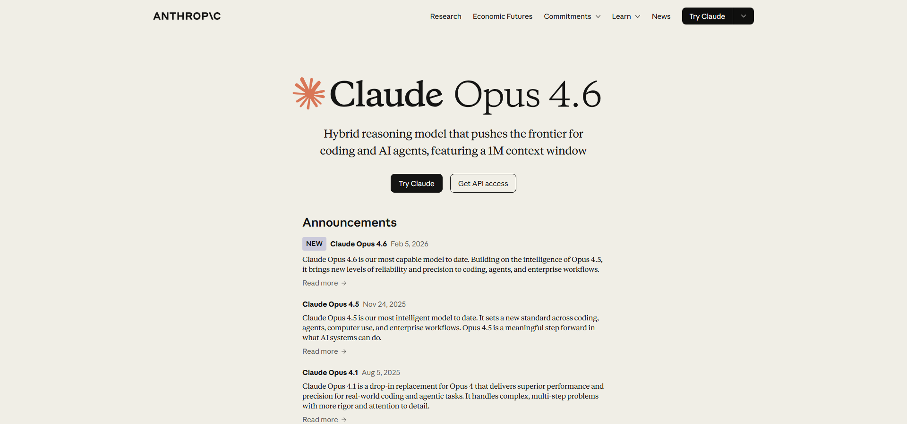

# Claude Opus 4.6 Review: 2 Weeks of Real-World Use from a Vibe Coder's Perspective

On February 5, 2026, Anthropic released their latest flagship model, Claude Opus 4.6. This is an evolution from Opus 4.5 released about two months ago, with a particular focus on enhanced coding performance and agentic tasks. As a vibe coder, I've been using it for about two weeks in real projects, so here's my honest review.

:::note
**Test Environment**
- Mid-scale web app development project (several thousand lines of code)
- Previous main models: Opus 4.5, GPT-5.2 Codex
:::

## Opus 4.6 Key Improvements

Let me organize the technical improvements first. Here are the main changes from Opus 4.5.

**Massive context window expansion** is the biggest highlight. The context expanded 5x from the previous 200K tokens to 1 million tokens (beta). This is a first for the Opus class, making work on large-scale codebases dramatically more comfortable. It scored 76% on MRCR v2 (long-context understanding test), showing overwhelming improvement from 4.5's 18.5%.

The introduction of **Adaptive Thinking** is also important. "Extended thinking" has evolved to automatically adjust reasoning depth across 4 levels: low, medium, high, and max. The default is high, thinking deeply on complex tasks while responding quickly to simple questions—it's great.

Coding performance has also been strengthened, achieving 65.4% on Terminal-Bench 2.0 and 80.8% on SWE-bench Verified. I can feel the improved accuracy on practical tasks, with 72.7% on OSWorld for agentic computer operations.

## My Real Impressions: The Joy of "Throwing Everything At It"

Let me share my honest impressions after using it for two weeks in a mid-scale web app development project.

**The feeling of being able to "throw everything at it" is different from anything else.** This was an experience I never felt with Opus 4.5 or GPT-5.2 Codex. I could delegate the entire flow from requirements definition to implementation and debugging. Thanks to the 1 million token context in particular, it remembers past instructions and implementation policies, allowing me to continue long-term tasks. With 4.5, I sometimes hit the 200K token wall and felt like the context was running out, but that's almost completely resolved in 4.6.

**Japanese language capability is also quite high.** It accurately understands technical explanations and instructions with subtle nuances. This is an important point for vibe coding—it's reassuring that it grasps intent even when I give rough instructions in Japanese.

**The balance between reasoning depth and speed is exquisite.** It thinks deeply, yet I can feel an overwhelming speed difference compared to GPT-5.2 Codex. Codex is certainly smarter, but it gives the impression of "thinking too much and being slow." On the other hand, thanks to Adaptive Thinking, 4.6 thinks deeply only when needed and processes simple tasks quickly. In actual development flows, this "waiting feeling" has been significantly reduced.

**Strengthened context retention is also noticeable.** It remembers relationships between files in mid-scale projects and design decisions made days ago, providing appropriate suggestions. This is extremely helpful for multi-file editing and refactoring.

:::note
**Major Improvements from Opus 4.5**
- Context: 200K → 1M tokens (5x)
- MRCR v2 score: 18.5% → 76%
- Speed and accuracy balance optimization via Adaptive Thinking
- Terminal-Bench 2.0: 65.4%, SWE-bench: 80.8%
:::

## The Price Wall: Is It Worth the Performance?

However, the biggest drawback is definitely the price.

The API pricing structure is as follows:
- Standard: Input $5/1M tokens, Output $25/1M tokens
- 1M context (beta): Input $10/1M tokens, Output $37.5/1M tokens

Compared to Sonnet (Input $3/1M, Output $15/1M) and GPT-4o, this is about 1.7x for both input and output. It's quite expensive for everyday use.

:::warning
**Cost Considerations**
- GitHub Copilot treats Opus 4.6 as a "Premium Model," consuming 3x the normal quota
- Using 1M context results in 2x the standard rate
- The pricing is tough for indie developers who want to use it heavily every day
:::

Additionally, GitHub Copilot treats Opus 4.6 as a "Premium Model," consuming 3x the normal quota. This is a significant hurdle for individual developers. I want to use it for serious projects, but it really is too expensive to use heavily every day.

## Model Comparison: Opus 4.5 / GPT-5.2 Codex / Opus 4.6

Let me compare each model.

**Opus 4.5** already had high coding performance. However, with 200K token context, it would hit walls on large-scale projects where "context wasn't enough." It was excellent overall, but had limitations in long-term task management.

**GPT-5.2 Codex** excelled in reasoning capability. Its ability to solve complex problems is high, but **speed was an issue**. Waiting times occurred, often disrupting the vibe coding rhythm. Pricing was also set relatively high for an OpenAI model.

**Opus 4.6** feels like taking the best of both worlds. It has reasoning capability close to Codex while being overwhelmingly faster. It can also handle long-term tasks with 1 million token context. However, the price is currently higher than both models.

:::example
**Model Usage Recommendations**
| Use Case | Recommended Model | Reason |
|----------|-----------------|--------|
| Serious development projects | Opus 4.6 | Focus on accuracy and speed |
| Everyday light coding | Sonnet 4.5 or GPT-4o | Cost-effectiveness |
| Ideation and requirements gathering | Sonnet 4.5 | More than sufficient capability |
:::

## Conclusion: Recommended Usage Patterns

Claude Opus 4.6 is undoubtedly one of the most powerful coding AIs available right now. The feeling of being able to "throw everything at it," Japanese language understanding, context retention, and speed balance are at a level that no other model can match.

:::conclusion
**Overall Rating**
- Performance: ★★★★★ (Top of the line currently)
- Price: ★★★☆☆ (High, but value matches performance)
- Usage: Shines in important projects, use other models for daily use to reduce costs
:::

However, **the price really is high**. It's tough for individual developers to use heavily every day, so it's more realistic to limit use to specific important projects and complex tasks.

While the price matches the performance, continued use requires consulting your wallet. Nevertheless, as a trump card for "I absolutely must make this project succeed," Opus 4.6 will surely deliver value. To all vibe coders out there, I'd definitely recommend giving it a try.
