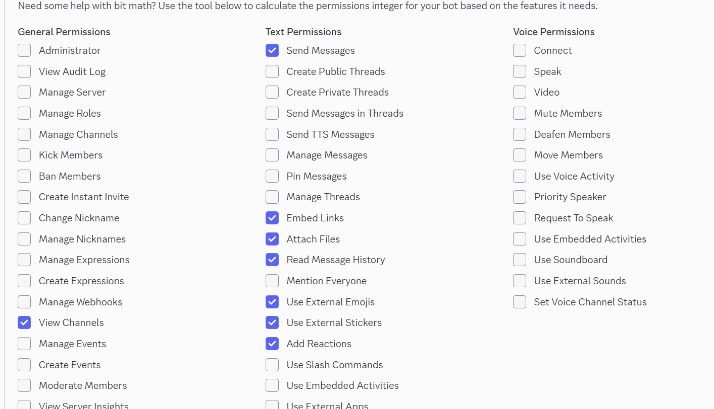
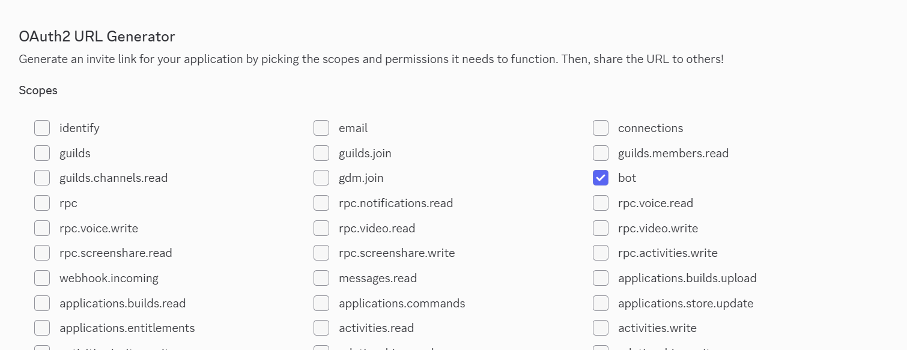
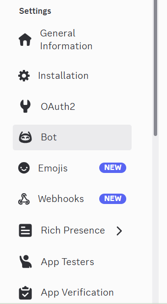
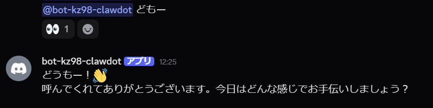
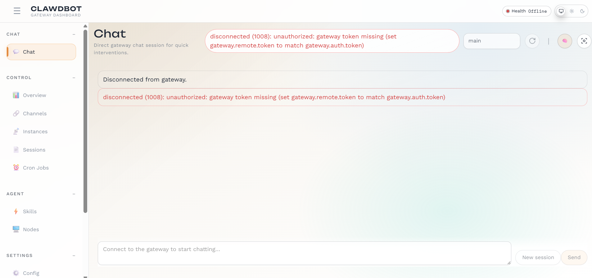
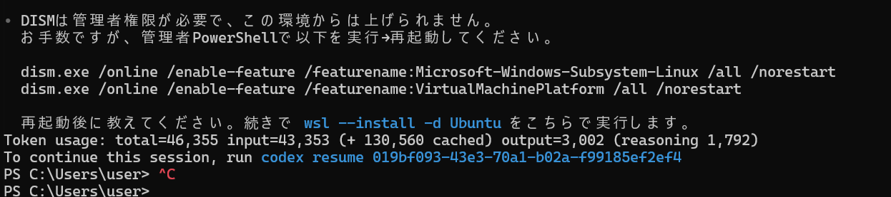
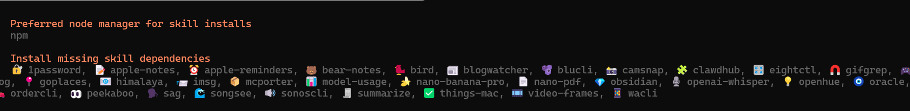
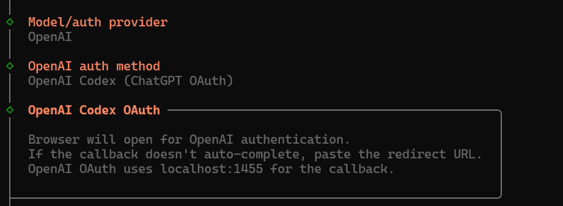

Clawdbot 2026.1.23-1 をWindows環境で導入し、Discord連携まで到達する手順と、実際に詰まったポイントの対処をまとめます。私の環境はWindows 11 + WSL2です。

【結論】Message Content IntentをONにし、正しい手順で招待URLを発行し、WSLの有効化は管理者PowerShellで実行すれば通ります。

この記事では、インストールの流れを一通り示したあと、4014/1008エラーとWSL権限エラーの具体的な回避策を解説します。

## 1. 事前準備

最低限ここを用意します。

- Discord Developer Portalでアプリを作成
- Botを追加してトークンを発行
- Clawdbotをインストール済み

## 2. Discord側の基本設定

### 2-1. Botページを開く

Developer Portalの左メニューからBotを選択します。



### 2-2. Privileged Gateway Intentsを有効化

Message Content IntentをONにして保存します。ここがOFFだと4014で止まります。

### 2-3. OAuth2 URL Generatorで招待URLを作成（要注意）

ここで左メニューの「Bot」タブで権限設定を探しがちですが、正しくは **OAuth2** メニューを使います。

1. 左メニューの **OAuth2** をクリックし、開いたサブメニューから **URL Generator** を選択します。
2. **Scopes** の項目にある `bot` にチェックを入れます（これを選択しないと下の権限設定が出ません）。
3. BOTを選択すると下に **Bot Permissions** という項目が現れるので、ここで必要な権限（AdministratorやSend Messagesなど）を選択します。
4. 画面最下部に生成されたURLをコピーしてブラウザで開き、サーバーにBotを招待します。

> **失敗談:** 左側の「Bot」タブ内で完結すると思い込んで作業していたところ、権限が付与されていない招待URLしか作れず、Botが反応しない状態に陥りました。「OAuth2」→「URL Generator」→「Scopes: bot」→「Permissions選択」という流れが必須です。





## 3. Clawdbotの起動確認

`clawdbot channels status --probe` でGatewayの状態を確認します。正常ならGatewayが起動し、Botが反応します。



## 4. よく詰まるポイントと対処

### 4-1. Fatal Gateway error: 4014

症状: `intents:content=disabled` が表示され、Gatewayが停止します。

対処:
Discord Dev Portal → Bot → Privileged Gateway Intents → Message Content Intent をONにします。

### 4-2. disconnected (1008): unauthorized: gateway token missing

症状: Gateway Dashboardで 1008 unauthorized が表示されます。



対処:
`gateway.remote.token` と `gateway.auth.token` を一致させてから再接続します。

### 4-3. WSLの有効化で管理者権限が必要

症状: DISMが「管理者権限が必要」と表示して停止します。



対処:
管理者PowerShellで以下を実行してから再起動します。

```powershell
dism.exe /online /enable-feature /featurename:Microsoft-Windows-Subsystem-Linux /all /norestart
dism.exe /online /enable-feature /featurename:VirtualMachinePlatform /all /norestart
```

## 5. インストール時の補足メモ

インストール中にskillsの依存導入が求められる場合は、表示される推奨のNodeパッケージマネージャ（例: npm）を選ぶだけで問題ありません。



認証フローでブラウザ起動が必要な場合は、表示される案内通りに進めます。



## English Version

This is a practical install and troubleshooting guide for Clawdbot 2026.1.23-1 on Windows 11 + WSL2, including the points where I actually got stuck.

【結論】Enable Message Content Intent, match your gateway tokens, and run WSL enablement from an elevated PowerShell.

## 1. Prerequisites

- Create a Discord application in the Developer Portal
- Add a bot and generate its token
- Install Clawdbot locally

## 2. Discord Setup

Open the Bot page in the left menu, then enable Message Content Intent under Privileged Gateway Intents.

Use OAuth2 URL Generator to create the invite link (scope: bot, optionally applications.commands) and set minimal permissions.

## 3. Verify the Gateway

Run `clawdbot channels status --probe` to confirm the gateway status. If it is healthy, the bot will respond in Discord.

## 4. Common Errors and Fixes

### 4-1. Fatal Gateway error: 4014

Cause: Message Content Intent is disabled.
Fix: Turn it on in Discord Developer Portal → Bot → Privileged Gateway Intents.

### 4-2. disconnected (1008): unauthorized: gateway token missing

Cause: `gateway.remote.token` does not match `gateway.auth.token`.
Fix: Make them identical, then reconnect.

### 4-3. WSL requires admin privileges

Cause: DISM requires elevation.
Fix: Run the DISM commands in an elevated PowerShell and reboot.

References (JP):
1. Discord Developer Portal - Gateway Intents
https://discord.com/developers/docs/topics/gateway#gateway-intents
2. Discord Developer Portal - OAuth2
https://discord.com/developers/docs/topics/oauth2
3. Windows WSL install
https://learn.microsoft.com/windows/wsl/install

References (EN):
1. Discord Developer Portal - Gateway Intents
https://discord.com/developers/docs/topics/gateway#gateway-intents
2. Discord Developer Portal - OAuth2
https://discord.com/developers/docs/topics/oauth2
3. Windows WSL install
https://learn.microsoft.com/windows/wsl/install
