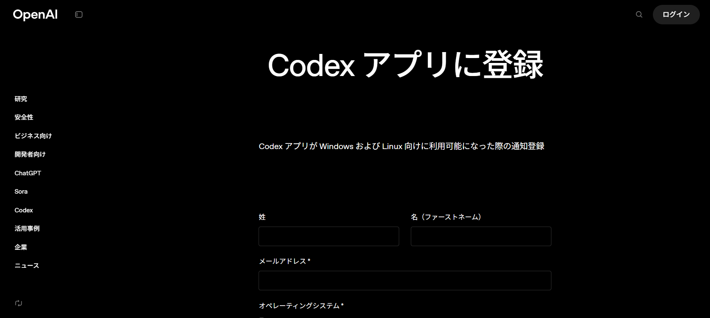

Codex App is a desktop version of the AI coding agent that runs in your local environment.

## Waitlist Invitation Arrived

Today, I received an invitation to join the waitlist for the Codex App from OpenAI. This is different from the traditional web-based Codex—it's a ==desktop application== that runs locally on your machine.



## What is Codex App?

Codex App is a ==desktop application== that brings OpenAI's AI coding agent "Codex" to run in your ==local environment==.

### Differences from Traditional Codex

| Feature | Codex Web (Cloud) | Codex App (Desktop) |
|---------|-------------------|---------------------|
| ==Environment== | OpenAI's cloud | Your local PC |
| ==Code Execution== | Runs in cloud environment | Runs directly in local environment |
| ==Git Integration== | Requires GitHub connection | Direct local Git operations |
| ==Skills== | Limited support | Full support |
| ==Worktrees== | Not available | Available (for parallel tasks) |

### Key Features

- ==Local-first==: Runs entirely on your PC, editing local files directly
- ==Integrated Terminal==: Open a terminal per thread to run commands and dev servers
- ==Git Integration==: Review diffs, inline comments, stage/revert, and commit—all within the app
- ==Skills System==: Define custom workflows for automation
- ==MCP Support==: Integration with external services via Model Context Protocol

## Skills Feature Details

Skills is a system that ==extends Codex with task-specific capabilities==.

### Skills Structure

```
my-skill/
├── SKILL.md          # Required: instructions + metadata
├── scripts/          # Optional: executable code
├── references/       # Optional: documentation
├── assets/           # Optional: templates, resources
└── agents/
    └── openai.yaml   # Optional: appearance and dependencies
```

### Available Skills Examples

- `$skill-creator`: Create new skills
- `$create-plan`: Create implementation plans (experimental)
- `$skill-installer`: Install skills from GitHub
- Linear integration, Notion integration, etc.

## Supported Platforms

:::note
Current Status: macOS (Apple Silicon) only officially available
Windows Version: Beta access available via waitlist registration
:::

The Windows version is not yet officially released, but you can ==get early beta access== by joining the waitlist.

## Requirements

Included with ChatGPT Plus, Pro, Business, Edu, and Enterprise plans. You can also sign in with an OpenAI API key, though some features (like cloud threads) may be limited.

## Summary

Codex App is an ==AI coding agent that runs in your local environment==, different from the cloud version. It offers powerful features for developers, including customization via Skills and integration with local Git. If you're interested in the Windows beta, be sure to join the waitlist.

---

**Reference**: [OpenAI Codex Documentation](https://developers.openai.com/codex)
