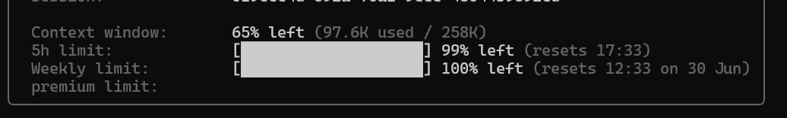
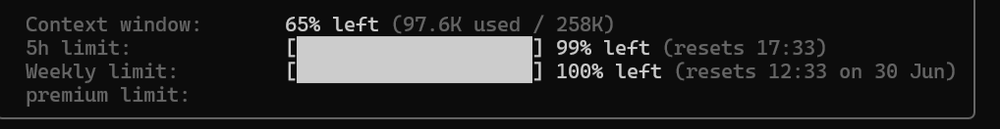
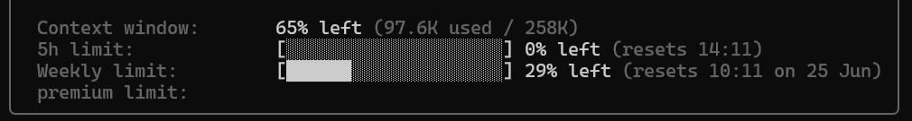

On June 12, 2026, OpenAI rolled out "banked rate-limit resets" for Codex. Every eligible ChatGPT plan (Go / Plus / Pro / Business) received one free reset credit, with more available through the referral program.

The problem? The "spend it now" button only lives in the desktop app and the VS Code / Cursor / Windsurf extension. The Rust CLI (`codex`) doesn't expose this feature yet, and the extension's reset prompt doesn't reliably appear on Linux either.

Enter **aaamosh/codex-reset**.

:::conclusion
codex-reset is a zero-dependency Python script that redeems your Codex banked rate-limit reset from the command line — no UI required. It talks to the same undocumented endpoints the official extension uses. If you're on a server, in WSL, or just live in a terminal, this is exactly what you need.
:::

## Tried It First-Hand

I downloaded and ran it on Windows 11 (PowerShell 7). It worked without any issues.

The status command showed 2 banked credits available:



Running `consume` redeemed one credit and reset the secondary rate limit to 0%:



Before the reset, the secondary window was fully exhausted. After the reset it was back to 0%. This is what it looks like when you have no credits left:



## What It Does

| Command | Action |
|---------|--------|
| `codex-reset` | Show available credits and current usage |
| `codex-reset consume` | Redeem one credit (with confirmation prompt) |
| `codex-reset consume --yes` | Redeem immediately, no prompt |
| `codex-reset consume --dry-run` | Dry run (no credit actually consumed) |
| `codex-reset --auth PATH` | Specify a different auth.json |
| `codex-reset status --json` | Machine-readable JSON output |
| `codex-reset invite-status` | Read-only referral diagnostics |

Terminal output looks like this:

```
$ codex-reset
banked credits: 1 available
  ● RateLimitResetCredit_…  status=available  granted=2026-06-12T01:33:14Z  expires=2026-07-12T01:33:14Z

current usage:
  primary  : 1% used, window=5.0h, resets in 5.0h
  secondary: 100% used, window=7.0d, resets in 3.2d

run `codex-reset consume` to redeem one credit now.

$ codex-reset consume
consumed. windows_reset=1, code=reset, redeemed_at=2026-06-13T13:12:31Z

new usage:
  primary  : 1% used, window=5.0h, resets in 5.0h
  secondary: 0% used, window=7.0d, resets in 7.0d
```

## Installation

Python 3.9+ required, no third-party dependencies:

```bash
curl -fsSL https://raw.githubusercontent.com/aaamosh/codex-reset/main/codex_reset.py \
  -o ~/.local/bin/codex-reset && chmod +x ~/.local/bin/codex-reset
```

Or just clone the repo and run `python3 codex_reset.py` directly.

On Windows via PowerShell:

```powershell
curl.exe -fsSL -o codex-reset.py https://raw.githubusercontent.com/aaamosh/codex-reset/main/codex_reset.py
python codex-reset.py
```

## Authentication

The script doesn't handle auth itself — it reads `access_token` and `account_id` from `~/.codex/auth.json`, a file that `codex login` already created for you.

It then calls endpoints under `https://chatgpt.com/backend-api`:

| Endpoint | Method | Purpose |
|----------|--------|---------|
| `/wham/rate-limit-reset-credits` | GET | List banked credits |
| `/wham/rate-limit-reset-credits/consume` | POST | Redeem one credit |
| `/wham/usage` | GET | Current rate-limit windows |
| `/referrals/invite/eligibility` | GET | Read-only invite probe |

Every request carries:

```
Authorization: Bearer <access_token>
ChatGPT-Account-Id: <account_id>
```

These endpoints were extracted from the official VS Code extension's webview bundle.

## Referral Integration

codex-reset also exposes read-only referral diagnostics. OpenAI's referral promo runs through **June 24, 2026** — Plus/Pro users earn an extra banked reset for every new Codex user they invite (up to 3).

Eligibility probing may require a browser Cookie header (bearer-only auth can return 403):

```bash
codex-reset invite-status --cookie-file ./cookie-header.txt
```

:::warning
`invite-status` is strictly read-only. It does not send invite emails. The mutating invite endpoint (`POST /backend-api/wham/referrals/invite`) is never called by this script.
:::

For referral coordination, there's also a Telegram bot (`@codexHuddbot`) — see <https://github.com/aaamosh/codex-hud>.

## Caveats

:::note
codex-reset depends on undocumented, unsupported OpenAI endpoints. They could be renamed, gated, or removed at any time. If it stops working, open an issue — the author will re-grep the extension bundle.
:::

Key points to keep in mind:

- **Not a bypass tool**: It only spends credits OpenAI explicitly granted. `available_count: 0` means nothing to redeem
- **API-key users unaffected**: Banked resets are tied to ChatGPT subscriptions, not API-key billing
- **Consumption is irreversible**: A 200 response means the credit is gone — same behavior as clicking the button in the app

## Browser Companion

A standalone HTML companion is available at:

<https://github.com/aaamosh/codex-reset/raw/main/codex-reset.html>

It has `connect-src 'none'` CSP — no external network calls, no auth reading, no cookies. It's a helper to build commands, copy install instructions, and normalize recipient emails for the official invite UI.

:::warning
This tool is very early — 18 stars, 0 forks, v0.1.0 only. The Python code (~300 lines) looks legitimate and is easy to audit, but there is no guarantee it will continue to work or be maintained. Use at your own risk.
:::

## Verdict

codex-reset fills a real gap: a feature OpenAI built but didn't expose everywhere they should have.

- Strengths: Python 3.9+ stdlib only, zero dependencies, reuses existing `auth.json`, short and auditable code
- Weaknesses: depends on undocumented endpoints, Windows auth.json path may differ, consumption is one-way

If you use Codex from the terminal and have hit rate-limit walls, this tool is worth having in your pocket. Fun fact: the script was written in a single session by Claude Opus 4.7, reverse-engineered from the VS Code extension's webview bundle — while the author's own Codex account was locked behind a redeem button they couldn't click.
