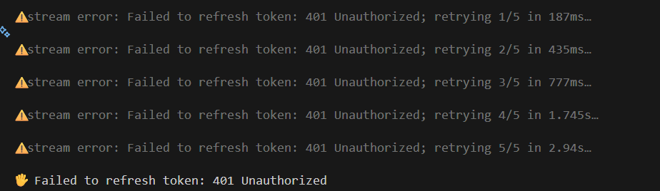

CODEX CLIを使っていると、ある日突然以下のようなエラーが連続で表示され、処理が止まってしまうことがあります。

```
stream error: Failed to refresh token: 401 Unauthorized; retrying 1/5 in 187ms...
stream error: Failed to refresh token: 401 Unauthorized; retrying 2/5 in 435ms...
...
Failed to refresh token: 401 Unauthorized
```



結論から言うと、このエラーは**「認証トークンが破損または失効しており、自動更新もできない状態」**です。
CODEX側のサーバーダウンなどではなく、手元の認証情報をリセットすれば99%直ります。

## 対処法：悩まず再ログイン

以下のコマンドを実行してください。

```bash
codex logout
codex login
```

これだけでOKです。
`codex login` を実行すると、ブラウザが起動し「ChatGPTを使用してCodexにサインイン」という画面が表示されます。

:::step
1. **Logout**: 古いトークンを破棄
2. **Login**: ブラウザで認証画面が開く
3. **Approve**: "Continue" や "Allow" を押して認証を完了させる
:::

認証が成功すれば、ターミナルに戻って操作を再開できます。

## なぜこのエラーが起きるのか？

`Failed to refresh token: 401 Unauthorized` は、CLIが持っている「リフレッシュトークン（次のアクセストークンをもらうための鍵）」自体が拒否されている状態です。

特に以下のようなケースで発生しやすくなります。

- **ツールの併用**: ChatGPT, Copilot, Codex を頻繁に行き来している
- **アカウント切り替え**: 別のアカウントでログインし直した直後
- **VPNの切り替え**: 接続IPが変わったタイミングでの認証試行
- **放置**: 長期間CLIを起動したままにしていた

CLIは「トークンが期限切れだ！更新しよう！」と頑張りますが、その更新自体が拒否されるため、無限ループに近い再試行（Retrying 1/5...）に入ってしまいます。

:::note
人間が手動で `logout` して「もう一回ゼロから認証し直して」と指示してあげるのが最短の解決策です。
:::

## それでも直らない場合

もし再ログインしてもエラーが続く場合は、キャッシュファイルが壊れている可能性があります。
以下のディレクトリを手動で削除してから、再度ログインを試してください。

```bash
# Mac/Linux
rm -rf ~/.codex
rm -rf ~/.config/codex

# Windows (PowerShell)
Remove-Item -Recurse -Force "$env:APPDATA\codex"
```

また、OpenAIのAPIキーを環境変数（`OPENAI_API_KEY`）で設定している場合は、そのキー自体が無効になっていないか確認してください。

## まとめ

Codexで `401 Unauthorized` が出たら、**「何はともあれログアウトしてログイン」**。
これで解決です。

:::conclusion
**復旧コマンド:**
`codex logout && codex login`
:::
