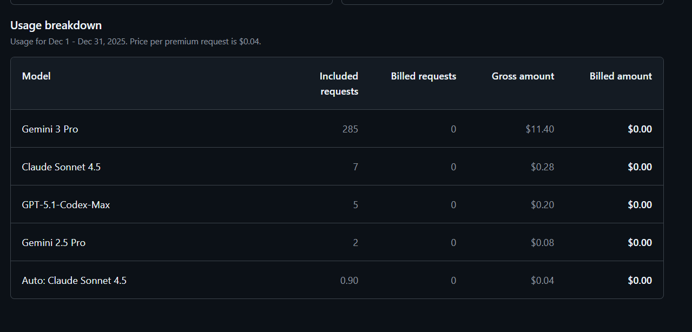

One day, I suddenly saw this error in VS Code's GitHub Copilot Chat:

> **You have exceeded your premium request allowance.**
> We have automatically switched you to GPT-4.1.

"Wait, did I exceed my ChatGPT (OpenAI) limit?" I panicked for a moment. But actually, this is a **GitHub Copilot limit**.

In this article, I'll explain what this error really is, why I chose to set a "$5 monthly budget" as a solution, and why I believe you should pay for it.

## The Real Issue: It's GitHub, Not OpenAI

This message means you have used up your **Premium Requests** quota in VS Code's GitHub Copilot Chat.

The important thing is that this is NOT a ChatGPT (OpenAI) plan limit, but a **GitHub Copilot billing quota**.

I initially looked for OpenAI settings, but the correct place was GitHub settings.

## The Solution: Setting a Budget on GitHub

"I'm scared of unlimited billing."
"But I don't want to endure low-performance models."

So, I chose to **"pay with a $5 monthly cap"**. This way, I don't have to worry about overspending, but I can use high-performance models when I need them.

### Steps

1. Go to GitHub Settings > **Billing and plans** > **Budgets and alerts**.
2. Click **Edit monthly budget**.

If you see "Payment method is missing" here, you need to add a payment method. This is proof that it's a "GitHub issue".

3. The target SKU is **Copilot premium requests**.

4. Set the budget. I set it to **$5**.
   And most importantly, check **"Stop usage when budget limit is reached"**. This ensures it stops automatically when it exceeds $5, so you'll never get a huge bill.

When the setting is complete, you'll see a notification like this.

## The Result: Even Using Gemini 3 Pro...

After setting it up, I used it heavily.
In my environment, **Gemini 3 Pro** is selected as the model.

I was surprised by the result.
**Even after 285 requests with Gemini 3 Pro, the bill is $0.00.**

This is because GitHub Copilot has "Included requests" (free tier) built-in.
So, even if you set a $5 budget, you only start paying **after you use up the free tier**.

For my usage (coding, architecture discussion, writing), I found that a $5 budget provides more than enough buffer.

## Conclusion: Invest in Your Tools

If you do programming, writing, or research as "work", I definitely recommend paying for this.

Copilot and AI are not just convenient tools, they are **"Cost of Goods Sold" (COGS)**.
If it saves you 10 or 20 minutes, you can recover $5 or $10 in an instant.

Conversely, the time spent "worrying unnecessarily" or "getting stuck" because you're being cheap is much more expensive.

- **$5/month**
- **Stop limit enabled**

With this setting, the risk is zero.
Stop "just enduring" and switch to a setting where you can intentionally use AI to its fullest.
