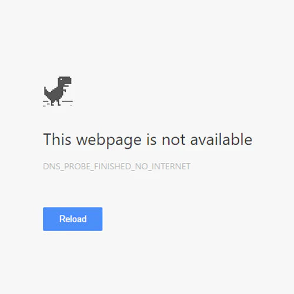

dns_probe_finished_no_internet

This error suddenly appears in Google Chrome, and you might find yourself in a situation where "Wi-Fi is connected, but I can't browse the internet."

In this article, I will explain the causes and solutions for this error.

## What is dns_probe_finished_no_internet?

This is a **network error generated by Google Chrome**.

*   **Chrome network error**
*   Occurs when Chrome determines it "cannot go outside" during DNS lookup
*   Not a website issue

Chrome tried to ask the DNS "Where is this URL?", but realized "I can't even get out to the internet" and stopped.

## Causes

The main causes are as follows:

*   **Temporary router/line failure**
*   **Public Wi-Fi authentication not completed**
*   **VPN/Security software interference**
*   **Provider DNS failure**

## Solutions

Please try the following steps:

1.  **Restart your router**
2.  **Switch to another network (e.g., smartphone tethering)**
3.  **Turn off VPN**
4.  **Change DNS server to `8.8.8.8`**

## Related Information

*   [Why Does “Access Denied” Appear via Akamai? Causes & Fixes for Mobile and PC](https://www.zidooka.com/why-does-access-denied-appear-via-akamai-causes-fixes-for-mobile-and-pc)
*   Chrome Network Error Summary
*   dns_probe_finished_nxdomain

References:
1. SoftwareKeep - How to Fix DNS Probe Finished No Internet
https://softwarekeep.com/help-center/how-to-fix-dns-probe-finished-no-internet
