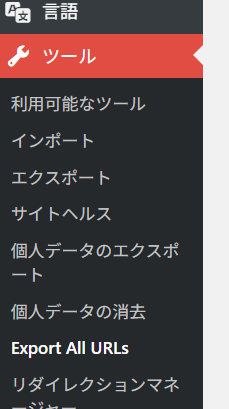
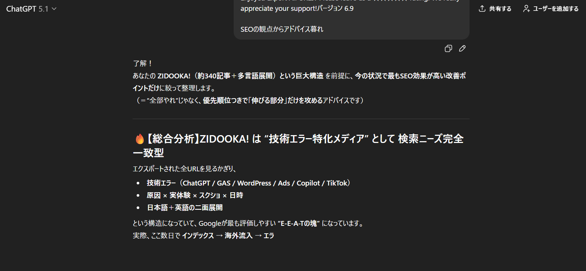
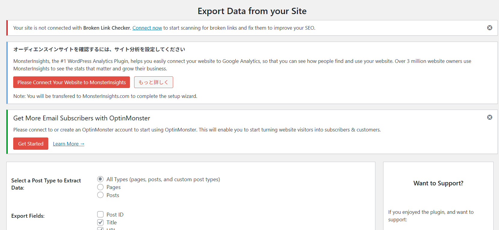

# 結論：記事数が増えたら「AI編集長」に相談せよ

こんにちは、ZIDOOKA! です。
ブログを長く運営していると、必ずぶつかる壁があります。
それは **「記事が増えすぎて、全体像が把握できない」** という問題です。

当サイト（ZIDOOKA!）も記事数が340本を超え、以下のような「構造の歪み」が生じていました。

*   カテゴリー分けと実際の検索流入にズレがある
*   特定の技術エラー記事だけが伸びて、他が埋もれている
*   ロングテールキーワードを狙った良記事が、内部リンク不足で孤立している

この状況を打開するために実施したのが、**「Export All URLs」プラグインで全データを抜き出し、ChatGPTにSEO診断させる** という手法です。
これが驚くほど効果的だったので、その具体的な手順と成果を共有します。



# 1. 「Export All URLs」とは？

WordPressのプラグインで、サイト内の全記事のURL、タイトル、カテゴリーなどをCSV形式で一括出力できるツールです。
管理画面の「ツール」→「Export All URLs」から簡単に利用できます。

**取得できる主な項目:**
*   URL
*   Title（記事タイトル）
*   Date（公開日）
*   Post Type（投稿タイプ）

これを「SEO改善の棚卸し台帳」として使います。

# 2. ChatGPTによる「全記事SEO診断」プロセス

出力したCSVデータをChatGPT（GPT-4oなど）に読み込ませ、以下のステップで分析を行いました。

## Step 1: サイト全体の傾向分析

まず、ChatGPTに「このサイトの記事一覧から、どのような強みと弱みがあるか分析して」と投げかけます。

**ZIDOOKA! の分析結果（例）:**
*   **強み:** 「技術エラー解決」に特化しており、E-E-A-T（経験・専門性）が高い。特に「原因×体験×スクショ×日時」の構成が一貫している。
*   **特徴:** 英語記事と日本語記事が対になっており、グローバルな検索意図をカバーできている。

自分では気づかなかった「客観的な強み」が言語化されました。



## Step 2: 検索意図のマッピング

次に、記事群を「検索意図」ベースでクラスタリング（グループ化）してもらいました。

*   **技術エラー系:** 解決策を求めて急いでいるユーザー向け
*   **開発ノウハウ系:** GAS / WordPress / Copilot など、じっくり学ぶユーザー向け
*   **ツール比較系:** 導入を検討しているユーザー向け

これにより、カテゴリー設定だけでは見えなかった「ユーザーの目的別の記事の塊」が可視化されました。

## Step 3: 改善ポイント（穴）の発見

ここが一番の収穫です。ChatGPTに「SEO上の機会損失（穴）はどこか？」と尋ねました。

*   「英語版はあるのに日本語版がない記事がある」
*   「検索ボリュームが大きいテーマなのに、記事数が1本しかない」
*   「古い記事（2023年以前）で、情報が更新されていないものが上位表示されている」

これらの指摘に基づき、優先的にリライトすべき記事リストが完成しました。

# 3. 導入後の成果

この「棚卸し」を実施し、指摘されたポイントを修正した結果、以下のような変化がありました。



1.  **インデックス速度の向上:** 孤立していた記事に内部リンクを通したことで、クローラーの回遊率が上がりました。
2.  **メディアとしての一貫性:** サイト全体のテーマが明確になり、回遊率（PV/セッション）が改善しました。
3.  **新規ネタの発掘:** 「エラー解決」から派生する「予防策」や「ツール紹介」など、新しい記事の切り口が見つかりました。

# 4. あなたのブログでも実践する方法

手順は非常にシンプルです。

1.  **プラグイン導入:** 「Export All URLs」をインストールし、CSVをエクスポート。
2.  **ChatGPTにアップロード:** Code Interpreter (Advanced Data Analysis) 機能を使い、CSVを読み込ませる。
3.  **プロンプト入力:** 以下のテンプレートを使ってみてください。

```markdown
このファイルは私のブログの全記事リストです。
SEOの観点から以下の分析を行ってください。

1. 記事タイトルの傾向から、このサイトの「専門性」を定義してください。
2. 記事をトピックごとにクラスタリングし、カテゴリー構造の改善案を出してください。
3. コンテンツの重複や、不足しているトピック（機会損失）があれば指摘してください。
```

# まとめ：「全URL × AI」は現代SEOの最強コンボ

記事数が増えれば増えるほど、人間がすべてを把握するのは不可能になります。
しかし、AIにとってはデータ量が多いほど分析の精度が上がります。

ChatGPTを「編集長」として雇い、定期的にサイトの健康診断を行う。
これこそが、コンテンツ過多の時代に個人ブログが生き残るための賢い戦略ではないでしょうか。
