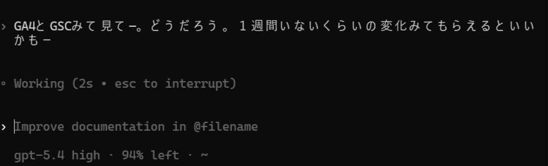

SEOの作業でいちばん時間がかかるのは、実は「記事を書く前」かもしれません。

GA4 を開いて、GSC を開いて、期間を合わせて、落ちたページを探して、クエリも見て、そこから「じゃあ何を直すのか」を考える。ここが地味に重いです。

でも、GA4 と GSC を AI エージェントにつないでおくと、この部分がかなり変わります。

:::conclusion
GA4 は「中で何が起きたか」を見せてくれて、GSC は「検索で何が起きたか」を見せてくれます。両方を Agent に渡すと、数字確認から仮説出しまでを会話の流れで一気に進められます。
:::

たとえば、こんな感じです。



「GA4とGSCみて見て。どうだろう。1週間くらいの変化みてもらえるといいかも」

これだけでも、Agent 側が期間を切って、両方のデータを見て、差分をまとめて返せます。  
しかも終わりではなく、そのまま「どのページから直すべきか」「検索側と行動側で数字がズレているのはなぜか」まで相談できます。

## 何が速くなるのか

従来の SEO 確認は、次のような分断が起きやすいです。

- GA4 ではセッションを見る
- GSC ではクリックと表示回数を見る
- どのページが原因かは別で照合する
- 落ちた理由の仮説は人間があとで考える

これを Agent に任せると、流れがこう変わります。

1. `直近7日と前7日で比べて` と自然文で頼む
2. Agent が GA4 と GSC を両方確認する
3. 主要な増減ページとクエリを並べる
4. `Google 検索は落ちているのに GA4 全体は横ばい` のようなズレも見つける
5. そのまま次の打ち手を相談する

:::note
速いのは「レポートを出す速度」だけではありません。数字の読み解きと、次のアクション決めまでが 1 往復でつながるのが大きいです。
:::

## 実際に 1 週間比較してみた

今回は `2026-03-24` から `2026-03-30` と、前週の `2026-03-17` から `2026-03-23` を比較しました。

### GA4 側の変化

| 指標 | 今週 | 前週 | 差分 |
| --- | ---: | ---: | ---: |
| sessions | 1152 | 1145 | +7 |
| totalUsers | 977 | 992 | -15 |
| screenPageViews | 1137 | 1178 | -41 |
| engagedSessions | 554 | 581 | -27 |

ぱっと見ると、GA4 全体はそこまで大崩れしていません。

ただし中身を見ると、かなり偏りがあります。

- `google / organic` は `447 → 343` で大きく減少
- `bing / organic` は `483 → 520` で増加
- `direct / none` は `138 → 193` で増加

つまり、==Google 検索流入の落ち込みを Bing と Direct が一部打ち消している== 状態でした。

:::warning
GA4 だけ見ると「横ばいだから問題なし」と誤読しやすいです。検索の変化を見るには、GSC を必ず横に置いたほうが安全です。
:::

### GSC 側の変化

| 指標 | 今週 | 前週 | 差分 |
| --- | ---: | ---: | ---: |
| clicks | 240 | 402 | -162 |
| impressions | 9565 | 14818 | -5253 |
| CTR | 2.51% | 2.71% | -0.20pt |
| 平均掲載順位 | 7.91 | 8.71 | +0.80 改善 |

ここが面白いところです。

GSC では `クリック` も `表示回数` もはっきり落ちています。  
一方で平均掲載順位はむしろ改善しています。

これは、単純な「順位下落」よりも、==需要の波が引いたか、強かったクエリ群が今週は弱かった== 可能性を示しています。

## どのページが落ちたのか

今回の比較で大きく落ちていたのは、次のページ群でした。

- [`https://www.zidooka.com/archives/240`](https://www.zidooka.com/archives/240)
  Cursorで「We're experiencing high demand for Claude 3.7 Sonnet right now」と出たときの対処法
- [`https://www.zidooka.com/archives/2755`](https://www.zidooka.com/archives/2755)
  Copilot の `rate_limited` / token usage 系エラー記事
- [`https://www.zidooka.com/archives/105`](https://www.zidooka.com/archives/105)
  `princexml is required to be installed` の対処記事
- [`https://www.zidooka.com/archives/633`](https://www.zidooka.com/archives/633)
  X(Twitter) で「現在、ポストを取得できません」
- [`https://www.zidooka.com/archives/185`](https://www.zidooka.com/archives/185)
  `files.oaiusercontent.com にアップロードできませんでした`
- [`https://www.zidooka.com/archives/3290`](https://www.zidooka.com/archives/3290)
  X(Twitter) の `Something went wrong` 系記事

逆に、新しく伸び始めている気配もありました。

- [`https://www.zidooka.com/archives/2320`](https://www.zidooka.com/archives/2320)
  `You're generating images too quickly`
- `errors.edgesuite.net`
- `edgesuite.net`
- `個の画像を分析しています`

この時点で、ただの「アクセス減ったかも」から、かなり具体的な打ち手に変わります。

:::step
まず手を付ける候補は、落ち幅の大きい `240`、`2755`、`105` の3本です。タイトル・導入文・関連記事導線・更新日表示を優先的に見直すと効率がいいです。
:::

## Agent が便利なのは、ここから先です

ここまでは頑張れば人間でもできます。

でも本当に便利なのは、次の問いをそのまま続けられることです。

```text
Google 検索は落ちているのに、GA4 全体が横ばいなのはなぜ？
```

```text
今週いちばん優先して直すべき記事を3本に絞って。
```

```text
落ちたページごとに、title / 見出し / 内部リンクの改善案を出して。
```

```text
検索需要が減っただけのページと、改善余地があるページを分けて。
```

この「数字を見る人」と「仮説を出す人」が分かれていないのが、Agent を使う強さです。

## なぜ GA4 だけでも GSC だけでも足りないのか

GA4 だけだと、サイト内行動はわかります。  
でも検索で見つけられているかどうかは見えません。

GSC だけだと、検索結果での露出はわかります。  
でも来たあとに読まれているか、直帰しているか、他ページに回っているかは見えません。

この2つをつなぐと、次のような判断がしやすくなります。

- GSC で落ちていて GA4 でも落ちている
  検索需要か SERP 変化の影響が大きい可能性
- GSC で落ちているのに GA4 は横ばい
  Direct / Bing / SNS など他流入が埋めている可能性
- GSC は横ばいなのに GA4 の engagement が落ちている
  タイトルでは取れているが、本文や導線に課題がある可能性

:::example
今回のケースでは、Google 検索は弱っているのに、Bing と Direct が支えていました。こういうズレは、片方のツールだけでは読み違えやすいです。
:::

## つなぎ方はシンプルです

このワークフロー自体は、そこまで大げさではありません。

最低限、次の3つがあれば始められます。

```powershell
GOOGLE_SERVICE_ACCOUNT_KEY_PATH=C:\path\to\service-account.json
GOOGLE_GA4_PROPERTY_ID=123456789
GOOGLE_GSC_SITE=https://example.com/
```

あとは Agent 側から GA4 / GSC を読むコマンドやスクリプトを呼べるようにしておけば、自然文で頼めます。

たとえばこのリポジトリなら、下のような CLI を使えます。

```powershell
npm run ga4 -- --preset overview --compare previous
npm run gsc -- --site=https://www.zidooka.com/ --preset top-queries --start-date=2026-03-24 --end-date=2026-03-30
```

## 向いている使い方

とくに向いているのは、次のような場面です。

- 週次で「落ちたページだけ」素早く拾いたい
- Search Console のクエリ変化から追記テーマを探したい
- ハブ記事や内部リンクの追加候補を見つけたい
- エラー系・障害系の需要変動をすばやく追いたい

ZIDOOKA! のように、検索需要の波が激しい記事群を扱うサイトでは、この差はかなり大きいです。

## まとめ

SEO で本当に欲しいのは、単なるダッシュボードではなく、==数字を見ながら次の一手まで相談できる相手== だと思っています。

GA4 と GSC を Agent につないでおくと、確認作業が速くなるだけではなく、

- どこが落ちたか
- それは検索の問題か、行動の問題か
- まず何本直すべきか

まで、会話の流れで詰められます。

:::conclusion
GA4 と GSC を Agent につなぐと、SEO は「数字を見る作業」から「数字をもとに判断する作業」へ一気に進みます。ここがいちばん大きい変化です。
:::
