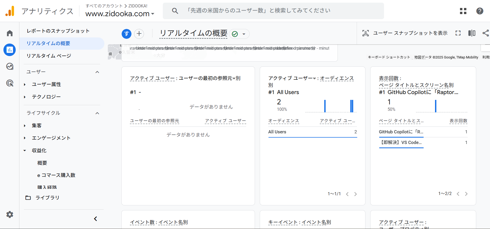

WordPressでサイトを運営していて、ふとこんな疑問を持ったことはありませんか？

「あれ、自分で記事を確認しているのに、GA4のリアルタイムに反映されない？」
「管理画面（admin）だけじゃなく、普通の記事ページも計測されていない気がする」

結論から言うと、その感覚は正しい可能性が高いです。
**WordPressにログインしている状態そのものがトリガーとなって、GA4の計測から除外されている** ケースが非常によくあります。

本記事では、なぜ「ログイン中は計測されない」のか、その仕組みと確認方法について解説します。

## 現象：ログイン中は「透明人間」になる

まず、起きている現象を整理しましょう。

*   **未ログイン（シークレットモードなど）** でサイトを見る
    *   → GA4のリアルタイムレポートに即座に反映される
*   **ログイン状態** でサイトを見る
    *   → 管理画面はもちろん、**表側の記事ページを見ても一切反応しない**



これは「バグ」や「不具合」ではありません。
多くの場合、**意図的にそのように設定されている** 正常な挙動です。

## なぜ計測されないのか？（主な3つの原因）

「ログイン中は計測しない」という挙動は、主に以下の3つのいずれか（または組み合わせ）によって引き起こされます。

### 1. GTM（Googleタグマネージャー）での除外設定

最も一般的なのがこれです。
GTMのトリガー設定で、以下のような条件が入っているケースです。

*   **条件:** `Cookie` に `wordpress_logged_in` を含む場合
*   **動作:** GA4タグを発火させない（ブロッキングトリガー）

これは「運営者のアクセスでデータが汚れるのを防ぐ」ための一般的な設定です。
IPアドレスによる除外よりも確実性が高いため、多くの制作会社やテンプレートで採用されています。

### 2. WordPressプラグインによる制御

SEO系プラグインや、Google公式の「Site Kit」などを使っている場合、プラグイン側の設定で制御されていることがあります。

*   **Site Kit by Google:** デフォルトで「ログインユーザーをカウントしない」設定になっていることが多いです。
*   **SEOプラグイン:** 「管理者（Administrator）のアクセスを除外する」というチェックボックスがオンになっている場合があります。

この場合、HTMLソースコードを見ても、そもそもGA4のタグ（gtag.js）が出力されていません。

### 3. テーマ（functions.php）での制御

テーマのカスタマイズで、以下のようなコードが入っている場合もあります。

```php
if ( !is_user_logged_in() ) {
    // ここにGA4タグを出力
}
```

これも「ログインしていない人だけにタグを見せる」という処理です。

## 設定場所がわからなくても大丈夫

「どこで設定されているかわからない」
「自分で設定した覚えがない」

という場合でも、焦る必要はありません。
むしろ、**「ログイン中は計測されない」というのは、正しい運用状態** と言えます。

もし、自分のアクセスも計測されてしまうと：

*   記事のプレビューや修正確認がすべてPVに加算される
*   滞在時間や直帰率のデータが歪む
*   正確な分析ができなくなる

といったデメリットの方が大きいです。

## まとめ：確認するなら「シークレットモード」で

もし「本当にタグが動いているか不安」になったら、一番確実な確認方法はこれです。

**ブラウザの「シークレットモード（プライベートウィンドウ）」でサイトを開く**

これでGA4のリアルタイムレポートに反応があれば、タグは正常に動作しています。
そして、普段のブラウザ（ログイン状態）で反応がないなら、**「運営者除外」が正しく機能している** という証拠です。

「見えない」ことは異常ではなく、むしろ健全な状態ですので、安心して運用を続けてください。
