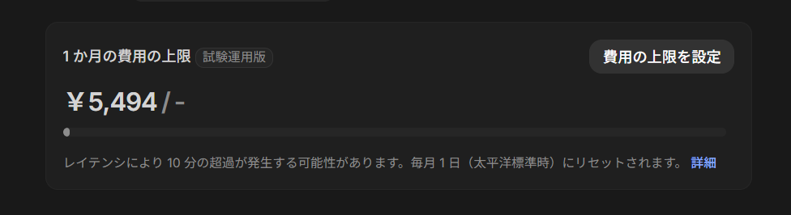

【結論】Gemini API は、`2026-03-25` 時点で Google AI Studio から「1か月の費用の上限」を設定できる状態になっていました。

少し前まで、Gemini API では「Budgets で通知はできても、自動的に止める上限は実質ない」という理解が一般的でした。実際、私も以前はその前提で [Gemini APIキーに課金の上限は設定できるのか](https://www.zidooka.com/archives/2786) を整理していました。

ところが今日 AI Studio を開いたところ、`1か月の費用の上限` というカードと、`費用の上限を設定` ダイアログが表示されていました。

しかも、Google の公式ドキュメントにもすでに `Spend caps` セクションが追加されています。`Billing` ページの最終更新日は `2026-03-23 UTC` でした。

## 何が変わったのか

今回の変更点は、大きく分けると 2 つあります。

- `Project spend caps`
- `Billing account tier spend caps`

【ポイント】以前の「Budget alert は通知だけ」という状態から、少なくとも Gemini API / AI Studio 側で「月額の上限を持つ」方向へ仕様が明確に変わりました。

### 1. プロジェクト単位の spend cap

公式ドキュメントでは、AI Studio の `Spend` ページからプロジェクト単位の月額上限を設定できると書かれています。これは `Experimental` 扱いです。

私の画面でも、`1か月の費用の上限` に金額を入力する UI が見えていました。複数プロジェクトを同じ請求アカウントにぶら下げている人にはかなり便利です。

### 2. 請求アカウント tier 側の spend cap

さらに、請求アカウント tier 側にも月額上限が入ります。こちらはユーザーが自由に決めるものではなく、tier ごとの固定値です。

- Tier 1: `$250`
- Tier 2: `$2,000`
- Tier 3: `$20,000 - $100,000+`

公式 docs では、これらの tier spend caps は `2026-04-01` から適用開始予定で、UI はそれより前に見えるようにしていると説明されています。

## どこで設定するのか

現時点では、Google AI Studio の `Spend` ページで設定する流れです。

1. Google AI Studio を開く
2. 課金済みプロジェクトを選ぶ
3. `Spend` ページを開く
4. `Monthly spend cap` から `Edit spend cap` を押す
5. 金額を入力して保存する

【注意】これは API キー単位の課金設定ではありません。公式 docs でも、API キーは独立した billing 設定を持たず、プロジェクトと billing account の設定を継承すると明記されています。

## まだ注意が必要な点

便利になった一方で、完全に「1円も超えない魔法の停止」ではありません。

- Batch mode は超過が発生する可能性がある
- Billing データ処理には最大で約 10 分の遅延がありうる
- プロジェクト cap と billing account cap の両方を見る必要がある
- cap は「APIキーごと」ではなく「プロジェクトごと」

【注意】ドキュメントには、処理遅延のせいで project cap を少し超える可能性がある、と明記されています。

## これ、かなり大きい改善です

正直、これはかなり助かります。Gemini API は個人開発や検証用途でも使いやすい一方で、「ちょっと実験したいだけなのに、料金が青天井っぽくて怖い」という心理的ハードルがありました。

今回の `Spend caps` は、その不安をかなり下げます。

- 検証用プロジェクトだけ低い cap を置ける
- 本番用は別枠で管理できる
- 「通知しかない」状態よりずっと事故りにくい

以前の私の記事は「できない」が結論でしたが、少なくとも `2026-03-25` 時点では、その結論は更新が必要です。

## まとめ

【結論】Gemini API / Google AI Studio には、月額の費用上限を設定する仕組みが入り始めています。

今回確認できたことは次のとおりです。

- AI Studio 上に `1か月の費用の上限` UI が表示された
- 公式 Billing docs に `Spend caps` セクションが追加された
- project-level cap は `Experimental`
- billing account tier cap は `2026-04-01` から適用予定
- ただし遅延や batch mode による超過の可能性は残る

「Gemini API に課金上限がなくて怖い」と感じていた人にとっては、かなり前進です。

References:
1. Gemini API Billing
https://ai.google.dev/gemini-api/docs/billing
2. Gemini API Rate limits
https://ai.google.dev/gemini-api/docs/rate-limits
