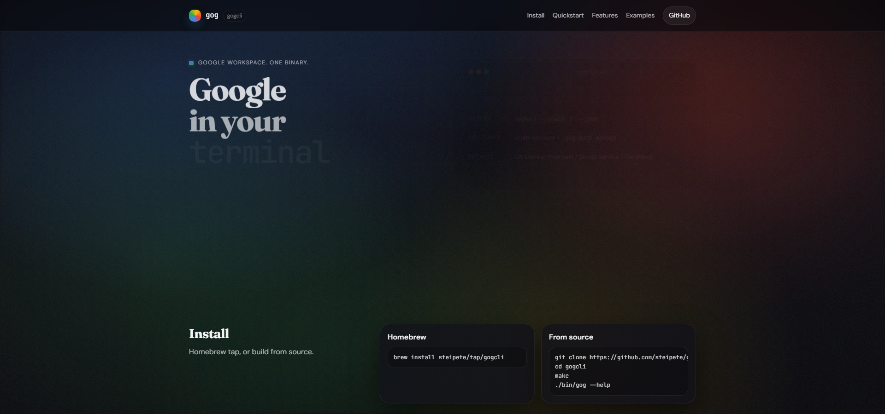

gogcliをインストールしたら、次は「どんなコマンドがあるの？」「実際に何に使えるの？」が気になりますよね。

この記事では、**よく使うコマンドを用途別に整理**して、すぐに使える例を紹介します。

:::warning
**2026年1月31日時点の情報です。** gogcliは活発に開発されているため、最新の仕様は公式サイトでご確認ください。
:::

:::conclusion
迷ったら `gog --help` → `gog <サービス名> --help`。この記事はその日本語版チートシートです。
:::


## コマンドの基本の読み方

gogcliのコマンドは「**サービス → アクション → オプション**」の順番で覚えます。

```bash
gog <サービス> <アクション> [オプション]
```

**具体例：**
```bash
# Gmailで「7日以内のメール」を「10件だけ」検索
gog gmail search 'newer_than:7d' --max 10

# Driveで「PDFファイル」を「3件だけ」探す
gog drive search "mimeType='application/pdf'" --max 3
```

:::note
**覚えておくと便利な共通オプション**
- `--max 10`：結果を10件に制限
- `--json`：JSON形式で出力（プログラム連携向け）
- `--out ./file.txt`：ファイルに保存
:::



## まずはこの3つを覚えよう

インストール直後に試したい、基本中の基本コマンドです。

### 1. Gmailで未読メールを確認

```bash
# ラベル（フォルダ）一覧を表示
gog gmail labels list

# 受信トレイのメールを10件表示
gog gmail messages list --label INBOX --max 10

# 「重要」ラベルのメールを検索
gog gmail search 'label:important' --max 5
```

**使いどころ：**
- 朝イチで未読チェック
- 特定のラベルだけ確認
- 件名に「エラー」が含まれるメールを探す

### 2. カレンダーで今日の予定を確認

```bash
# 今日の予定を表示
gog calendar events primary --today

# 明日の予定を表示
gog calendar events primary --tomorrow

# 「会議」という文字を含む予定を検索
gog calendar search "会議" --today
```

**使いどころ：**
- 朝の予定確認
- 会議前のリマインダー
- 特定の予定を素早く探す

### 3. Driveでファイルを検索・ダウンロード

```bash
# 「請求書」を含むファイルを検索
gog drive search "請求書" --max 10

# PDFファイルだけを探す
gog drive search "mimeType='application/pdf'" --max 5

# ファイルをダウンロード
gog drive download <ファイルID> --out ./請求書.pdf
```

**使いどころ：**
- 請求書や領収書を素早く探す
- 特定のファイル形式だけ一覧表示
- ファイルを一括ダウンロード

## 用途別コマンド集

### Gmail編（メール操作）

```bash
# スレッド（会話単位）で表示
gog gmail thread list --max 10

# 特定のスレッドの詳細を表示
gog gmail thread get <スレッドID>

# 添付ファイルを一括ダウンロード
gog gmail thread get <スレッドID> --download --out-dir ./attachments

# メールを送信（簡易版）
gog gmail send --to recipient@example.com --subject "件名" --body "本文"
```

:::example
**実践例：** 毎朝のルーチン
```bash
# 未読メールをチェック
gog gmail search 'is:unread' --max 5

# 「エラー」という文字を含むメールを探す
gog gmail search 'エラー newer_than:1d'
```
:::

### カレンダー編（予定管理）

```bash
# 予定を作成
gog calendar create primary \
  --summary "打ち合わせ" \
  --from "2026-02-01T14:00:00" \
  --to "2026-02-01T15:00:00"

# 空き時間を確認
gog calendar freebusy \
  --calendars "primary,work@example.com" \
  --from "2026-02-01T09:00:00" \
  --to "2026-02-01T18:00:00"
```

### Drive編（ファイル管理）

```bash
# ファイルをアップロード
gog drive upload ./document.pdf --parent <フォルダID>

# フォルダ内のファイルを一覧
gog drive list --parent <フォルダID> --max 20

# ファイルを共有
gog drive share <ファイルID> --email colleague@example.com --role editor

# ファイルをゴミ箱に移動
gog drive trash <ファイルID>
```

### スプレッドシート編（Sheets操作）

```bash
# セルの値を取得
gog sheets get <スプレッドシートID> 'Sheet1!A1:B10'

# セルの値を更新
gog sheets update <スプレッドシートID> 'A1' '値1|値2,値3|値4'

# 行を追加
gog sheets append <スプレッドシートID> 'Sheet1!A:C' 'データ1|データ2|データ3'

# PDFとしてエクスポート
gog sheets export <スプレッドシートID> --format pdf --out ./report.pdf
```

**使いどころ：**
- データ入力の自動化
- レポートのPDF出力
- スプレッドシートのバックアップ

### ドキュメント編（Docs/Slides）

```bash
# Google DocsをPDF化
gog docs export <ドキュメントID> --format pdf --out ./document.pdf

# Google SlidesをPDF化
gog slides export <プレゼンテーションID> --format pdf --out ./slides.pdf
```

## 便利な検索クエリ集

GmailやDriveの検索は、Googleの検索構文と同じように使えます。

### Gmail検索の例

```bash
# 7日以内のメール
gog gmail search 'newer_than:7d' --max 10

# 特定の送信者からのメール
gog gmail search 'from:boss@company.com' --max 5

# 件名に「請求書」を含むメール
gog gmail search 'subject:請求書' --max 10

# 未読かつ重要ラベル
gog gmail search 'is:unread label:important'

# 特定の日付範囲ス
gog gmail search 'after:2026/01/01 before:2026/01/31'
```

### Drive検索の例

```bash
# PDFファイルだけ
gog drive search "mimeType='application/pdf'" --max 10

# スプレッドシートだけ
gog drive search "mimeType='application/vnd.google-apps.spreadsheet'" --max 5

# 特定の名前を含むファイル
gog drive search "name contains 'レポート'" --max 10
```

## よくある質問

### Q: コマンドを忘れたときは？

```bash
# 全体のヘルプ
gog --help

# 特定サービスのヘルプ（例：Gmail）
gog gmail --help

# 特定アクションのヘルプ（例：Gmailの検索）
gog gmail search --help
```

### Q: アカウントを切り替えたい

```bash
# コマンドごとに指定
gog gmail labels list --account work@company.com

# 環境変数で設定（Windows）
$env:GOG_ACCOUNT = "work@company.com"
gog gmail labels list

# 環境変数で設定（Mac/Linux）
export GOG_ACCOUNT=work@company.com
gog gmail labels list
```

### Q: 結果をファイルに保存したい

```bash
# テキストファイルに保存
gog gmail labels list --out ./labels.txt

# JSON形式で保存（プログラムで処理しやすい）
gog gmail messages list --json --out ./messages.json
```

## まとめ

gogcliのコマンドは「**サービス → アクション → オプション**」の順番で覚えると簡単です。

:::conclusion
- **迷ったら** `gog --help`
- **基本は3つ**：Gmail検索、カレンダー確認、Drive検索
- **検索は強力**：Googleの検索構文がそのまま使える
- **出力先を指定**：`--out` でファイル保存、`--json` で機械可読形式

これらを覚えておけば、日々の作業が格段に効率化されます。
:::

---

## 参考リンク

- gogcli公式サイト：https://gogcli.sh/
- GitHubリポジトリ：https://github.com/steipete/gogcli
- Gmail検索の仕方：https://support.google.com/mail/answer/7190
