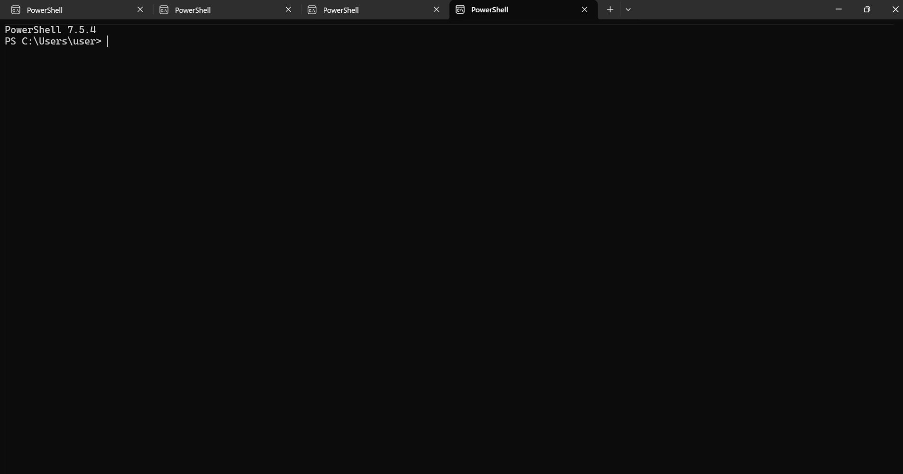
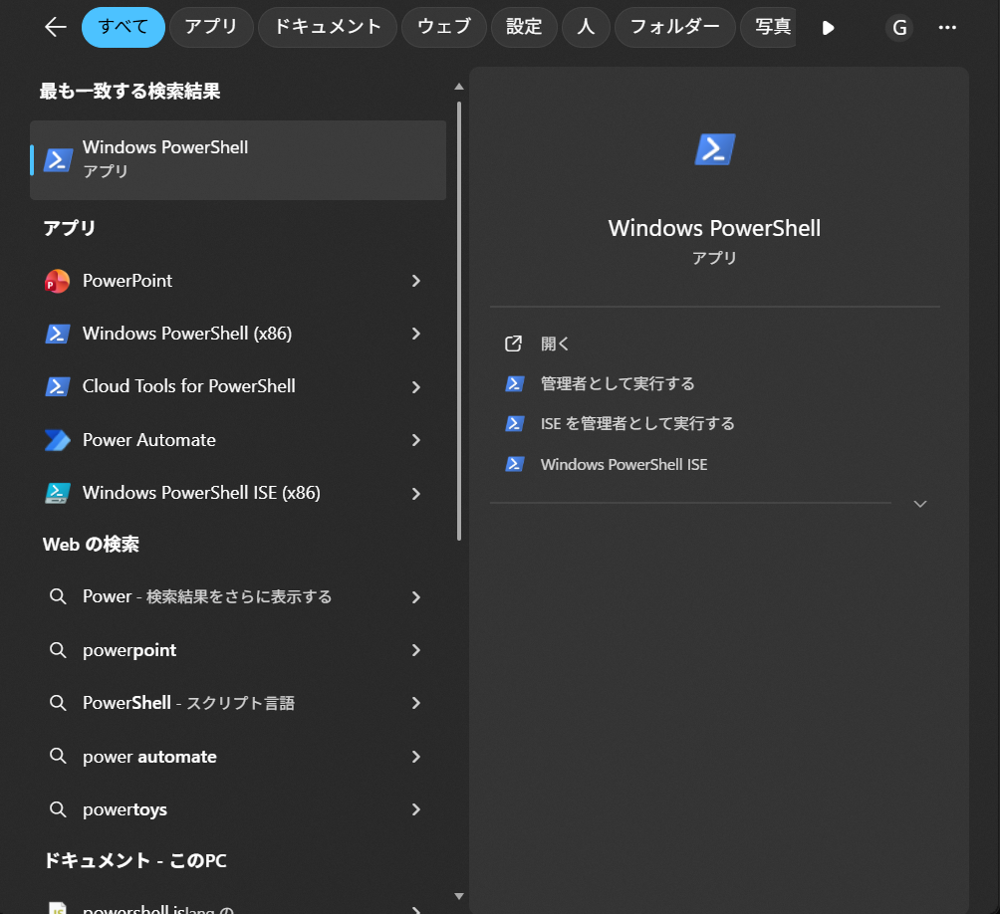
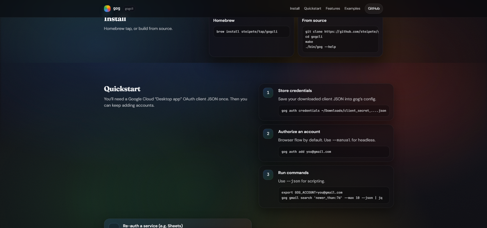
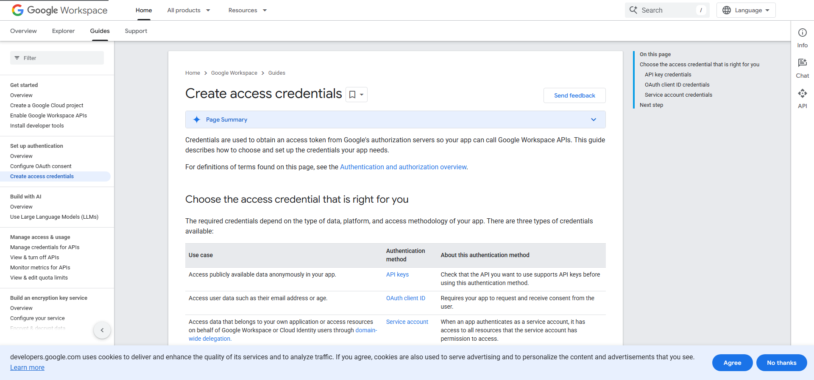
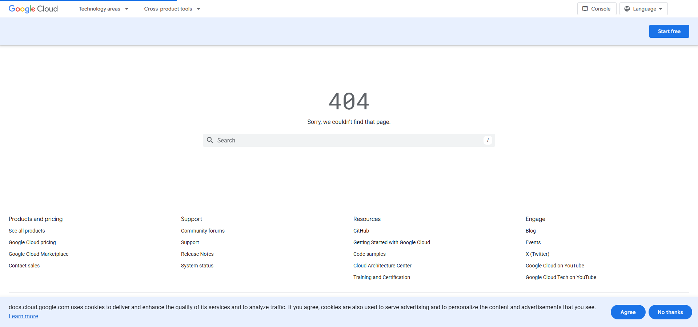

## What You'll Learn in This Article

gog (gogcli) is a tool that lets you control Gmail, Google Calendar, and Drive from a black screen (terminal).

:::conclusion
**Conclusion:** Even if you're not tech-savvy, you can start using gog within 30 minutes by following this guide.
:::


## What is gog? What Can It Do?

### In Simple Terms

gog is a tool that lets you control Google services from a black screen (terminal).

Normally, you open Gmail in a browser (like Chrome or Safari) to check emails, right?
With gog, you can do the same thing just by typing text into a black screen.

### What You Can Do

| What You Want to Do | Normal Method | With gog |
|---------------------|---------------|----------|
| Check unread emails | Open Gmail and click | `gog gmail labels list` |
| Check today's schedule | Open Calendar | `gog calendar agenda --today` |
| Find files in Drive | Open Drive and search | `gog drive ls` |

:::example
**Key Point:** No need to open a browser—one command does the job, making your work faster.
:::

## Things to Know Before Installing

### What is a Terminal (Black Screen)?

A terminal is a screen where you type text to control your computer.

- **Windows** → PowerShell
- **Mac** → Terminal

:::note
**Key Point:** No difficult programming needed. Just copy and paste commands.
:::



### Common Terms (Good to Know)

| Term | Simple Explanation |
|------|-------------------|
| **Go** | Tool to "build" gog (Windows users only) |
| **Git** | Tool to "download" files from the internet |
| **Homebrew** | App store for Mac (install apps via commands) |
| **PATH** | Setting to use commands from any folder |
| **OAuth** | System to ask Google "Can I use this app?" |

## Overall Flow (4 Steps)

```
[Step 1] Preparation (10 min)
    ↓
[Step 2] Install gog (10 min)
    ↓
[Step 3] Connect with Google (10 min)
    ↓
[Step 4] Try it out (5 min)
```

**Key Point:** Even beginners can complete this in 35 minutes. Take it one step at a time.

---

## [Step 1] Preparation (Windows/Mac Common)

### 1-1. Open the Terminal

**For Windows:**
1. Press the "Windows key" on your keyboard
2. Type "PowerShell" and search
3. Click "Windows PowerShell" to open



**For Mac:**
1. Open "Launchpad" (rocket icon)
2. Search for "Terminal" and click

:::warning
**Note:** All subsequent commands should be pasted into this black screen and press Enter.
:::

### 1-2. Check What's Installed on Your Computer

**Windows users, try this:**

```powershell
winget --version
```

If numbers appear, you're good. If nothing appears, install "App Installer" from Microsoft Store.

**Mac users, try this:**

```bash
brew --version
```

If numbers appear, you're good. If nothing appears, we'll install Homebrew later.

---

## [Step 2] Install gog

The official site's Install section offers two options: Homebrew or source build.



### For Windows

Windows requires "downloading parts and assembling them yourself."

#### 2-1. Install Go and Git

Copy and paste this into PowerShell, then press Enter:

```powershell
winget install -e --id GoLang.Go
```

When done, paste this next:

```powershell
winget install -e --id Git.Git
```

:::note
**Key Point:** Go is the "tool," Git is the "download tool." Once installed, you can use them anytime.
:::

#### 2-2. Restart Your Computer (or Close and Reopen PowerShell)

To use the installed tools, close PowerShell once and reopen it.

#### 2-3. Download and Build gog

Paste these commands one by one and press Enter:

```powershell
cd ~
```

```powershell
git clone https://github.com/steipete/gogcli.git
```

```powershell
cd gogcli
```

```powershell
go mod download
```

```powershell
go build -o .\bin\gog.exe .\cmd\gog
```

:::step
**Key Point:** `go build` is the process of "creating the gog.exe executable file." Once this is done, you're almost ready to use it.
:::

#### 2-4. Test It

```powershell
.\bin\gog.exe --help
```

If lots of English explanations appear, success!

#### 2-5. Set Up PATH (Use from Anywhere)

```powershell
setx PATH "%USERPROFILE%\gogcli\bin;%PATH%"
```

:::warning
**Note:** To apply this setting, you need to close and reopen PowerShell.
:::

After closing and reopening PowerShell, try this:

```powershell
gog --help
```

If it appears, installation is complete!

---

### For Mac

Mac is easy—like "installing from an app store."

#### 2-1. Install Homebrew (If You Haven't Already)

Paste this command into Terminal and press Enter:

```bash
/bin/bash -c "$(curl -fsSL https://raw.githubusercontent.com/Homebrew/install/HEAD/install.sh)"
```

:::note
**Key Point:** Homebrew is like an "app store" for installing Mac apps via commands.
:::

#### 2-2. Install gog

```bash
brew install steipete/tap/gogcli
```

#### 2-3. Test It

```bash
gog --help
```

If English explanations appear, success!

---

## [Step 3] Connect with Google

This is the setup to "log in with your Google account."

### 3-1. Create a "Key" in Google Cloud Console

Official documentation pages are provided here to help you visualize the screen transitions.




1. Open https://console.cloud.google.com/ in your browser
2. Click "Select Project" at top right → "New Project"
3. Enter project name "gog-cli" (anything is OK) → Click "Create"
4. From left menu, click "APIs & Services" → "OAuth consent screen"
5. Select "External" → Click "Create"
6. Enter app name "gog" (anything is OK), email address → "Save and Continue"
7. Click "Add or Remove Scopes"
8. Search and check these:
   - `https://mail.google.com/` (Gmail)
   - `https://www.googleapis.com/auth/calendar` (Calendar)
   - `https://www.googleapis.com/auth/drive` (Drive)
9. "Update" → "Save and Continue" → "Save and Continue" → "Back to Dashboard"
10. From left menu, click "Credentials" → "Create Credentials" → "OAuth client ID"
11. Select "Desktop app" as application type
12. Enter name "gog-desktop" (anything is OK) → "Create"
13. Click "Download JSON"

:::warning
**Note:** The downloaded JSON file is a "key." Never show it to anyone.
:::

### 3-2. Register the "Key" with gog

Check where the downloaded JSON file is located.

**For Windows:**

It should be in the Downloads folder, so run this command (replace `XXXX` with the actual filename):

```powershell
gog auth credentials ~/Downloads/client_secret_XXXX.json
```

**For Mac:**

```bash
gog auth credentials ~/Downloads/client_secret_XXXX.json
```

### 3-3. Add Your Google Account

```bash
gog auth add you@gmail.com
```

:::note
**Key Point:** Replace `you@gmail.com` with the actual Gmail address you want to use.
:::

A browser will open asking "Do you want to allow this app to access?" Click "Allow."

:::warning
**Solution:** If the browser doesn't open, add `--manual` like this:

```bash
gog auth add you@gmail.com --manual
```

Copy the displayed URL, open it manually in your browser, and paste the displayed code back into the terminal.
:::

---

## [Step 4] Try It Out

### 4-1. Specify the Account You Want to Use

**For Windows:**

```powershell
$env:GOG_ACCOUNT = "you@gmail.com"
```

**For Mac:**

```bash
export GOG_ACCOUNT=you@gmail.com
```

:::note
**Key Point:** Replace `you@gmail.com` with your actual address.
:::

### 4-2. Display Gmail Label List

```bash
gog gmail labels list
```

If a list of labels (Inbox, Sent, Trash, etc.) appears, success!

### 4-3. Other Commands to Try

```bash
# Display today's schedule
gog calendar agenda --today

# Display only 3 files from Drive
gog drive ls --max 3

# Check number of unread emails
gog gmail labels list | grep UNREAD
```

---

## Common Problems and Solutions

### "gog" Not Found

**For Windows:**
1. Close and reopen PowerShell
2. If still not working, check PATH with:

```powershell
$env:PATH
```

Check if `C:\Users\(your username)\gogcli\bin` is included.

**For Mac:**

```bash
echo $PATH
```

Check if `/opt/homebrew/bin` or `/usr/local/bin` is included.

### Browser Authentication Not Working

Use the `--manual` option:

```bash
gog auth add you@gmail.com --manual
```

Copy the displayed URL, open it in your browser, and paste the displayed code into the terminal.

### Not Enough Permissions

Re-authenticate with `--force-consent`:

```bash
gog auth add you@gmail.com --services gmail,calendar,drive --force-consent
```

---

## Summary

Great job! You can now use gog.

:::conclusion
**Conclusion:**
1. Windows: Build with Go, Mac: Install with Homebrew
2. Create a "key (JSON)" in Google Cloud and register it
3. Connect account with `gog auth add`
4. Test with `gog gmail labels list`

You can now control Gmail, Calendar, and Drive from the black screen!
:::

Once you get used to it, you'll save time by not having to open a browser. Start with daily email checks and schedule checks.

---

## Reference Links

- gog official site: https://gogcli.sh/
- GitHub repository: https://github.com/steipete/gogcli
- Google Cloud Console: https://console.cloud.google.com/
