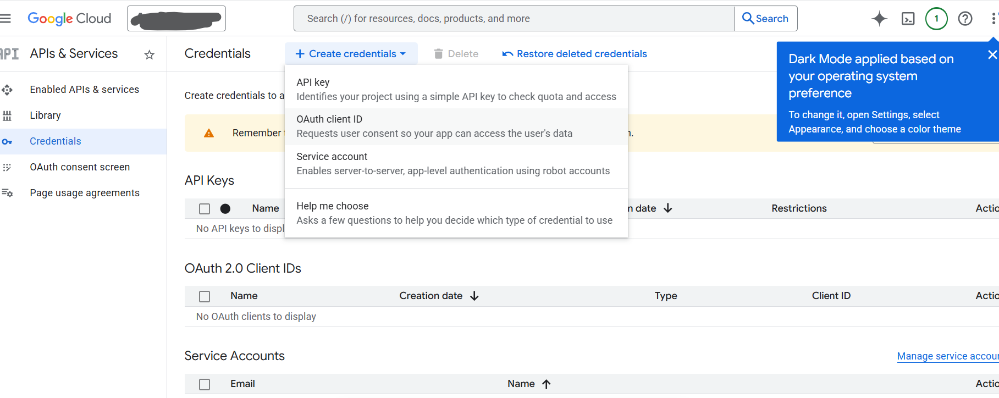

## Problem

When running `gog auth login` or `gog auth add <email>` with gogcli (Google CLI tool), you encounter this error:

> Access blocked: gog-cli-auth has not completed the Google verification process  
> This app is currently in testing mode and can only be accessed by testers approved by the developer.

## Cause

The OAuth client created in Google Cloud Console is still in "**Testing**" mode. In testing mode, only explicitly approved test users can access the app.

## Solution

Add your email address as a **test user** in Google Cloud Console.

### Steps

1. Go to [Google Cloud Console](https://console.cloud.google.com/)
2. Navigate to **APIs & Services** → **OAuth consent screen**
3. Confirm the app is in **Testing** mode

4. Scroll down to the **Test users** section
5. Click **Add users**
6. Enter your email address (e.g., `your-email@gmail.com`)
7. Click **Save**
8. Wait a few minutes, then retry `gog auth login`

## Notes

- Switching to "In production" (published status) also resolves this, but may require a verification process
- For personal or small-scale use, configuring test users is sufficient

## Related Articles

- [gogcli Installation Guide](/gogcli-install-guide-en/)
- [Google Cloud OAuth Consent Screen Setup](https://support.google.com/cloud/answer/10311615)
