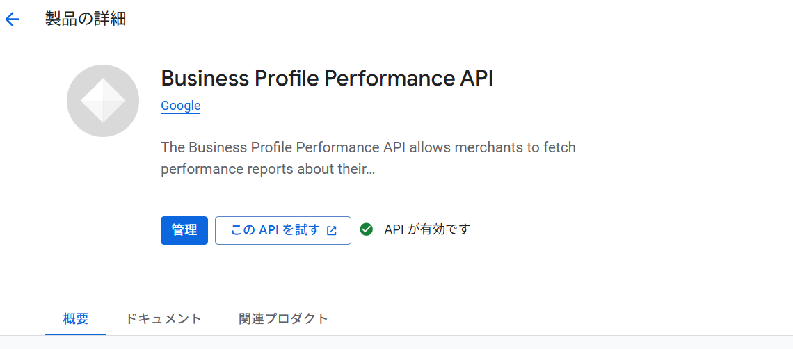
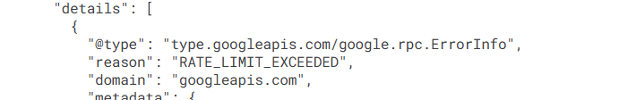

GoogleビジネスプロフィールのデータをGoogle Apps Script（GAS）で自動取得したいと考える方は多いです。しかし、実際にはAPI申請が必須で、単純にAPIを有効化するだけでは動作しません。この記事では、実際に遭遇するエラーと対処法を含め、初心者でも分かるように解説します。

## GoogleビジネスプロフィールAPIとは

GoogleビジネスプロフィールAPI（旧Google My Business API）は、Googleマップに表示される店舗情報やパフォーマンスデータをプログラムから操作・取得できるAPIです。

:::conclusion
GASで取得可能ですが、APIの申請承認が必須で、簡単ではありません。
:::

### 取得できるデータ

- **店舗情報**: 店名、住所、営業時間、電話番号
- **パフォーマンス指標**: 検索表示回数、マップ表示回数、ルート検索数、電話発信数
- **口コミデータ**: 口コミ本文、★評価、投稿日
- **写真**: 店舗写真の管理

## GASで取得できるか？答えと注意点

### できるが、ハードルがある

:::note
技術的には可能ですが、以下3つの関門があります。
:::

1. **GCPでのAPI有効化**
2. **OAuthスコープの明示的な設定**
3. **Google への利用申請と承認待ち（最大の関門）**

特に3番目の「利用申請」が必須で、承認されるまでAPIは実質的に使えません。

## 実装を始めるとすぐに遭遇するエラー

### エラー1: 403 PERMISSION_DENIED（スコープ不足）

```json
{
  "error": {
    "code": 403,
    "message": "Request had insufficient authentication scopes.",
    "status": "PERMISSION_DENIED"
  }
}
```

**原因**: OAuth スコープにビジネスプロフィール用の権限が含まれていません。

#### 対処法

`appsscript.json` にスコープを追加します。

```json
{
  "timeZone": "Asia/Tokyo",
  "oauthScopes": [
    "https://www.googleapis.com/auth/business.manage",
    "https://www.googleapis.com/auth/spreadsheets",
    "https://www.googleapis.com/auth/script.external_request"
  ]
}
```

:::step
GASエディタで「プロジェクト設定」→「マニフェスト ファイルを表示」から編集します。
:::

### エラー2: 403 SERVICE_DISABLED（API未有効化）

```json
{
  "error": {
    "code": 403,
    "message": "My Business Account Management API has not been used in project XXXXX before or it is disabled.",
    "status": "PERMISSION_DENIED"
  }
}
```

**原因**: GCPコンソールでAPIが有効化されていません。

#### 対処法

1. GASエディタの「プロジェクト設定」でGCPプロジェクト番号を確認
2. [Google Cloud Console](https://console.cloud.google.com/)を開く
3. 該当プロジェクトを選択
4. 「APIとサービス」→「ライブラリ」
5. 以下のAPIを検索して有効化：
   - **My Business Account Management API**
   - **Business Profile Performance API**



### エラー3: 429 RESOURCE_EXHAUSTED（最大の関門）

```json
{
  "error": {
    "code": 429,
    "message": "Quota exceeded for quota metric 'Requests' and limit 'Requests per minute' of service 'mybusinessaccountmanagement.googleapis.com' for consumer 'project_number:XXXXX'.",
    "status": "RESOURCE_EXHAUSTED",
    "details": [
      {
        "quota_limit_value": "0"
      }
    ]
  }
}
```



:::warning
これが最も重要なエラーです。`quota_limit_value: 0` に注目してください。
:::

#### このエラーの意味

- APIは有効化されている
- 認証も通っている
- **しかしクォータが0のため、1リクエストも許可されていない**

:::conclusion
このAPIは「申請制」であり、Googleの承認なしでは使えません。
:::

## API利用申請の手順

### なぜ申請が必要なのか

GoogleビジネスプロフィールAPIは、ビジネス情報を扱う性質上、不正利用を防ぐため審査制になっています。

- スクレイピング防止
- 競合データの不正取得防止
- SaaS転売の制限

:::note
自社店舗の管理・分析目的であれば、ほぼ確実に承認されます。
:::

### 申請フォームの場所

公式申請フォーム:
https://support.google.com/business/contact/api_default

### 申請時の記入例

#### 重要な選択肢

| 項目 | 回答 |
|------|------|
| **API利用目的** | ローカル インサイトの分析とレポート作成 |
| **連携方法** | 情報の更新は自社が行っているが、データの取得はお客様と連携して行っている |
| **管理店舗タイプ** | チェーン／フランチャイズ（10か所以上） |

:::warning
「宣伝目的」は選ばない方が無難です。分析・内部利用を強調しましょう。
:::

#### 補足説明（英語・そのまま使える）

```
We operate approximately 20 physical business locations under a single Google Business Profile account, and we fully own and manage these locations.

We plan to use the Business Profile API exclusively to retrieve performance insights such as search views, map views, customer actions, reviews, and ratings for internal analytics and reporting purposes.

The data will be used only within our company for business analysis and decision-making. We will not provide this data to third parties, resell it, or expose it in any public-facing product or service.

The implementation is based on Google Apps Script using OAuth 2.0, and the data will be stored internally in Google Sheets and visualized via Looker Studio.
```

### 承認までの期間

- **最短**: 当日〜2営業日
- **通常**: 3〜5営業日
- **追加質問があった場合**: 1週間〜

:::step
気長に待つしかありません。承認メールが来るまで、実装の計画を立てておきましょう。
:::

## 承認後の実装例

### 最小限の動作確認コード

```javascript
function testGBPConnection() {
  const url = "https://mybusinessaccountmanagement.googleapis.com/v1/accounts";
  const res = UrlFetchApp.fetch(url, {
    headers: {
      Authorization: "Bearer " + ScriptApp.getOAuthToken()
    },
    muteHttpExceptions: true
  });

  Logger.log(res.getResponseCode()); // 200なら成功
  Logger.log(res.getContentText());
}
```

### 店舗一覧を取得

```javascript
function listLocations() {
  // アカウント取得
  const accountsUrl = "https://mybusinessaccountmanagement.googleapis.com/v1/accounts";
  const accountsRes = UrlFetchApp.fetch(accountsUrl, {
    headers: { Authorization: "Bearer " + ScriptApp.getOAuthToken() }
  });
  const accounts = JSON.parse(accountsRes.getContentText()).accounts;
  const accountName = accounts[0].name;

  // 店舗一覧取得
  const locationsUrl = `https://mybusinessbusinessinformation.googleapis.com/v1/${accountName}/locations?readMask=name,title,storeCode`;
  const locationsRes = UrlFetchApp.fetch(locationsUrl, {
    headers: { Authorization: "Bearer " + ScriptApp.getOAuthToken() }
  });
  
  const locations = JSON.parse(locationsRes.getContentText()).locations || [];
  
  // スプレッドシートに出力
  const sheet = SpreadsheetApp.getActive().getSheetByName("locations") || 
                SpreadsheetApp.getActive().insertSheet("locations");
  sheet.clear();
  sheet.appendRow(["Location Name", "Title", "Store Code"]);
  
  locations.forEach(loc => {
    sheet.appendRow([loc.name, loc.title, loc.storeCode || ""]);
  });
}
```

### パフォーマンスデータ取得

```javascript
function fetchPerformanceData() {
  const sheet = SpreadsheetApp.getActive().getSheetByName("locations");
  const data = sheet.getDataRange().getValues();
  data.shift(); // ヘッダー除外

  const endDate = new Date();
  const startDate = new Date();
  startDate.setDate(endDate.getDate() - 30); // 過去30日

  const resultSheet = SpreadsheetApp.getActive().getSheetByName("performance") || 
                      SpreadsheetApp.getActive().insertSheet("performance");
  resultSheet.clear();
  resultSheet.appendRow(["Date", "Location", "Metric", "Value"]);

  data.forEach(row => {
    const locationName = row[0];
    
    const request = {
      locationNames: [locationName],
      basicRequest: {
        timeRange: {
          startTime: startDate.toISOString(),
          endTime: endDate.toISOString()
        },
        metricRequests: [
          { metric: "SEARCH_VIEWS" },
          { metric: "MAP_VIEWS" },
          { metric: "WEBSITE_CLICKS" }
        ]
      }
    };

    const url = "https://businessprofileperformance.googleapis.com/v1/locations:reportInsights";
    const res = UrlFetchApp.fetch(url, {
      method: "post",
      headers: { Authorization: "Bearer " + ScriptApp.getOAuthToken() },
      contentType: "application/json",
      payload: JSON.stringify(request)
    });

    const response = JSON.parse(res.getContentText());
    // データをシートに書き込み（実装は省略）
  });
}
```

## よくある質問と回答

### Q1: 申請が却下されることはありますか？

:::step
以下のケースは却下や保留になる可能性があります：
:::

- 競合店舗のデータ取得目的
- SaaS製品としての再販目的
- 会社のウェブサイトが存在しない
- 実際に管理権限がない店舗にアクセスしようとしている

自社店舗の分析目的なら、ほぼ確実に承認されます。

### Q2: 承認前に開発を進められますか？

:::conclusion
スプレッドシートの設計やLooker Studioのダッシュボード設計は進められます。
:::

API呼び出し部分はダミーデータで開発し、承認後に本番接続するのが現実的です。

### Q3: 無料で使えますか？

通常の利用範囲（数十店舗、日次更新）であれば無料枠内で十分です。

:::warning
大量リクエストや高頻度更新の場合は、クォータ超過に注意が必要です。
:::

### Q4: 高度なGoogleサービスに出てこないのはなぜ？

GASの「高度なGoogleサービス」一覧にはビジネスプロフィールAPIは表示されません。

:::step
`UrlFetchApp` で直接REST APIを叩く方式で実装します。
:::

## 複数店舗管理の実用例

### Looker Studioとの連携

1. GASでスプレッドシートにデータを定期取得
2. スプレッドシートをLooker Studioのデータソースに指定
3. ダッシュボードで可視化

### トリガー設定

```javascript
function setupDailyTrigger() {
  ScriptApp.newTrigger("fetchPerformanceData")
    .timeBased()
    .everyDays(1)
    .atHour(6) // 毎朝6時に実行
    .create();
}
```

## まとめ

GoogleビジネスプロフィールAPIをGASで使う際のポイントをまとめます。

:::conclusion
技術的には可能だが、API申請の承認が必須。承認さえ得られれば、強力な自動化ツールとして活用できます。
:::

### 実装の流れ

1. **GCPでAPI有効化**（5分）
2. **appsscript.jsonにスコープ追加**（5分）
3. **Google に利用申請**（30分）
4. **承認待ち**（数日〜1週間）
5. **実装・運用開始**（1〜2日）

### 承認後に可能になること

- 複数店舗のデータ一元管理
- 日次パフォーマンスの自動取得
- Looker Studioでの可視化
- 口コミの自動監視

### こんな人におすすめ

- 複数店舗を運営している企業
- Googleマップの効果測定をしたい方
- 店舗ごとのKPI比較が必要な方
- 手動でのデータ確認から解放されたい方

:::warning
申請は1企業1回のみです。慎重に記入しましょう。
:::

## 参考情報

1. Google Business Profile API Documentation
https://developers.google.com/my-business
2. API Access Request Form
https://support.google.com/business/contact/api_default
3. Google Cloud Console
https://console.cloud.google.com/
4. GAS OAuth Scopes Reference
https://developers.google.com/apps-script/guides/services/authorization
