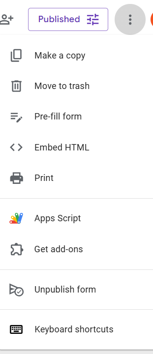
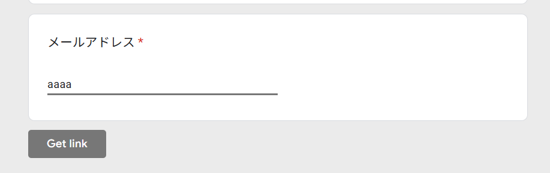

技術ブログを運営していると、こんな悩みに直面することがあります。

* 記事は読まれているが、問い合わせにつながらない
* 問い合わせフォームは置いているが、使われない
* 相談が来ても、状況説明に時間がかかる

本記事では、こうした課題に対して **Googleフォームに「記事文脈」を自動で注入する設計** を取り入れた結果、問い合わせの質と率が明確に改善した事例を紹介します。
具体的な案件名や数値はすべて匿名化し、再現可能な設計思想と実装の考え方に絞って解説します。

## 問い合わせが増えない本当の理由

一般的な問い合わせフォームは、次のような構成が多いはずです。

* 名前
* メールアドレス
* お問い合わせ内容（自由記述）

一見シンプルですが、ユーザー側には見えない負担があります。

* どこから説明すればいいのかわからない
* どの記事の話なのかを一から書く必要がある
* ちゃんと伝わるか不安

この「考える工程」こそが、問い合わせ率を下げる最大の要因でした。
価格やCTA文言以前に、**説明責任をすべてユーザーに負わせている** ことが問題だったのです。

## 発想の転換：説明させない問い合わせ導線

そこで考えたのが、

> ユーザーに説明させない問い合わせフォーム

という設計です。

具体的には、**記事からフォームに遷移した時点で、すでに話が始まっている状態** を作ります。

* この記事のタイトル
* この記事のURL

これらを、Googleフォームの回答欄に **自動で事前入力** しておく。
ユーザーは「この記事の内容について相談する」という前提を、考えることなく共有できます。

## GoogleフォームはURLパラメータで事前入力できる

Googleフォームには「回答を事前に入力する（prefill）」機能があります。
この機能を使うと、URLパラメータ経由で特定の設問に値を渡せます。





概念的には次のような仕組みです。

```
https://docs.google.com/forms/d/e/XXXX/viewform
?entry.XXXXXXXX=値
```

この `entry.XXXXXXXX` が、特定の設問に対応するIDです。

## WordPress側で「記事文脈」を動的に注入する

ポイントは、これを **手動ではなくPHPで動的に生成する** ことです。

WordPressでは、記事ページ（single.php）から次の情報が取得できます。

* 記事タイトル：`get_the_title()`
* 記事URL：`get_permalink()`

これらを組み合わせて、フォームURLを動的に作ります。

擬似コードで表すと、次のような考え方です。

```
記事タイトル + 改行 + 記事URL
```

この文字列を、Googleフォームの該当設問に事前入力しておく。
すると、フォームを開いた瞬間に次のような状態になります。

```
Article: （この記事のタイトル）
URL: https://example.com/...
```

ユーザーは、すでに文脈が共有された状態で相談を始められます。

## 問い合わせ率が上がった本当の理由

重要なのは、**入力項目を減らしたことではありません**。

本質は、次の一点です。

> 認知負荷を削減した

ユーザーは、

* 何を相談していいか
* どの記事の話か

を考えなくてよくなりました。
残るのは、補足があれば書く、連絡先を書く、という最低限の行動だけです。

この一工程の削減が、問い合わせ率に直結しました。

## 副次効果：受け取る側の負担も減る

この設計は、受け取る側にも大きなメリットがあります。

* どの記事の話かが一目でわかる
* 技術領域の切り分けが早い
* 見積や対応可否の判断が即できる

結果として、

* やり取りの往復が減る
* 初動が早くなる
* 冷やかしが自然に減る

という効果が生まれました。

## なぜ「PHPで動的」にする必要があるのか

記事ごとに手動でフォームURLを作る方法もありますが、これはスケールしません。

PHPで動的に生成すれば、

* 記事が増えても運用コストはゼロ
* 日本語・英語の出し分けも可能
* 将来的にカテゴリやタグ情報を追加できる

ブログが成長するほど、**問い合わせ導線そのものが強化される設計** になります。

## まとめ

問い合わせ率が上がった理由は、

* CTAを強くしたから
* 営業文を工夫したから

ではありません。

**ユーザーに説明させる工程を、一つ消したから** です。

技術記事は、正しく設計すればそのまま仕事の入口になります。
GoogleフォームとWordPressは、そのための十分な道具です。

もし、技術ブログを「読まれる場所」から「相談につながる場所」に変えたいなら、
まずはこの「記事文脈を自動注入する設計」から検討してみてください。
