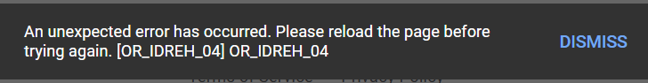
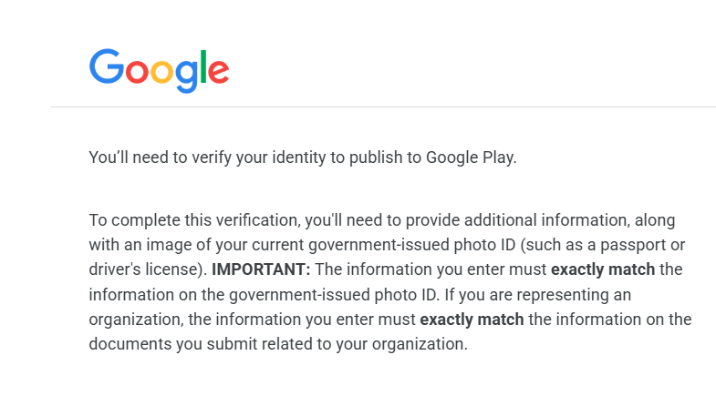
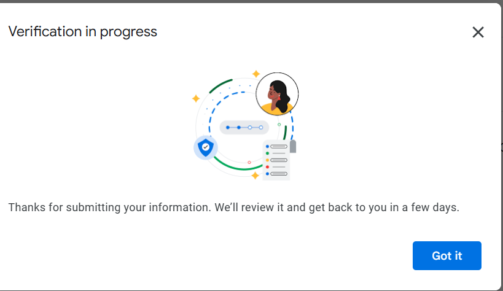

# Google Play Console 本人確認でハマった話

Google Play Console のデベロッパーアカウントを作成し、本人確認（Identity Verification）を進めていたところ、いくつかの壁にぶつかりました。
特に謎のエラーコード `OR_IDREH_04` に遭遇したので、その経緯と解決策をメモしておきます。

## 1. 英語入力ではじかれる

最初は英語（ローマ字）で入力していましたが、なぜかうまくいきませんでした。
そこで、日本語の運転免許証を使って、日本語での入力に切り替えてみました。

## 2. 謎のエラー OR_IDREH_04

日本語で入力し、免許証の画像をアップロードして送信しようとしたところ、以下のエラーが発生しました。

> OR_IDREH_04

このエラーについて調べてみると、Google Play Console 側の本人確認フローでよく出る内部エラーのようです。
ユーザーの入力ミスというよりは、システム側の一時的な不具合やセッション切れの可能性が高いとのこと。

## 3. 解決策：やり直したら通った

結論から言うと、**一度ログアウトして、時間を置いてからやり直したら通りました。**

ChatGPTのアドバイスによると、以下の点がポイントだったようです。

*   **免許証は日本語でもOK**: Google Play の本人確認は日本の運転免許証に対応しています。
*   **入力はローマ字でもOK**: 免許証が日本語でも、入力はローマ字（Kazunori Yamaguchi など）で問題ありません。Google側で日本語⇄ローマ字の対応を認識しています。
*   **OR_IDREH_04 は「待ち」が正解**: このエラーはセッション不良やサーバー側の混雑で出ることが多いので、連打せずに時間を置くか、ブラウザを変える（シークレットモードなど）のが有効です。

もし同じエラーで困っている方がいたら、焦らずに時間を置いてから再トライしてみてください。
入力内容自体は間違っていない可能性が高いです。
