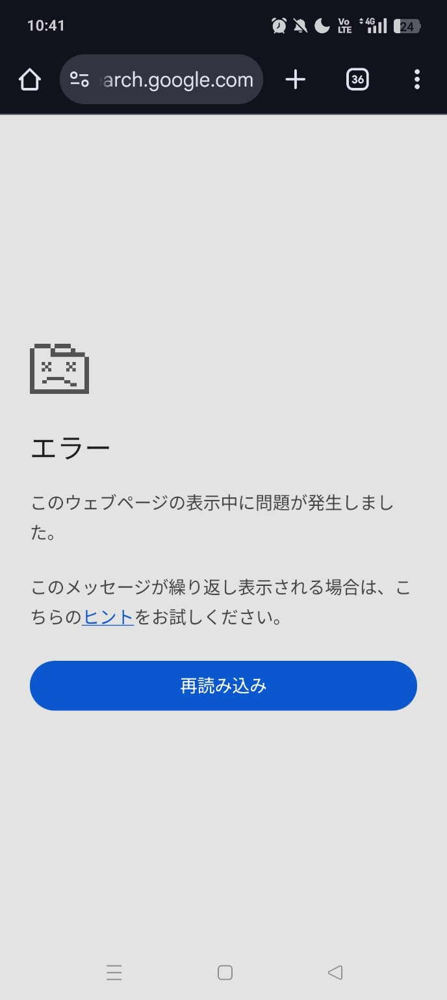

## Introduction

When opening Google Search (search.google.com) on an Android smartphone, you may encounter a screen that says:

> **Error**
> **A problem occurred while displaying this webpage.**

This error often persists even after reloading the page. It is particularly common when using Chrome or mobile data (4G/5G), leading many to wonder if Google is down.

This article outlines the **most common causes reported by users** and provides a **step-by-step troubleshooting guide** that resolves the issue in most cases.

---

## Characteristics of this Error

This error has several common characteristics:

*   It only occurs on `search.google.com`.
*   Reloading the page results in the same error screen.
*   It may resolve itself spontaneously after a while.
*   It might happen on mobile data but not on Wi-Fi.
*   It often works fine in Incognito mode.

These signs indicate that **the page itself is not broken**, but rather something local or connection-related is interfering.

---

## Cause 1: Inconsistency between Google Search and Browser Cache

The most common cause is a temporary corruption of:

*   Chrome's cache
*   Google Search session information

Google Search maintains detailed internal states for page transitions, scrolling, and search criteria changes. If this state becomes inconsistent, this error screen appears.

### Solution

1.  Open Chrome Settings.
2.  Go to "Privacy and security".
3.  Tap "Clear browsing data".
4.  Select **Cached images and files** only and clear data.

*Note: You usually do not need to clear Cookies.*

---

## Cause 2: Connection Issues (Especially Mobile Data)

On 4G/5G networks, factors such as:

*   Packet loss or intermittent connection
*   DNS switching
*   IPv6 / IPv4 switching

can occur frequently, potentially clashing with Google Search's dynamic rendering.

### Solution

*   Switch to Wi-Fi temporarily.
*   Toggle Airplane mode ON and then OFF.
*   Turn off VPN temporarily if you are using one.

In many cases, these simple steps fix the issue immediately.

---

## Cause 3: Chrome Extensions or Ad Blockers

Even on Android Chrome, certain apps can interfere with search result rendering:

*   Ad blockers
*   DNS apps
*   Security apps

### How to Isolate the Issue

*   Try opening the page in Incognito mode.
*   Try searching using the Google App instead of Chrome.

If the page loads correctly in these cases, an extension or background app is likely the cause.

---

## Cause 4: Temporary Glitch on Google's Side

Although rare, display errors can occur for specific users due to:

*   Google Search A/B testing
*   Immediately after a new UI rollout

In this case, **there is nothing you can do but wait**.
It usually resolves itself naturally within a few minutes to a few hours.

---

## Why Doesn't "Reload" Fix It?

This error occurs:

*   Before the page HTML is fully retrieved
*   Or during the JavaScript execution phase

Because the process stops halfway, reloading simply **reproduces the same broken state**.
Clearing the cache or switching connections is effective because it forces a reset of this internal state.

---

## Summary

If you see "A problem occurred while displaying this webpage" on Google Search:

1.  Clear Chrome's cache.
2.  Switch connections (Wi-Fi / Airplane mode).
3.  Check in Incognito mode.
4.  Wait a while.

Trying these steps in order will **almost certainly resolve the issue**.

Rest assured, Google Search itself is likely not broken, so stay calm and try these fixes.
