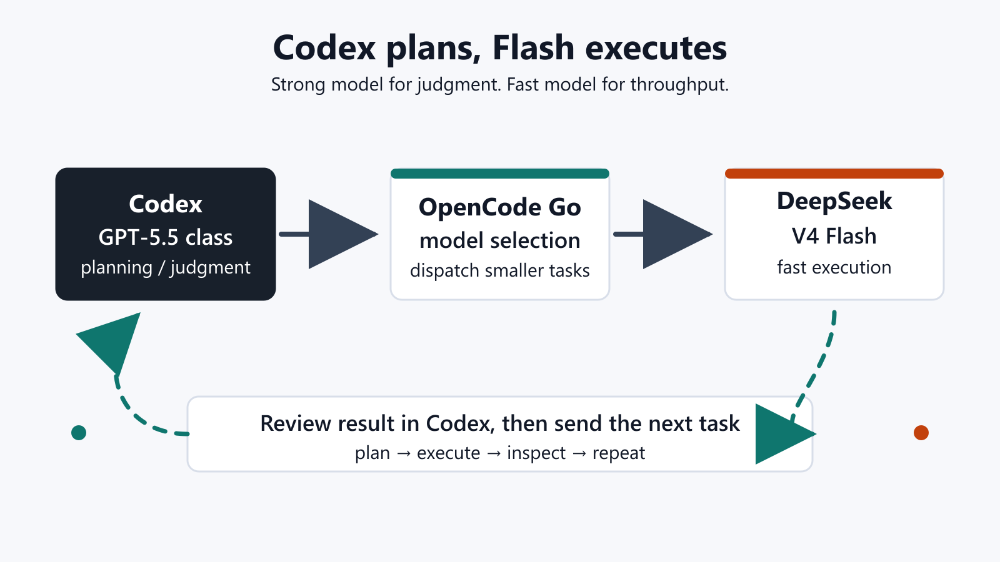

最近、AIコーディングの使い方が少し固まってきました。

結論から言うと、Codex側でGPT-5.5系に立案させて、実作業はOpenCode Goのモデル指定でDeepSeek V4 Flashを呼び出してどんどん進めさせる。この運用がかなりいいです。

:::conclusion
強いモデルに全体設計を任せ、速くて安いモデルに実行を任せる。CodexからOpenCode GoのDeepSeek V4 Flashを呼ぶ形は、今のところかなり実用的です。
:::

## 何がいいのか

DeepSeek V4 Flashは、無限とは言いません。

ただ、私の使い方では、もう「ほぼ無限に近い」と感じるくらい使えます。小さな修正、ファイル確認、ログ読み、差分確認、単純な実装、下書きの整理。こういう作業を何度も投げても、心理的なコストがかなり低いです。

一方で、全体を見通す力は強いモデルほどではありません。

これは仕方ないと思っています。大きな設計、複数ファイルにまたがる判断、失敗したときのリカバリ方針、タスクの切り分け。このあたりを全部Flash側に任せると、やや近視眼的になることがあります。

だから、役割を分けます。

## Codexを司令塔にする

私の今の運用はこうです。

1. Codex側でGPT-5.5系に状況を読ませる
2. 何をどの順番で進めるか立案させる
3. 細かい実行単位に分ける
4. OpenCode Goでモデルを指定してDeepSeek V4 Flashを呼ぶ
5. 進んだ結果をCodex側で見て、次の指示に戻す

つまり、Codexを司令塔にして、OpenCode Go + DeepSeek V4 Flashを実働部隊にする感じです。

これがめちゃくちゃ相性いいです。

重い判断は強いモデルに任せる。手数が必要な作業はFlashに流す。すると、高いモデルをずっと走らせるより軽く、安いモデルだけで全部やるより安定します。

## 実際にはこういう流れ

文章だけだとイメージしにくいので、実際の作業に近い形で書くとこうです。

たとえば、WordPress記事の投稿ツールを直したいとします。

まずCodex側に、リポジトリ全体を見てもらいます。どのファイルが入口で、どこに投稿処理があり、どの変更が危なそうかを整理させます。ここではスピードより見通しが大事です。

次にCodexが、作業を小さく分けます。

- 投稿前のFrontmatter検証を追加する
- 画像アップロードまわりのログを読みやすくする
- 既存テストの失敗原因を確認する
- READMEの手順だけ更新する

この小分けにした作業を、OpenCode Goでモデル指定してDeepSeek V4 Flashに流します。

Flashは、目の前の小タスクを速く進めます。ひとつ直したら戻す。ログを読ませる。差分を出させる。必要ならまた別の小タスクを投げる。

最後にCodex側へ戻して、「この差分で全体としておかしくないか」「触りすぎていないか」「公開してよいか」を見ます。

この流れだと、読ませる・直す・確認する、のテンポがかなり良くなります。

## Flashに向いている作業

DeepSeek V4 Flashに向いているのは、見通しよりも手数が大事な作業です。

- 既存コードの一部を読む
- エラーログを要約する
- 小さな修正案を出す
- 同じ形式のファイルを量産する
- テスト失敗の原因候補を洗う
- 記事やメモの初稿を整える

こういう作業は速さが効きます。

「完璧な一発回答」より、「どんどん進めて、上位のモデルが検査する」ほうが合っています。

## Flashだけにしない理由

DeepSeek V4 Flashだけで全部やる、という感じではありません。

私の感覚では、Flashは局所戦が強いです。目の前のファイル、目の前のログ、目の前の修正にはかなり強い。でも、作業全体の目的や、複数の判断をまたいだ整合性は、強いモデルに見てもらったほうがいい。

たとえば、次のような判断はCodex側に残したいです。

- どこまで直すべきか
- どの変更は触らないほうがいいか
- 既存の設計に合わせるにはどうするか
- テストをどの粒度で走らせるか
- 最終的に公開・納品していい状態か

このへんは、速さよりも見通しが必要です。

## いちばん良いところ

この運用の良さは、モデルを「賢さ順」に並べるのではなく、「役割」で分けられるところです。

DeepSeek V4 Flashは、万能の最高司令官ではないかもしれません。でも、速くて、軽くて、何度も呼び出しやすい。これは実務ではかなり強いです。

Codex側の強いモデルが計画を作り、Flashが実行する。Flashの出力をまたCodex側で見て、必要なら修正する。

この往復ができると、AIコーディングがかなり現実的になります。

## まとめ

今の私の結論はこれです。

- 設計・判断：Codex / GPT-5.5系
- 実行・手数：OpenCode Go / DeepSeek V4 Flash
- 最終確認：もう一度Codex側で見る

DeepSeek V4 Flashは、全体を見通す力では強いモデルに負ける場面があります。でも、速さと呼び出しやすさはかなり魅力です。

だから、Flashを「全部任せる相手」として見るより、「強い司令塔の下で走る実働モデル」として使う。

この運用が、今のところいちばんしっくりきています。
