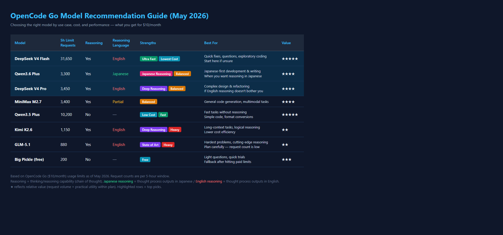

After using DeepSeek V4 Pro, I decided to give Qwen3.6 Plus a try.

Performance-wise, both are top-tier. When it comes to writing code or handling complex instructions, there's almost no perceptible difference. But there's **one clear distinction** between them.

:::conclusion
Qwen3.6 Plus outputs its reasoning in Japanese. That alone creates a completely different sense of comfort.
:::

With DeepSeek V4 Pro, the reasoning output appearing in English bothered me a bit. Functionally it was fine, but my brain had to pay a small context-switching cost as the flow went "Japanese → English → Japanese."

Qwen3.6 Plus, on the other hand, **reasons in Japanese**.

When I ask for complex code design, Qwen3.6 shows its thinking process — "first I'll consider this... then do that..." — in Japanese. Getting the final result in Japanese is expected, but having the **actual thought process in Japanese** makes a surprisingly big difference.

There's a sense of reassurance, like "okay, this model is actually thinking in Japanese for me."

I'm not sure what causes this difference — whether it's training data, or different prompt handling for reasoning sections. But the subjective experience is clear.

- **DeepSeek V4 Pro**: Uncompromising performance, reasoning in English
- **Qwen3.6 Plus**: Similarly high performance, reasoning in Japanese feels reassuring

Which one to choose seems like a matter of preference. Personally, I like being able to follow the thought flow in Japanese, so right now Qwen3.6 Plus feels more comfortable.

Of course, DeepSeek's English output isn't a deal-breaker once you get used to it, and there are probably situations where English reasoning is actually preferable. But when you want everything to happen in Japanese, Qwen3.6 Plus becomes a strong contender.

## OpenCode Go Model Recommendations (May 2026)

Subscribing to OpenCode Go gives you access to 14 paid models plus 1 free model. After testing them all, here are my recommendations by use case.

:::step
1. **Daily driver (main)**: Qwen3.6 Plus — Japanese reasoning is comforting, good value
2. **Quick fixes & questions**: DeepSeek V4 Flash — high request count, start here if unsure
3. **Complex design & refactoring**: DeepSeek V4 Pro — deep reasoning, if you don't mind English thinking
4. **After hitting limits**: Big Pickle (free) — fewer requests but useful as a fallback
:::

:::note
The reasoning output language is an important factor when working in Japanese. Qwen3.6 Plus outputs its thinking process in Japanese, while DeepSeek V4 Pro outputs in English. This difference alone affects fatigue levels during long coding sessions.
:::

:::note
Kimi K2.6 is currently running a **3x usage limit promotion** (roughly 3x the normal request count per 5h window). The regular request count is modest, but for those "make or break" moments — complex logical reasoning or long-context tasks — switching to Kimi K2.6 is worth it. The promotion softens the cost-efficiency concern, so now is a good time to try it.
:::
