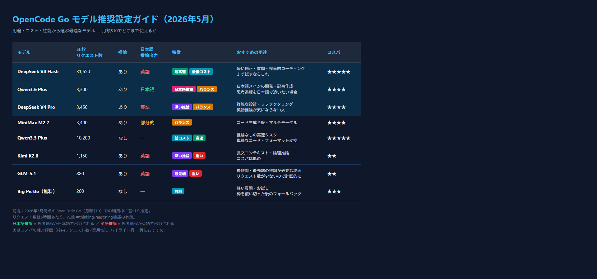

DeepSeek V4 Pro を使ったあと、今度は Qwen3.6 Plus を試してみました。

性能自体はどちらも高水準で、コードを書かせたり、複雑な指示を出したりする分には違いはほとんど感じません。でも、**ひとつ明確に違う点**があります。

:::conclusion
Qwen3.6 Plus は推論過程を日本語で出力してくれる。これだけで「安心感」が全然違う。
:::

DeepSeek V4 Pro のときは、推論（reasoning）部分が英語で出てくるのが気になっていました。機能的には問題ないんですが、思考の流れが「日本語→英語→日本語」となると、脳がちょっとだけ切り替えコストを払っていました。

Qwen3.6 Plus はその点、**推論も日本語で出てくる**んです。

同じように複雑なコードの設計を頼んでも、Qwen3.6 は「まずこう考えて…次にこうして…」という思考を日本語で表示してくれます。結果として日本語で返ってくるのは当然として、**思考の過程自体が日本語**なのが地味に大きいです。

使っていて「あ、このモデルはちゃんと日本語で考えてくれてるんだな」という安心感があります。

この違いは何が原因なのか、モデルのトレーニングデータの違いなのか、あるいは推論部分のプロンプト処理が違うのか、詳細はわかりません。ただ、体感としては明確です。

- **DeepSeek V4 Pro**: 性能は文句なし、推論は英語
- **Qwen3.6 Plus**: 性能は同じくらい高い、推論は日本語で安心

どちらを選ぶかは好みの問題になりそうです。私は「思考の流れを日本語で追いたい」ので、今のところ Qwen3.6 Plus の方が居心地がいいです。

もちろん、DeepSeek の英語出力も慾れれば問題ないし、むしろ英語で考えた方がいい場面もあるでしょう。でも「日本語で全部完結させたい」というときは、Qwen3.6 Plus が候補に入ってきます。

## OpenCode Go モデル推奨設定（2026年5月）

OpenCode Go に契約すると14モデル＋無料1モデルが使えます。すべてのモデルを試した結果、用途別のおすすめをまとめました。

:::step
1. **普段遣い（メイン）**: Qwen3.6 Plus — 日本語推論が安心、コスパも良い
2. **軽い修正・質問**: DeepSeek V4 Flash — リクエスト数が多く、まず試すならこれ
3. **複雑な設計・リファクタリング**: DeepSeek V4 Pro — 推論が深い、英語思考は許容できる人に
4. **枠を使い切った後**: Big Pickle（無料）— リクエスト数は少ないがフォールバックとして有用
:::

:::note
推論（reasoning）の出力言語は、日本語で作業するうえでの重要な選択基準です。Qwen3.6 Plus は思考過程が日本語で出力され、DeepSeek V4 Pro は英語で出力されます。この違いだけで、長時間の作業での疲れやすさが変わってきます。
:::

:::note
Kimi K2.6 は現在 **3倍の利用枠キャンペーン** 中です（5h枠で3,450→公開値の約3倍）。普段のリクエスト数は控えめですが、ここぞという場面 ― 複雑な論理推論や長文コンテキストが必要なとき ― には切り替える価値があります。キャンペーン中ならコスパの悪さも緩和されるので、試すなら今がチャンスです。
:::
