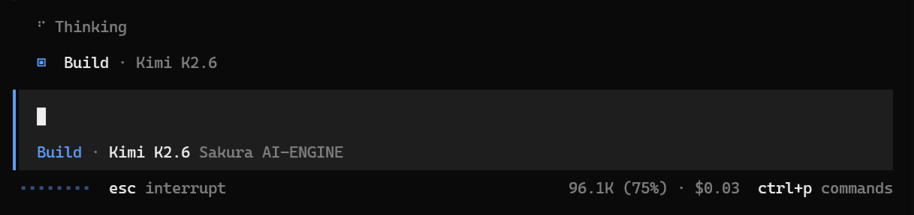

さくらのAI-ENGINEにKimi K2.6が追加されたと聞いて試してみました。OpenCode Goから接続したときの応答を簡単に記録しておきます。

接続自体はできました。モデル一覧にもKimi K2.6が表示され、選択も問題なく行えました。

:::note
検証日時: 2026年5月27日。OpenCode GoからさくらのAI-ENGINEのKimi K2.6エンドポイントを呼び出した際の挙動です。時間帯やサーバー負荷によって変わる可能性があります。
:::

## 観測した応答の傾向

コーディングの小さなタスクをいくつか投げてみたところ、以下のような応答のばらつきが見られました。

- 最初の応答が返ってくるまでに時間がかかることがある（30秒以上待つケースもあった）
- ストリーミング中に応答が途切れることがある
- 応答が途中で止まったまま復帰しない場合がある
- 一方で、正常に最後まで応答が返ってくることもある

OpenCode Goの設定は特に変更していません。同じ環境で他のモデル（DeepSeek V4 Proなど）を試した場合は、このような応答の遅延は見られませんでした。

## 原因について

応答が遅くなる原因は今のところ特定できていません。さくらのAI-ENGINE側のサーバー負荷、Kimi K2.6のデプロイ構成、あるいはAPI経由の通信経路など、いくつかの要因が考えられますが、切り分けには至っていません。

現時点では観測した事実を記録しておくにとどめ、引き続き様子を見ようと思います。

:::conclusion
さくらのAI-ENGINE上のKimi K2.6は接続できるが、応答に時間がかかるケースが観測された。原因は不明で、引き続き経過を追う。
:::
