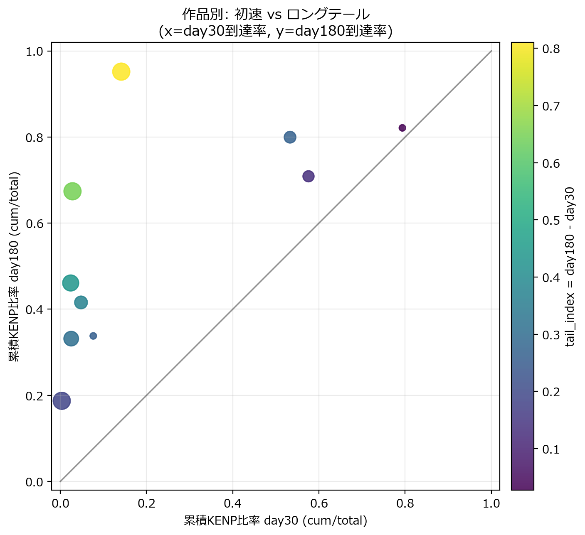
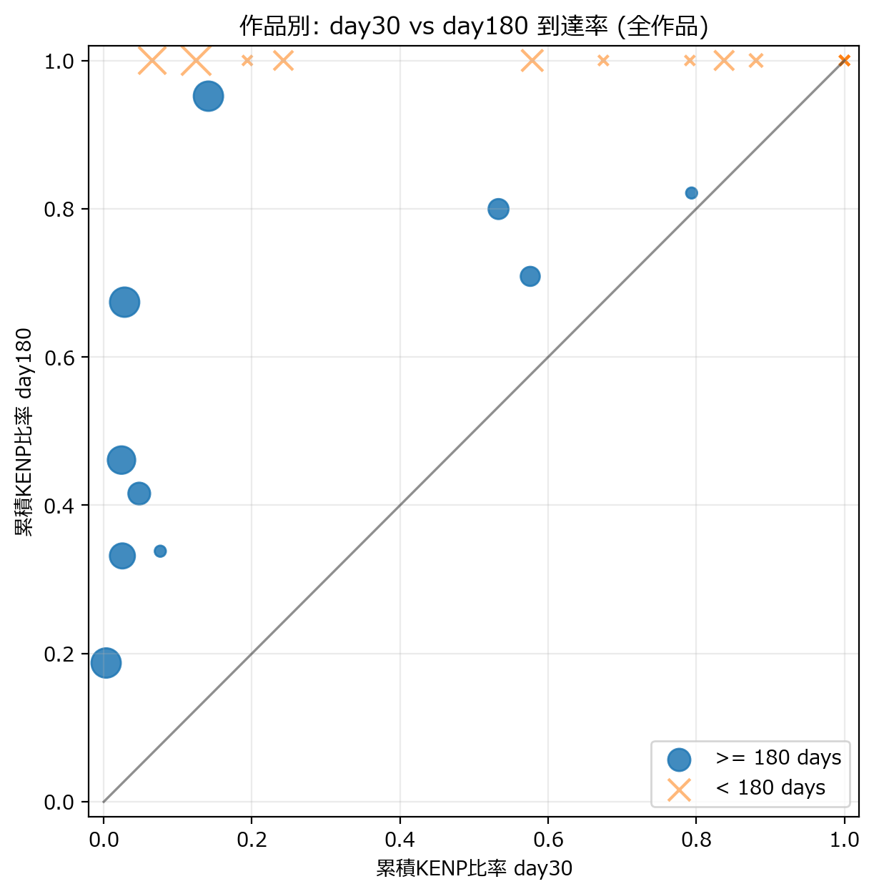
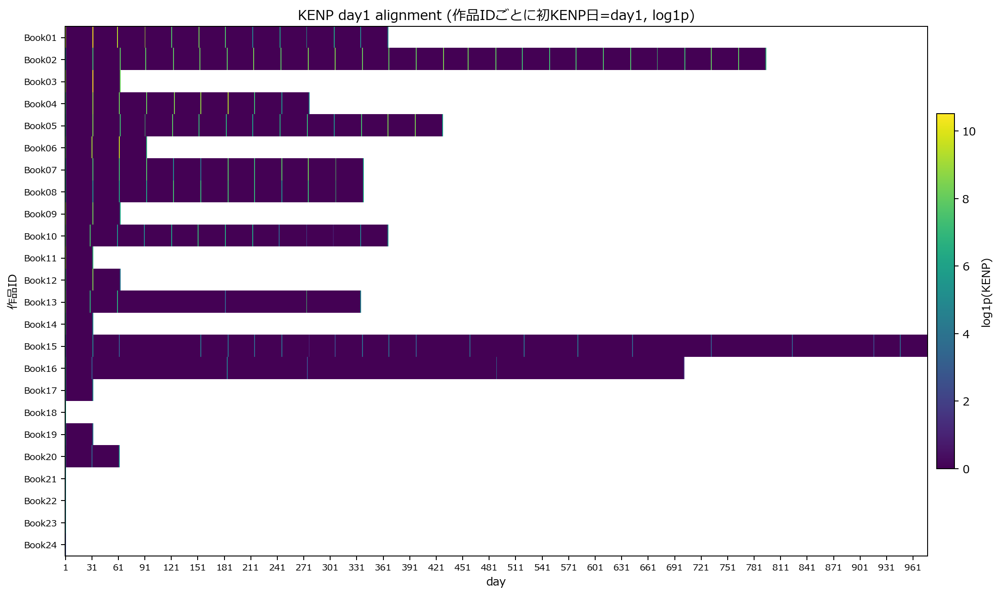

**Target Audience**: Intermediate to advanced KDP authors with 3+ published works, aiming to maximize Kindle Unlimited revenue  
**Reading Time**: ~8 minutes  
**Keywords**: KDP data analysis, Kindle Unlimited, KENP, long-tail, self-publishing marketing

---

## Introduction: Is Your Book "Fast-Burn" or "Long-Tail"?

KDP authors earning consistent monthly revenue from Kindle Unlimited often struggle with these questions:

- "Should I abandon a book if KENP growth stalls after 2 weeks?"
- "When is the right time to evaluate books that keep getting read after 6 months?"
- "How do I decide which books deserve my ad budget?"

The truth is, ==every book has a completely different "reading pattern"==. In this article, I'll share insights from my own KDP report data using a method called "day1 alignment analysis" to categorize books into three types—**Fast-Burn**, **Long-Tail**, and **Ultra Long-Tail**—and reveal the optimal marketing strategy for each.

:::conclusion
**What you'll learn from this article**:
- The day1 alignment method for analyzing KENP data by "book lifespan"
- A 3-type classification framework using scatter plots
- Type-specific advertising strategies and decision frameworks for when to cut losses
- Step-by-step instructions you can replicate in Excel
:::

---

## 1. Why Analyze by "First KENP Record Date" Instead of "Publication Date"

### Limitations of Traditional Analysis

When reviewing KDP reports, many authors track sales trends from the "publication date." However, this approach has pitfalls:

- **Publication date ≠ First KENP record date**: Some books show zero KENP for days or weeks after release
- **Cross-book comparison is difficult**: Comparing books released at different times introduces noise from seasonal factors and market conditions

### Benefits of Day1 Alignment (First KENP Record Date Basis)

**Day1 alignment** means:
> For each book, define the first day with KENP > 0 as `day1`, then align the timeline by elapsed days (day2, day3...) from that point

This enables:
- Perfect synchronization of "when books started being read" for comparison
- Elimination of seasonal/market differences to extract pure "reading pattern characteristics"

We also use the **cumulative KENP ratio** metric:
```
day30 cumulative ratio = (day1 to day30 KENP total) ÷ (total KENP for all time)
```

The ==closer this value is to 1.0, the more concentrated the reading== was up to that point.

---

## 2. Crystal Clear in a Scatter Plot: The 3-Type Classification Method

### Analysis Method: Day30 vs Day180 Scatter Plot

The scatter plot uses these two axes:

- **X-axis**: Day30 cumulative KENP ratio (initial velocity strength)
- **Y-axis**: Day180 cumulative KENP ratio (6-month completion rate)

**How to read this scatter plot**:
Each point represents one book, and its position shows when KENP occurs. Books in the upper-right are read quickly; books in the upper-left are read gradually over time.



**Key Point:** Comparing each book's cumulative KENP ratio at day30 and day180. Upper-right indicates Fast-Burn type; upper-left indicates Long-Tail type

**Key insights from Figure 1**:
- **Upper-right books (day30 ratio >70%)**: "Fast-Burn" type where most KENP occurs within the first month
- **Upper-left books (day30 ratio <20%, day180 ratio >80%)**: "Long-Tail" type that catches up over 6 months despite a slow start
- **Diagonal line books**: Consistent growth from day30 to day180. Use this as a baseline to identify over/under-performers

### Full Dataset Scatter Plot

Here's the complete picture including books with less than 180 days of data.



**Key Point:** Full picture including books with shorter data periods. Books with <180 days tend to cluster in the lower-right

**Trends visible in Figure 2**:
- Books with <180 days (shorter observation period) cluster in the lower-right
- This is due to "not enough time elapsed," not necessarily "failed books"
- Highlights the importance of long-term data collection

### Characteristics and Positioning of the 3 Types

| Type | Scatter Plot Position | Characteristics | Typical Reader Demographic |
|------|----------------------|-----------------|---------------------------|
| **Fast-Burn** | Upper-right (High X, High Y) | ~80% of KENP occurs within 30 days of release. Short-term intensive type | Heavy readers sensitive to new releases, series followers |
| **Long-Tail** | Upper-left (Low X, High Y) | ~15% at day30 but reaches 95% by 6 months. Read gradually over time | Genre fans, readers flowing in from related books |
| **Ultra Long-Tail** | Lower-left to center (Low X, Medium Y) | 3% at day30, 67% by 6 months. New readers continue flowing in long-term | Organic discovery via Amazon search and category browsing |

Actual numbers from this dataset (10 books with 180+ days of data out of 24 total):
- Day30 cumulative ratio range: **0.3% to 79.4%**
- Day180 cumulative ratio range: **18.7% to 95.2%**

This alone shows the overwhelming difference in "reading patterns" even among books by the same author.

---

## 3. KENP Patterns Over Time: Heatmap Analysis

Visualizing daily KENP trends as a heatmap alongside scatter plots reveals deeper insights.



**Key Point:** Y-axis shows book ID, X-axis shows days from day1. Color intensity represents KENP volume. Vertical bands (multiple books showing KENP on the same day) suggest campaign or sale effects

**Insights from Figure 3**:
- **Horizontal patterns**: Books fading from left to right are "Fast-Burn"; books with dark colors continuing to the right are "Long-Tail"
- **Vertical patterns**: Dark colors appearing on the same day across multiple books suggest campaign announcements or sale effects
- **Individual book characteristics**: Visual differences between books like Book13 (dark only at the start, then disappears) vs Book07 (light but persistent over the long term)

Combining this heatmap with scatter plots provides more material for deciding "when" and "which books" need intervention.

---

## 4. Why "Type Classification" Changes Marketing Strategy

### Risk of Incorrect Abandonment Decisions

A common failure pattern among KDP authors:

:::warning
"KENP growth stalled after 1 month, so this book is a failure. Moving on to the next one."
:::

However, ==it's normal for Long-Tail books to show almost no reading at the 30-day mark==. Some books reach only 14% at day30 but hit 95% after 6 months.

:::conclusion
**In other words, judging based solely on 30-day data risks killing potential golden eggs.**
:::

### Correct Strategy Design by Type

| Type | Decision Criteria | Optimal Marketing Strategy |
|------|------------------|---------------------------|
| **Fast-Burn** | Monitor day7-day30 growth. Act early if stagnation occurs | ① Concentrated ad spend right after release (Amazon ads, SNS)<br>② New release announcements via email/blog<br>③ If cumulative ratio is low at day30, consider abandoning or revising cover/title |
| **Long-Tail** | **Don't mistake low day30 performance as "failure"** | ① Maintain continuous visibility (ads to maintain category ranking)<br>② Strengthen internal links from related books<br>③ Evaluate on a **minimum 180-day span**. Never cut ads short-term |
| **Ultra Long-Tail** | Organic search and category traffic are the main drivers | ① SEO optimization (title, keywords, description)<br>② Emphasize "guidance from other books" through series development<br>③ Minimize ad spend. Prioritize long-term category positioning |

### Concrete Examples: Decision Flow by Book

:::example
**[Fast-Burn: Book A]**
- Day30 cumulative ratio: 79% → Day180 cumulative ratio: 82%
- "Almost all KENP came in the first 30 days"
- Strategy: Reduce ad spend after day30. Reallocate resources to next book
:::

:::example
**[Long-Tail: Book B]**
- Day30 cumulative ratio: 14% → Day180 cumulative ratio: 95%
- "Underwhelming at day30 but catches up over 6 months"
- Strategy: Continue ads. Re-evaluate at day90 and day180
:::

:::example
**[Ultra Long-Tail: Book C]**
- Day30 cumulative ratio: 3% → Day180 cumulative ratio: 67%
- "Near zero initially, builds up gradually over time"
- Strategy: Suppress ad spend. Cultivate organic traffic through category SEO and series development
:::

---

## 5. Data Analysis Implementation: Steps You Can Take Today

### Step 1: Data Preparation

Extract from KDP reports (.csv):
- Daily KENP by book
- ASIN (for book identification)

### Step 2: Execute Day1 Alignment

For each book:
1. Define the first day with KENP > 0 as `day1`
2. Calculate elapsed days from that point (day2, day3...)
3. Calculate cumulative KENP for each day
4. Divide by the book's total lifetime KENP to get the "cumulative ratio"

**Excel calculation example**:
```
=SUM($B$2:B2)/SUM($B$2:$B$last_row)
```
($B$2:B2 represents the range from day1 to that day)

### Step 3: Create the Scatter Plot

- X-axis: Day30 cumulative ratio
- Y-axis: Day180 cumulative ratio
- Plot each book

Threshold guidelines (derived from this analysis):
- **Day30 ratio ≥30%** → Likely Fast-Burn type
- **Day30 ratio <30%, Day180 ratio ≥80%** → Long-Tail type
- **Day180 ratio <70%** → Ultra Long-Tail type or insufficient visibility

### Step 4: Assign Strategies

Determine ad budget and promotion direction according to the "Type-Specific Strategy Design" above.

---

## 6. Supplement: Note on Correlation Between Orders and KENP

Examining the correlation between "orders (paid downloads) and KENP" in the same dataset revealed interesting patterns:

**Correlation is weak in daily data** but **stronger when aggregated monthly**.

**Reasons**:
- Daily data has more noise from day-of-week effects, campaigns, and missing observations
- KU readers have different reading paces, causing completion timing to vary on a daily basis
- Monthly aggregation clarifies the relationship between "new readers flowing in that month" and "completions"

Practical implications:
- Don't obsess over daily KENP fluctuations
- Make trend judgments based on monthly progression
- Evaluate campaign effectiveness on a minimum 1-month basis

---

## 7. Next Steps: Advanced Applications

Building on this analysis, consider these extensions:

### ① Build an Automated Classification System

Set thresholds on day30 cumulative ratio for automatic book classification:
- Day30 ratio ≥30% → "Fast-Burn" → Short-term evaluation route
- Day30 ratio <30% → "Long-Tail suspected" → 180-day evaluation route

### ② Link with Campaign Data

Record past campaigns (free download campaigns, Amazon ad spend, SNS posts) chronologically and verify ROI by type:
- Derive rules like "Fast-Burn books recover ad spend faster"
- "Long-Tail books benefit from continuous ads"

### ③ Build a Prediction Model

Create a model to predict day30 and day180 ratios from day7 and day14 cumulative ratios, enabling "early abandonment decisions."

---

## Conclusion: Start Your "Reading Pattern" Analysis Today

:::conclusion
1. Use **day1 alignment** to correctly visualize how your books are being read
2. Classify into 3 types (**Fast-Burn, Long-Tail, Ultra Long-Tail**) using **day30 vs day180 scatter plots**
3. Check temporal patterns with **heatmaps** to identify optimal intervention timing
4. **Vary strategies by type** to reduce wasted ad spend while maximizing revenue
:::

Most importantly, **don't abandon Long-Tail books too early**. Instead of getting discouraged by low KENP at day30, evaluate on a 6-month timeline to recover missed revenue opportunities.

---

**Which type does your book's KENP data fall into?**  
Try day1 alignment in Excel today. You're sure to discover something new.

---

## Reference: Generated Files (Anonymized)

| File | Content |
|------|---------|
| `kenp_day1_heatmap_log1p_anon.png` | Book-by-day KENP heatmap (day1 aligned) |
| `scatter_day30_day180_anon.png` | Day30 vs Day180 scatter plot (books with 180+ days of data) |
| `scatter_day30_day180_all_anon.png` | Day30 vs Day180 scatter plot (all books) |
| `kenp_cum_ratio_day30_day180_anonymized.csv` | Book-by-book cumulative ratio data (analysis CSV) |
