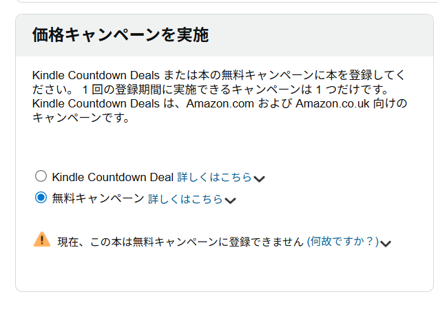

# KDPセレクトに登録したのに無料キャンペーンが設定できない！

「KDPセレクトに登録した！よし、無料キャンペーンを設定して販促だ！」
と意気込んで設定画面を開くと、こんなエラーが出ることがあります。

> **現在、この本は無料キャンペーンに登録できません（何故ですか？）**

「え？ まだ一回もキャンペーン使ってないのに？」
「KDPセレクトには登録済みになっているはずなのに…」

と焦ってしまいますよね。

:::conclusion
結論から言うと、これは**KDPのシステム上の反映遅延（タイムラグ）**である可能性が非常に高いです。
あなたの設定ミスではありません。
:::

## 状況の確認

まず、KDPセレクトの登録状況を確認してみましょう。

このように「KDPセレクトへの登録状況」が「登録済み」になっており、登録期間中であるにもかかわらず、キャンペーン設定画面では弾かれてしまう。
これが今回のトラブルの典型的なパターンです。

## 原因：KDPの内部処理とタイムゾーンのズレ

なぜこのようなことが起こるのでしょうか？
主な原因は以下の2点です。

1.  **KDPセレクトの登録ステータスと、キャンペーン権限の付与は別処理**
    画面上で「登録済み」と表示されていても、内部システムで「キャンペーンを行う権限」が付与されるまでにはタイムラグがあります。これらは別のバッチ処理（定期的な自動処理）で動いているため、表示と実態にズレが生じることがあります。

2.  **基準時間が米国太平洋時間 (PST/PDT)**
    KDPのシステムは基本的に米国太平洋時間を基準に動いています。日本時間 (JST) で「登録期間開始日」になっていても、向こうの時間ではまだ前日だったり、処理が始まっていなかったりすることがあります。

KDPの公式コミュニティでも同様の報告があり、「無料プロモーションは太平洋時間で開始されるため、地域によっては遅れが生じる」といった回答が寄せられています。

## 対処法：とにかく待つ

このエラーが出た場合の対処法はシンプルです。

:::step
**「24時間〜48時間、何もせずに待つ」**

これだけです。
:::
焦ってKDPセレクトを解除して再登録したり、価格をいじったりすると、かえって内部ステータスがおかしくなる可能性があります。

### チェックリスト
*   [x] KDPセレクトに登録済みである
*   [x] 登録期間中である
*   [x] まだ無料キャンペーンの日数（5日間）を使い切っていない

これらが全てOKなら、あなたは何も間違っていません。
Amazon側のシステムが追いついてくるのを待ちましょう。

## まとめ

「一回も使っていないのに登録できない」と言われるとドキッとしますが、これはKDPあるあるの仕様（というか遅延）です。
明日か明後日にもう一度確認してみてください。きっと設定できるようになっているはずです。
