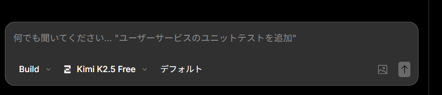

Kimi 2.5（kimi-k2.5-free）がOpenCodeで利用できるようになりました。

:::conclusion
OpenCodeでKimi 2.5が使えるようになり、より高性能なAIアシスタントが利用可能になりました。
:::

これまでOpenCodeでは様々なAIモデルが利用できましたが、Kimi 2.5の追加により、より高精度な回答やコーディング支援が期待できます。

【ポイント】Kimi 2.5は長文理解やコーディングタスクで優れた性能を発揮します。

今後の業務効率化に役立てていきたいですね。
