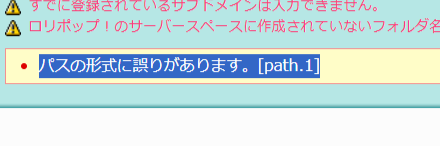
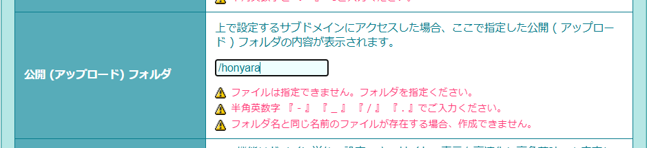
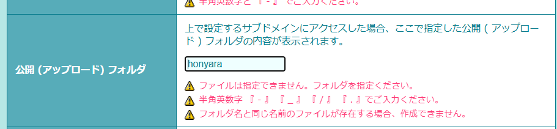

# 「パスの形式に誤りがあります。[path.1]」の原因はスラッシュでした

こんにちは、ZIDOOKAです。
Lolipop!レンタルサーバーで新しいサブドメインを追加しようとした際、見慣れないエラーが出て少しハマったので共有します。

## 発生したエラー

ユーザー専用ページから「独自ドメイン設定」→「サブドメイン設定」と進み、新規作成を行おうとしたところ、以下のエラーが表示されました。

> パスの形式に誤りがあります。[path.1]

「公開（アップロード）フォルダ」の指定でエラーになっているようです。

## 原因：先頭のスラッシュ

原因は非常に単純で、フォルダパスの先頭に `/`（スラッシュ）を入れていたことでした。

**× 間違い（スラッシュあり）**

Linuxなどのパス指定に慣れていると、ついルートを表す `/` を先頭につけたくなりますが、Lolipopの設定画面ではこれが「形式エラー」とみなされます。

## 解決策：スラッシュをトル

先頭のスラッシュを削除し、フォルダ名から書き始めることで無事に登録できました。

**〇 正解（スラッシュなし）**

## まとめ

*   Lolipopでサブドメインの公開フォルダを指定する際は、先頭に `/` をつけない。
*   「パスの形式に誤りがあります」と言われたら、入力した文字列の記号を疑う。

単純なことですが、エラーメッセージだけでは少し分かりにくいので注意が必要です。

https://zidooka.com/
