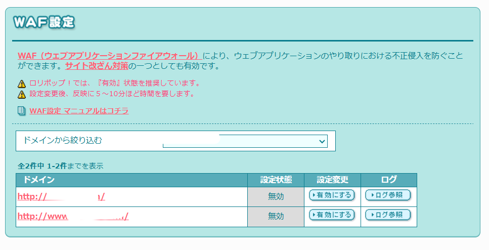

# Check Your Domain Settings When 403 Errors Persist

Hello, this is ZIDOOKA.
Today, I want to share a troubleshooting experience I had while trying to upload images via the WordPress REST API.

The conclusion is simple: **I overlooked that 'www' and 'non-www' domains are managed separately.**

## The Problem

I was trying to post an article to WordPress using a custom CLI tool, but image uploads were consistently failing with a `403 Forbidden` error.
Usually, this is caused by the WAF (Web Application Firewall) on the hosting server (in this case, Lolipop!), so I decided to check the settings.

## The Trap

I checked the server settings on the Lolipop user dashboard and tried to investigate based on the logs.
However, no matter how much I reviewed the settings, changed the User-Agent, or resized the images, the 403 error persisted.

I wondered for hours why my changes weren't being reflected. The cause was incredibly simple.

## The Cause: www vs non-www

I was checking the settings for `www.zidooka.com`.
However, the REST API endpoint I was actually hitting was `zidooka.com` (without www).

In Lolipop's specification, the "www" and "non-www" versions of a custom domain are listed as **separate domains** in the settings screen.

As shown in the image above, I didn't realize the settings were separated, and I was frantically adjusting the settings for the domain I wasn't even using.
Naturally, changing settings on the wrong domain had no effect on the actual endpoint.

## The Solution

I needed to check the settings for the correct domain (in this case, `zidooka.com` without www).
Since I was looking at the wrong domain, my investigation was going nowhere.

Once I looked at the correct domain's configuration, I was finally able to identify the issue and resolve it.
If you get 403 errors with the WordPress REST API, check your domain settings and logs carefully
## Summary

*   Suspect the WAF if you get 403 errors with the WordPress REST API.
*   On servers like Lolipop, "www" and "non-www" settings may be independent.
*   Always verify that the domain you are configuring matches the endpoint you are accessing.

It was a simple mistake, but assumptions can make it hard to spot.
I hope this helps anyone else struggling with a similar issue.

https://zidooka.com/
