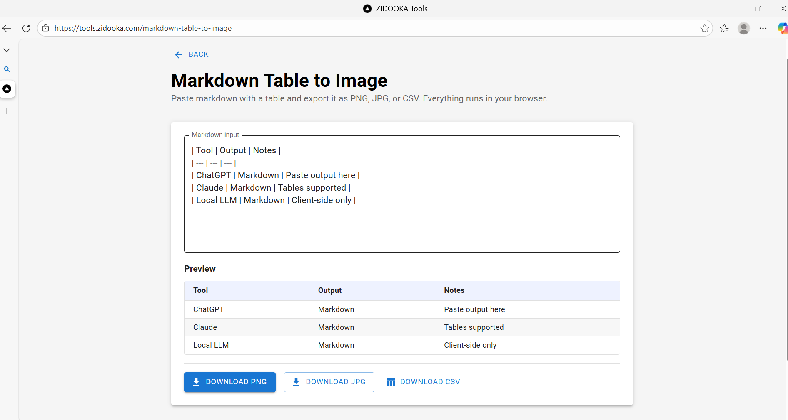

Sharing data tables from ChatGPT, Claude, or local LLMs on social media can be frustrating. Markdown tables look great in an editor but break completely when pasted into Twitter, LinkedIn, or Slack.

I've built a simple, free tool to solve this: **Markdown Table to Image**.

## What is it?

This is a lightweight, browser-based utility that converts Markdown table syntax into a clean, formatted image (PNG/JPG) or a CSV file.

### Key Features

:::note
**Privacy First:** Everything runs 100% in your browser. No data is sent to any server.
:::

- **Instant Preview:** See exactly how your table will look as you type.
- **Multiple Formats:** Export as **PNG** or **JPG** for sharing, or **CSV** for spreadsheet work.
- **Auto-Formatting:** Automatically handles column widths and consistent styling.

## How to Use

Using the tool is incredibly clear and simple.

:::step
**Step 1: Paste Your Markdown**
Copy the table output from your LLM (ChatGPT, Claude, etc.) or Markdown editor and paste it into the text area.
:::

:::step
**Step 2: Check the Preview**
The tool automatically parses the Markdown and renders a preview table below. If it detects a valid table, you'll see it immediately.
:::

:::step
**Step 3: Download**
Click **Download PNG** or **Download JPG** to save the image. Use **Download CSV** if you need to move the data into Excel or Google Sheets.
:::

## Under the Hood

For the developers out there, this tool is built using **React** (Next.js) and **Material UI**. 

The core logic revolves around parsing the pipe-delimited Markdown format and then rendering it onto an HTML5 Canvas for image generation. This approach ensures high performance without needing server-side rendering libraries.

:::example
**Parsing Logic Snippet:**
The parser looks for the separator row (e.g., `|---|---|`) to identify the table structure, ignoring non-table text around it.
:::

## Conclusion

:::conclusion
Stop taking screenshots of your code editor. Use **Markdown Table to Image** to share crisp, professional-looking data tables anywhere.
:::
