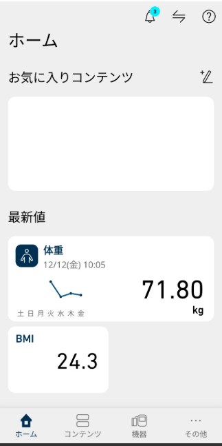
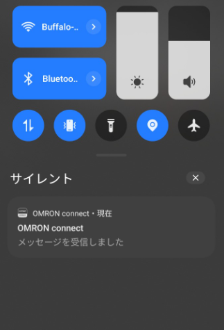

# A $30 Gadget That Changed My Life

Hello, this is ZIDOOKA.
Let me ask you: Are you keeping up with your weight management?

I used to fail constantly because "recording it manually is a pain."
However, since I switched to the **Omron HN-300T2**, I've been keeping records for over six months. And more importantly, **my weight is definitely going down.**

In this review, I'll explain **why this cheap model (around $30-$40) is more than enough** and **how it helped me build a habit.**

# Why I Chose the Omron HN-300T2

I chose the **HN-300T2** for a simple reason: **"It was the cheapest reliable option with Smartphone Sync (Bluetooth)."**

If you search on Amazon, you'll find tons of super-cheap scales from unknown brands. But I wanted to avoid unstable connections or shady apps.
In that regard, getting an Omron product for this price range was an incredible value.

# Killer Feature 1: Just Step On, It Records Automatically

The biggest benefit of this scale is that **you don't need to take out your phone.**

1.  Step on the scale (No need to turn it on, just step on).
2.  Measurement complete.
3.  It syncs automatically when your phone is nearby later.

That's it.
When it syncs, you get a quiet notification on your phone like this:

"OMRON connect - Message received."
Seeing this notification gives me peace of mind, knowing "Okay, it's recorded." You don't even need to open the app and press a sync button.

# Killer Feature 2: Graphs Are Clear and Motivating

The dedicated app "OMRON connect" is excellent.
Cheap scales often have terrible apps, but this is from a medical equipment manufacturer, so it's solid.

## Monthly Graph: See Daily Fluctuations

## Yearly Graph: See Long-Term Trends

Look at this **beautiful downward trend** (if I do say so myself).
My average in September-October was **73.28kg**, but now it's down to **71.80kg**.

"Measure every day, look at the graph."
Just doing this naturally creates a mindset of "I ate too much yesterday, so I'll hold back today." This is the **power of self-monitoring.**

# Recommended Models and Links

The HN-300T2 comes in a few color variations, but the functions are the same.
Choose based on price or your room's style.

**[Recommendation #1] Omron HN-300T2-JTBK (Black)**
This is the one I use. Simple and sleek design. It's often the most affordable standard model.
[View on Amazon](https://www.amazon.co.jp/dp/B09L4FC3FY)

**[Recommendation #2] Omron HN-300T2-JTW (White)**
If you want to match a white bathroom, go for this one. Very clean look.
[View on Amazon](https://www.amazon.co.jp/dp/B09L42VBH5)

**[Old Package Version] HN-300T2-JW (White)**
The contents are almost the same, but sometimes sold cheaper as an old package. Lucky if you find it in stock.
[View on Amazon](https://www.amazon.co.jp/dp/B0B5Q7JZJ6)

# Summary: If In Doubt, Buy This

*   **Cheap** (Affordable price range)
*   **Stable Connection** (Omron quality)
*   **Easy-to-use App** (Auto-sync & Graphs)

High-end body composition monitors (that measure muscle mass, etc.) are attractive, but **for the purpose of "losing weight," this HN-300T2 is necessary and sufficient.**
In fact, because the functions are simple, the battery lasts longer, and you can use it for a long time.

If you are thinking "I want to lose weight this year" or "I want to make recording a habit," why not start with this scale?
It will change your life.
