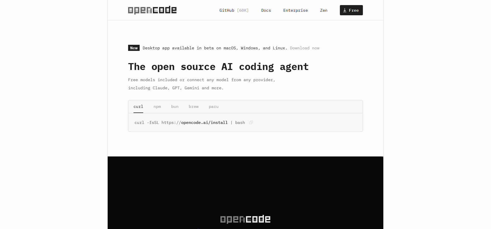

# OpenCode CLI (TUI) が起動しない？ GUIが開いてしまう時の対処法【Windows】



OpenCodeをWindowsにインストールして、いざターミナルで使おうとしたときに「あれ？」となることがあったので、そのトラブルシューティングを共有する。

【結論】ターミナル版（TUI）を使うには `opencode` ではなく `opencode-cli` コマンドを使う必要がある（環境によってはPATH設定も必要）。

## 🚨 発生した問題

Windows向けのインストーラー（.exe）でOpenCodeをインストールした後、以下の問題に遭遇した。

1.  **コマンドが見つからない**: ターミナルで `opencode` と打っても認識されない。
2.  **起動モードが違う**: なんとかコマンドが通るようになっても、期待していたTUI（ターミナル内の操作画面）ではなく、GUIのウィンドウが立ち上がってしまう。

## 🔍 原因

調査した結果、原因は以下の2点だった。

-   **PATH未設定**: インストーラーによっては、実行ファイルの場所がシステム環境変数 `PATH` に自動登録されない場合がある。
-   **実行ファイルの違い**: インストールフォルダ内には、用途の異なる2つの実行ファイルが存在している。
    -   `OpenCode.exe`: GUI版（ウィンドウで開く通常アプリ）
    -   `opencode-cli.exe`: TUI版（ターミナル内で動くCUIツール）

つまり、単に `opencode` を実行すると、GUI版の `OpenCode.exe` が優先されたり、そもそもパスが通っていなくて起動しなかったりするわけだ。

## ✅ 解決策

以下の手順で解決できた。再インストールの必要はなく、設定と使い分けだけでOK。

### 1. PATHの追加
OpenCodeのインストール先フォルダを探し、そのパスをユーザー環境変数の `PATH` に追加する。これでどこのディレクトリからでもコマンドを呼び出せるようになる。

### 2. 正しいコマンドの使用
ここが重要。TUI（ターミナル版）を使いたい場合は、コマンドを使い分ける。

-   **GUI版**（ウィンドウを開く）:
    ```powershell
    opencode
    ```
-   **TUI版**（ターミナルで使う）:
    ```powershell
    opencode-cli
    ```

【対処】ターミナル操作（TUI）をしたいなら、迷わず `opencode-cli` を実行すること。

これで、Windows環境でも快適にOpenCodeをターミナルから操作できるはずだ。
---
title: "OpenCode CLI (TUI) が起動しない？ GUIが開いてしまう時の対処法【Windows】"
slug: "opencode-cli-tui-troubleshooting-windows-jp"
status: "publish"
categories: 
  - "AI"
  - "便利ツール"
tags: 
  - "OpenCode"
  - "CLI"
  - "TUI"
  - "Windows"
  - "PATH"
featured_image: "../images-agent-browser/opencode-official.png"
---

# OpenCode CLI (TUI) が起動しない？ GUIが開いてしまう時の対処法【Windows】


OpenCodeをWindowsにインスト�Eルして、いざターミナルで使おうとしたときに「あれ？」となることがあった�Eで、そのトラブルシューチE��ングを�E有する、E

【結論】ターミナル版！EUI�E�を使ぁE��は `opencode` ではなぁE`opencode-cli` コマンドを使ぁE��E��がある�E�環墁E��よってはPATH設定も忁E��E��、E

## 🚨 発生した問顁E

Windows向けのインスト�Eラー�E�Eexe�E�でOpenCodeをインスト�Eルした後、以下�E問題に遭遁E��た、E

1.  **コマンドが見つからなぁE*: ターミナルで `opencode` と打っても認識されなぁE��E
2.  **起動モードが違う**: なんとかコマンドが通るようになっても、期征E��てぁE��TUI�E�ターミナル冁E�E操作画面�E�ではなく、GUIのウィンドウが立ち上がってしまぁE��E

## 🔍 原因

調査した結果、原因は以下�E2点だった、E

-   **PATH未設宁E*: インスト�Eラーによっては、実行ファイルの場所がシスチE��環墁E��数 `PATH` に自動登録されなぁE��合がある、E
-   **実行ファイルの違い**: インスト�Eルフォルダ冁E��は、用途�E異なめEつの実行ファイルが存在してぁE��、E
    -   `OpenCode.exe`: GUI版（ウィンドウで開く通常アプリ�E�E
    -   `opencode-cli.exe`: TUI版（ターミナル冁E��動くCUIチE�Eル�E�E

つまり、単に `opencode` を実行すると、GUI版�E `OpenCode.exe` が優先されたり、そもそもパスが通ってぁE��くて起動しなかったりするわけだ、E

## ✁E解決筁E

以下�E手頁E��解決できた。�Eインスト�Eルの忁E���Eなく、設定と使ぁE�EけだけでOK、E

### 1. PATHの追加
OpenCodeのインスト�Eル先フォルダを探し、そのパスをユーザー環墁E��数の `PATH` に追加する。これでどこ�EチE��レクトリからでもコマンドを呼び出せるようになる、E

### 2. 正しいコマンド�E使用
ここが重要。TUI�E�ターミナル版）を使ぁE��ぁE��合�E、コマンドを使ぁE�Eける、E

-   **GUI牁E*�E�ウィンドウを開く！E
    ```powershell
    opencode
    ```
-   **TUI牁E*�E�ターミナルで使ぁE��E
    ```powershell
    opencode-cli
    ```

【対処】ターミナル操作！EUI�E�をしたぁE��ら、迷わず `opencode-cli` を実行すること、E

これで、Windows環墁E��も快適にOpenCodeをターミナルから操作できるはずだ、E

