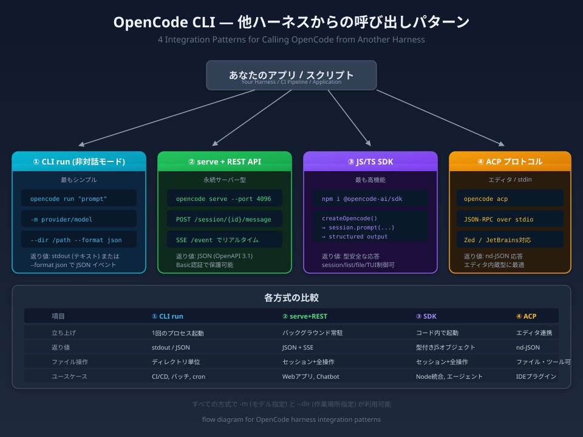

ターミナルで `opencode` と打つだけでも便利ですが、**別のスクリプトやCI/CDパイプラインから呼び出して自動化したい**というケースは多いです。

OpenCodeはそのために**4つの連携方式**を用意しています。モデル指定（`-m`）や作業ディレクトリ指定（`--dir`）も、どの方式でも共通して使えます。

:::conclusion
OpenCodeを外部ハーネスから呼び出す方法は「CLI run」「serve + REST API」「JS/TS SDK」「ACP（stdin JSON-RPC）」の4つ。用途に応じて選べます。
:::



## ① CLI run — 最もシンプルな非対話モード

シェルスクリプトやcronジョブ、CI/CDパイプラインから OpenCode を起動して、結果だけを受け取りたい場合に最適です。

```powershell
opencode run "src/index.ts のテストを書いて" -m anthropic/claude-sonnet-4-5 --dir C:\myproject
```

`opencode run` はプロンプトを渡すと、AIが応答を生成して stdout に出力し、プロセスが終了します。戻り値は標準出力のテキストです。

:::note
`--format json` を付けると、JSON形式のイベントストリームが返ってきます。パースして後続処理に使いたい場合に便利です。
:::

### 主なオプション

| オプション | 短縮形 | 説明 |
|-----------|--------|------|
| `--model` | `-m` | モデル指定（`provider/model` 形式） |
| `--dir` | | 作業ディレクトリ |
| `--format` | | `json` でJSONイベント出力 |
| `--continue` | `-c` | 前回のセッションを継続 |
| `--session` | `-s` | 特定のセッションIDを指定 |
| `--agent` | | 使用するエージェントを指定 |
| `--file` | `-f` | 添付ファイル |
| `--attach` | | 稼働中のサーバーに接続 |

### 使いどころ

- CI/CDパイプラインでのコード生成・レビュー
- バッチ処理（毎朝のレポート生成など）
- cronジョブからの定期タスク
- シェルスクリプトでの1発処理

:::step
`opencode run "メッセージ" -m モデル --dir 作業場所` で、ワンショットのAIタスクをスクリプトから実行できます。
:::

## ② serve + REST API — 永続サーバー型

Node.jsのHTTPサーバーを立ち上げて、REST API経由でOpenCodeを操作する方式です。

```powershell
# サーバーを起動（バックグラウンド）
opencode serve --port 4096
```

起動後は `http://localhost:4096` でHTTPリクエストを受け付けます。OpenAPI 3.1の仕様が `/doc` エンドポイントで公開されているため、クライアントの自動生成も可能です。

### 主要エンドポイント

```powershell
# セッション作成
curl -X POST http://localhost:4096/session -H "Content-Type: application/json" -d '{"title":"test"}'

# メッセージ送信（応答を待つ）
curl -X POST http://localhost:4096/session/{id}/message -H "Content-Type: application/json" `
  -d '{"parts":[{"type":"text","text":"Hello"}],"model":{"providerID":"anthropic","modelID":"claude-sonnet-4-5"}}'
```

:::note
`/event` エンドポイントでSSE（Server-Sent Events）を購読すると、リアルタイムのツール実行状況や進行状況を取得できます。
:::

### セキュリティ

環境変数 `OPENCODE_SERVER_PASSWORD` を設定すると Basic 認証が有効になります。本番運用時は必須です。

### 使いどころ

- Webアプリケーションのバックエンド
- チャットボットのサーバーサイド
- 複数セッションを管理するダッシュボード
- リモートマシン上での集中管理

## ③ JS/TS SDK — 最も高機能

OpenCode公式の `@opencode-ai/sdk` を使うと、Node.js のコードから型安全にOpenCodeを操作できます。

```bash
npm install @opencode-ai/sdk
```

```typescript
import { createOpencode } from "@opencode-ai/sdk";

const { client } = await createOpencode({
  config: { model: "anthropic/claude-sonnet-4-5" }
});

const session = await client.session.create({
  body: { title: "コードレビュー" }
});

const result = await client.session.prompt({
  path: { id: session.data.id! },
  body: {
    parts: [{ type: "text", text: "src/index.ts をレビューしてください" }]
  }
});

console.log(result.data.info.title);
```

### 構造化出力（Structured Output）

SDKではJSONスキーマを指定して、構造化された応答を直接取得できます。

```typescript
const result = await client.session.prompt({
  path: { id: sessionId },
  body: {
    parts: [{ type: "text", text: "このコードのバグを列挙して" }],
    format: {
      type: "json_schema",
      schema: {
        type: "object",
        properties: {
          bugs: {
            type: "array",
            items: {
              type: "object",
              properties: {
                file: { type: "string" },
                line: { type: "number" },
                description: { type: "string" },
                severity: { type: "string", enum: ["low", "medium", "high"] }
              },
              required: ["file", "description", "severity"]
            }
          }
        },
        required: ["bugs"]
      }
    }
  }
});
```

:::note
`noReply: true` を使うと、AI応答をトリガーせずにコンテキストだけを注入できます。プラグイン開発で便利です。
:::

### 使いどころ

- Node.jsアプリへの深い統合
- 構造化データの抽出・分析
- エージェント間連携のオーケストレーション
- カスタムツールとの組み合わせ

## ④ ACP（Agent Client Protocol） — エディタ / stdin 連携

ACPは、エディタとAIエージェントの間で標準化された通信プロトコルです。`opencode acp` を起動すると、stdin/stdout 経由で JSON-RPC の通信が始まります。

```powershell
opencode acp --cwd /path/to/project
```

### エディタ設定例

**Zed**（`~/.config/zed/settings.json`）:

```json
{
  "agent_servers": {
    "OpenCode": {
      "command": "opencode",
      "args": ["acp"]
    }
  }
}
```

**JetBrains IDE**（`acp.json`）:

```json
{
  "agent_servers": {
    "OpenCode": {
      "command": "/absolute/path/bin/opencode",
      "args": ["acp"]
    }
  }
}
```

:::note
ACP経由でも、ファイル操作・ターミナル実行・MCPサーバー・カスタムツールなど、OpenCodeの全機能が利用可能です。
:::

### 使いどころ

- Zed / JetBrains / Neovim などのエディタ連携
- カスタムIDEプラグインの開発
- プロセス間通信（IPC）によるツール連携

## 4方式の比較まとめ

| 項目 | CLI run | serve+REST | SDK | ACP |
|------|---------|------------|-----|-----|
| 立ち上げ | 1回のプロセス起動 | バックグラウンド常駐 | コード内で起動 | エディタ連携 |
| 返り値 | stdout / JSON | JSON + SSE | 型付きJSオブジェクト | nd-JSON |
| 学習コスト | 低（CLIのみ） | 中（REST知識） | 中（JS知識） | 低（設定のみ） |
| 同時セッション | 単一 | 複数 | 複数 | エディタ次第 |
| モデル指定 | `-m` | bodyで指定 | コードで指定 | 設定ファイル |

:::conclusion
- **シェルスクリプトやCI/CD** なら `opencode run` で十分
- **Webアプリからの連携** には `opencode serve` + REST API
- **Node.jsネイティブの統合** なら `@opencode-ai/sdk`
- **エディタ内蔵のAIアシスタント** なら `opencode acp`
- どの方式でも `-m` と `--dir` が使えるので、モデルと作業場所を自由に切り替え可能
:::
