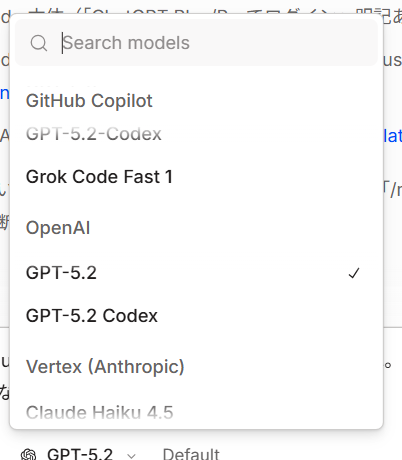

# OpenCodeをChatGPT Plus/Proで使うとAPI課金なし？GPT-5.2/Codexの料金と使い分け（モデル選択スクショ付き）

OpenCodeのモデル選択で `GPT-5.2` と `GPT-5.2 Codex` が並んで表示されていたので、スクショを残しておきます。

【結論】OpenCodeを`ChatGPT Plus/Pro`で接続して使う限り、基本はAPI従量課金ではなく「プラン内の利用枠」で回るので、使い方によってはかなりコスパが良い。

## まず結論：API課金じゃないルートがある

「OpenCodeって課金どうなるの？」って話は、接続方式が2種類あるのがポイントです。

1) `ChatGPT Plus/Pro`でログインして使う
- **APIキー不要**
- **従量課金ではなく、Plus/Pro側の利用制限（回数・混雑）**の影響を受ける

2) OpenAI APIキーで使う（いわゆるOpenAI API）
- **従量課金**（使った分だけ課金）
- レート制限や管理がAPI寄りになる

【ポイント】同じOpenCodeでも「Plus/Pro接続」か「APIキー接続」かで、財布と上限が変わる。

## GPT-5.2 と GPT-5.2 Codex の違いは？

表示上は `GPT-5.2` と `GPT-5.2 Codex` が選べます。

- `GPT-5.2`：通常の会話・説明・一般的なコーディングに向く
- `GPT-5.2 Codex`：より“コーディング寄り”の選択肢として並んでいる（OpenCode側の提供/接続先によって挙動が変わる可能性あり）

【注意】モデル名が出ていても、プランや混雑、提供側の都合で「常に同じ条件で使える」とは限らない。

## 「Plus/Proでログイン」のメリット（オトクっぽい理由）

- API従量課金を気にせず、とりあえず試せる
- OpenCodeのUI（TUI/デスクトップ）で、モデル切り替えや作業がしやすい
- 体感としては「ブラウザでChatGPTを開く」運用に近い

【ポイント】作業時間が長くなりがちな人ほど、API課金の“ドキドキ”が減って心理的にラク。

## 逆にデメリット（気をつけるところ）

- 使いすぎると、**お金が増える**のではなく、**止まる/混雑で待たされる/別モデルに落ちる**方向で効いてくる

【注意】Plus/Pro接続は「支払えば無限」ではなく「プラン枠の上限・混雑」が天井。

## どっちで使うべき？（ざっくり判断）

- まず試したい / 予算が読みづらい / 日常的な作業が多い → `ChatGPT Plus/Pro`接続
- 安定運用したい / リクエスト量を課金でコントロールしたい / 企業運用 → APIキー接続

## 参考（OpenCode公式の説明）

OpenCodeのDocs上でも、OpenAIの接続で `ChatGPT Plus/Pro` と `Manually enter API Key` が分かれて案内されています。

- https://opencode.ai/docs/providers/
