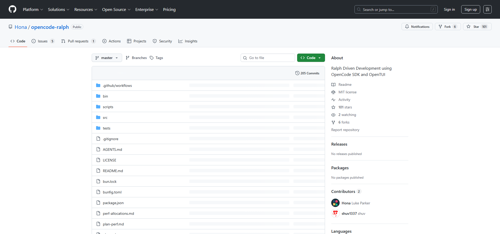

AIエージェントを「ループで回す」Ralph Driven Development。その思想を OpenCode で実現するのが **opencode-ralph** です。

この記事では、opencode-ralph のインストールから実際の使い方まで、詳しく解説します。

【結論】opencode-ralph は、OpenCode SDK を使って Ralph ループを実装した CLI ツールです。`plan.md` を書くだけで、AIが自動的にタスクを1つずつ実行してコミットしてくれます。

## opencode-ralph とは



[opencode-ralph](https://github.com/hona/opencode-ralph) は、Luke Parker（Hona）氏が開発した CLI ツールです。Ralph Driven Development の思想を、OpenCode SDK と OpenTUI を使って実装しています。

### 特徴

- **ターミナルUI**: OpenTUI による美しいインターフェース
- **状態管理**: `.ralph-state.json` で中断・再開が可能
- **一時停止機能**: `p` キーでいつでも停止可能
- **モデル選択**: 任意のモデルを `--model` で指定可能

## インストール方法

### 前提条件

- [Bun](https://bun.sh) v1.0 以上
- [OpenCode](https://opencode.ai) CLI が動作していること

### 安定版のインストール

```bash
bun install -g @hona/ralph-cli
```

### 開発版のインストール

最新の機能を試したい場合は、dev ブランチからインストールします：

```bash
bun install -g @hona/ralph-cli@dev
```

### ソースからビルド

```bash
git clone https://github.com/hona/opencode-ralph.git
cd opencode-ralph
bun install
bun run build:single  # 現在のプラットフォーム向けにコンパイル
```

## 基本的な使い方

### 1. plan.md を作成する

まず、プロジェクトのルートに `plan.md` を作成します：

```markdown
# Project Plan

## Phase 1: 初期セットアップ
- [ ] プロジェクトを bun init で初期化
- [ ] TypeScript の設定ファイルを追加
- [ ] src/index.ts エントリーポイントを作成

## Phase 2: コア機能
- [ ] ユーザー認証を実装
- [ ] データベース接続を追加
```

【ポイント】タスクは `- [ ]` 形式のチェックボックスで記述します。Ralph はこれをパースして進捗を管理します。

### 2. ralph コマンドを実行

```bash
ralph
```

これだけで、Ralph が動き始めます。

### コマンドラインオプション

| オプション | 短縮形 | デフォルト | 説明 |
|-----------|-------|----------|------|
| `--plan` | `-p` | `plan.md` | 計画ファイルのパス |
| `--model` | `-m` | `opencode/claude-opus-4-5` | 使用するモデル |
| `--prompt` | なし | 下記参照 | カスタムプロンプト |
| `--reset` | `-r` | `false` | 状態をリセット |

### 使用例

```bash
# 別の計画ファイルを使用
ralph --plan BACKLOG.md

# 別のモデルを指定
ralph --model anthropic/claude-opus-4

# 状態をリセットして最初から
ralph --reset
```

## デフォルトプロンプト

Ralph がAIに送るデフォルトのプロンプトは以下の通りです：

```
READ all of {plan}. Pick ONE task. If needed, verify via web/code search 
(this applies to packages, knowledge, deterministic data - NEVER VERIFY 
EDIT TOOLS WORKED OR THAT YOU COMMITED SOMETHING. BE PRAGMATIC ABOUT 
EVERYTHING). Complete task. Commit change (update the plan.md in the same 
commit). ONLY do one task unless GLARINGLY OBVIOUS steps should run 
together. Update {plan}. If you learn a critical operational detail, 
update AGENTS.md. When ALL tasks complete, create .ralph-done and exit. 
NEVER GIT PUSH. ONLY COMMIT.
```

`{plan}` は計画ファイルのパスに置換されます。

## 操作キー

Ralph 実行中は以下のキーで操作できます：

| キー | 動作 |
|-----|------|
| `p` | 一時停止 / 再開 |
| `q` | 終了 |
| `Ctrl+C` | 強制終了 |

## 生成されるファイル

Ralph は以下のファイルを生成・使用します：

| ファイル | 用途 |
|---------|------|
| `.ralph-state.json` | 状態保存（Ctrl+C後の再開用） |
| `.ralph-lock` | 多重起動防止 |
| `.ralph-done` | 全タスク完了時に作成 |
| `.ralph-pause` | `p` キーで一時停止時に作成 |

【対処】これらのファイルは `.gitignore` に追加することを推奨します：

```
.ralph-*
```

## plan.md の書き方のコツ

### 小さく分割する

悪い例：
```markdown
- [ ] ユーザー認証機能を追加
```

良い例：
```markdown
- [ ] ログインフォームのUIを作成
- [ ] パスワードのバリデーションを実装
- [ ] JWTトークンの生成処理を追加
- [ ] ログアウト機能を実装
```

### 順序を意識する

依存関係がある場合は、順番に記述します：

```markdown
## Phase 1: データベース
- [ ] PostgreSQL の接続設定を追加
- [ ] ユーザーテーブルのマイグレーションを作成
- [ ] ユーザーモデルを定義

## Phase 2: API
- [ ] /api/users エンドポイントを作成
- [ ] ユーザー一覧取得APIを実装
```

### 詳細に書く

Ralph は詳細であるほど正確に動作します。1000行以上のplan.mdも珍しくありません。

## AGENTS.md との連携

Ralph は学習した内容を `AGENTS.md` に書き込みます。これにより、次のイテレーションで同じ失敗を避けられます。

```markdown
# AGENTS.md

## Build
- `bun install` を `bun run dev` の前に実行すること

## 注意点
- `solid-js` からは直接インポートしない、`@opentui/solid` を使う
```

【注意】AGENTS.md はプロジェクトの運用知識の蓄積場所です。Ralph だけでなく、人間の開発者にとっても有用なドキュメントになります。

## アーキテクチャ

opencode-ralph の内部構造：

```
src/
├── index.ts      # CLI エントリー、TUI とループの接続
├── loop.ts       # メインエージェントループ
├── app.tsx       # Solid.js TUI ルートコンポーネント
├── state.ts      # 状態の型定義と永続化
├── plan.ts       # 計画ファイルのパーサー
├── git.ts        # Git 操作
├── lock.ts       # ロックファイル管理
├── prompt.ts     # ユーザー確認プロンプト
├── components/   # TUI コンポーネント
└── util/         # ヘルパー関数
```

## トラブルシューティング

### Ralph が同じタスクを繰り返す

AGENTS.md に明示的なルールを追加してください。

### コンテキストがすぐに埋まる

タスクが大きすぎます。より小さなタスクに分割してください。

### ロックファイルが残っている

前回の実行が異常終了した場合、`.ralph-lock` が残ることがあります。手動で削除してください。

```bash
rm .ralph-lock
```

## まとめ

:::conclusion
opencode-ralph は、Ralph Driven Development を OpenCode で実現するための実用的な CLI ツールです。`plan.md` を書いて `ralph` コマンドを実行するだけで、AIが自動的にタスクを完了していきます。git 履歴として全ての変更が記録されるため、追跡と切り戻しが容易です。
:::

## 参考リンク

- [opencode-ralph (GitHub)](https://github.com/hona/opencode-ralph)
- [OpenCode 公式サイト](https://opencode.ai)
- [Geoffrey Huntley - Ralph Wiggum as a "software engineer"](https://ghuntley.com/ralph/)
- [Luke Parker - Stop Chatting with AI, Start Loops](https://lukeparker.dev/stop-chatting-with-ai-start-loops-ralph-driven-development)
